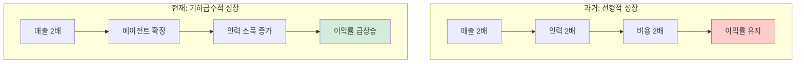
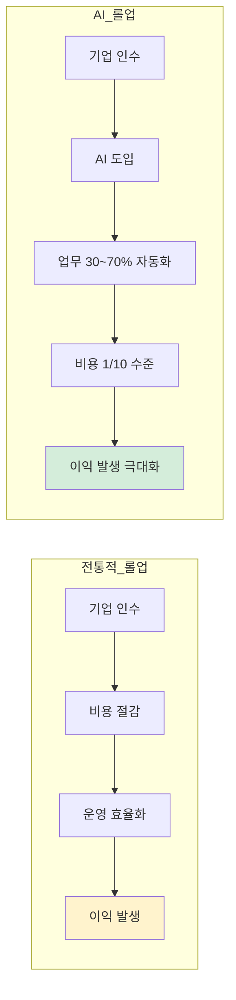

[] 한경 보도자료 기반으로 데이터 및 출처 명확히 해야함
[] 매각차익 개념도 좋지만 이익으로 정규화하고 사모펀드 개념은 명확히 한문장 정도만.
[] 근거 더 quote -> Sam Altman을 비롯한 일부 지식인들은 1조 원 기업을 운영하는 슈퍼 1인 또는 소수정예 조직이 대거 등장할 수 있다는 가능성을 이야기합니다.

# [v1] 비용 구조가 바뀌면 조직이 바뀐다

## 왜 내부 전환은 어려운가

AI 도입을 둘러싼 우려는 대부분 타당합니다. 품질, 저작권, 일자리, 정체성. 모두 진지하게 다뤄져야 할 문제입니다. 바로 그렇기 때문에 조직 내부에서의 전환은 느릴 수밖에 없습니다.
이 장에서는 다른 접근법을 살펴봅니다. 소유 구조 자체가 바뀌면서 전환이 일어나는 경우입니다.

---

## 인수 후 리팩토링: 에버노트 사례

에버노트(Evernote)는 "인수 후 리팩토링"이 어떤 형태로 진행되는지 보여주는 대표적인 사례입니다. 사모펀드나 소프트웨어 업계에는 이런 사례가 기존부터 많이 존재했습니다.

에버노트는 한때 실리콘밸리의 상징적인 유니콘이었습니다. 2억 명의 사용자, 10억 달러 기업가치. 하지만 시간이 지나면서 너무 거대해진 공룡이 되어 있었습니다. 매출은 발생하지만 비용이 더 빠르게 불어나고 있었습니다.

2023년 초, 이탈리아의 소프트웨어 전문 기업 벤딩스푼즈(Bending Spoons)가 에버노트를 인수했습니다. 그리고 구조조정, 운영 재배치, 제품 개선을 연속적으로 만들었습니다.

### 인수 후 타임라인

| 시기 | 변화 |
|------|------|
| 2023.02 | 인력 감축 (129명) |
| 2023.06 | 운영 중심을 유럽으로 이전 |
| 2023년말 | 재정 안정화, 협업 편집 및 AI 기능 추가 |
| 2024년 | 1년간 100개 개선 출시 |
| 2025 상반기 | 6개월간 110개 개선 출시 |

벤딩스푼즈는 에버노트 같은 '이미 알려진 디지털 브랜드'를 인수해 재정비하는 전략으로 성장해 왔습니다. 이미 존재하지만 느리게 움직이던 조직의 제품과 운영 효율을 끌어올렸습니다. 인수후 인력을 감축하고, 조직을 개편하고, 모든 코드를 리팩토링(리팩토링이 뭔지 짧게) 했습니다.

그리고 그러한 정돈 작업이 끝난 이후 캘린더 동기화, 메타데이터 동기화 엔진, AI 기반 전사 기능 등 개선 및 추가 작업이 엄청나게 빠르게 이어졌습니다. 개선 속도 자체가 이 회사의 경쟁력이 되었습니다.

### 리팩토링은 재무의 문제다

이런 리팩토링은 보통 "비용 구조 조정 + 제품 투자 + 가격/플랜 재정의"가 함께 움직입니다. 실제로 에버노트 사용자 커뮤니티에는 플랜 구조 변경과 큰 폭의 가격 인상에 대한 반응이 2025년에도 이어지고 있습니다.

이 대목은 중요한 힌트를 줍니다. '좋아진 제품'만으로는 린한 운영을 유지하기 어렵고, 그 운영을 지속시키려면 결국 손익 구조가 받쳐줘야 한다는 점입니다. 리팩토링은 기능의 문제가 아니라, 재무의 문제이기도 합니다.

표. 단순화된 영업이익 증가 원리

|  | 인수 전 | 인수 후 |
|---|---|---|
| 매출 | A | A × 1.3 |
| 비용 | B | B × 1/10 |
| 영업이익 | A - B | A×1.3 - B/10 |

이 표가 말하는 것은 '대량해고가 답'이라는 이야기가 아닙니다. 핵심은 이것입니다: 운영이 사람 중심에서 소프트웨어 중심 구조로 전환할 때, 같은 매출로도 전혀 다른 비용 구조가 가능합니다.

벤딩스푼즈의 에버노트 인수는 AI 이전의 사례입니다. 클라우드 인프라 최적화, 자동화 도구, 린한 조직 운영만으로도 이런 결과가 나왔습니다. 그런데 지금은 AI가 있습니다.

---

## 성장 ≠ 고용

전통적인 기업은 성장하기 위해 사람이 더 많이 필요했습니다. 매출이 2배가 되면 직원도 1.5배, 2배가 필요했습니다. 그래서 고용을 했습니다. 성장과 고용은 거의 동의어였습니다.

*Figure 11-1. 성장 패러다임의 변화: 선형에서 기하급수적으로*

하지만 패러다임이 변화했습니다. 성장을 위해 고용이 필수적이지 않습니다. 더 적은 자원으로 선형적인 시스템이 아닌, 기하급수적인 시스템을 만드는 것이 가능해졌습니다.

이것이 가능한 이유는 명확합니다. 사람이 컴퓨터 앞에 앉아서 하는 많은 업무들이 이제 고급 AI 모델에게 시간을 주고 다회 반복을 시키면 치환이 가능할 수준의 성능과 효율이 나오기 때문입니다. 사람 한 명을 채용하는 비용으로 수십, 수백 개의 에이전트를 운영할 수 있습니다.

---

## 1인 빌더, 1조 회사의 가능성

Sam Altman을 비롯한 일부 지식인들은 1조 원 기업을 운영하는 슈퍼 1인 또는 소수정예 조직이 대거 등장할 수 있다는 가능성을 이야기합니다.

왜 그런 주장이 나오는 걸까요? 가장 큰 이유는 에이전트입니다.

- 마케팅 에이전트가 콘텐츠를 생성하고 배포합니다
- 고객 응대 에이전트가 1차 문의를 처리합니다
- 데이터 분석 에이전트가 리포트를 작성합니다
- 코드 작성 에이전트가 기능을 개발합니다
- 품질 검증 에이전트가 테스트를 수행합니다

이 모든 것을 한 사람이 감독하고, 실행은 에이전트들이 담당하는 구조. 이론적으로는 가능합니다.

하지만 문제가 있습니다. 그런 미래가 올 것이라는 거대담론과는 다르게, 구체적으로 어떻게 해야 그렇게 할 수 있는지에 대한 실질적인 이야기는 거의 없습니다. 그저 ChatGPT나 Midjourney만 잘 쓴다고 가능한 일이 아닙니다.

그것이 이 책을 쓴 이유입니다. 어떤 개념을 알아야 하는지, 어떤 구조로 설계해야 하는지, 어디서부터 시작해야 하는지. 거대담론의 방향성이 아니라 실행 가능한 방법론을 제시하고자 합니다.

---

### 해외 동향: 2025년 AI와 고용 구조 변화

2025년 한 해 동안 글로벌 기업들의 움직임을 보면, 이 변화가 얼마나 빠르게 진행되고 있는지 체감할 수 있습니다.

| 시기 | 기업 | 동향 |
|------|------|------|
| 2025.02 | DBS (싱가포르) | 3년간 계약직 4,000명 감축, AI 역할 1,000개 신설 |
| 2025.02 | Salesforce | 1,000명+ 감원과 동시에 AI 사업(Agentforce) 확장 |
| 2025.04 | Shopify | "AI로 불가능 증명 없으면 증원 불가" 정책 도입 |
| 2025.05 | Duolingo | AI-first 선언, 계약직 단계적 축소 |
| 2025.05 | Klarna | AI-only CS의 한계 인정, 인력 재확대로 선회 |
| 2025.06 | BT (영국) | AI로 기존 감원 계획 확대 가능성 언급 |
| 2025.09 | Salesforce | CS 부문에서 AI로 4,000명 대체 |
| 2025.09 | Fiverr | 30% 감원(250명), AI 자동화 중심 재편 |
| 2025.10 | Amazon | 기업부문 14,000명 감축, AI 도입이 동인 |
| 2025.11 | Verizon | 13,000+ 감원, 직영점 프랜차이즈 전환 |
| 2025.12 | Wells Fargo | AI 전개 진행 중, 추가 감원 가능성 언급 |
| 2025.12 | Goldman Sachs | AI 생산성 제고 추진, 채용 둔화 |

Klarna 사례도 흥미롭습니다. AI만으로 고객지원을 운영하려다 한계를 느끼고 다시 사람을 늘리겠다고 선회했습니다. AI가 만능이 아니라는 것을 보여주는 동시에, 그럼에도 대부분의 기업들은 AI 도입을 통한 인력 효율화 방향으로 움직이고 있습니다.

---

## AI 롤업: 새로운 키워드

2025년, 실리콘밸리에서 'AI 롤업'이라는 새로운 투자 전략이 부상하고 있습니다.

AI 롤업이란 이런 것입니다: 벤처캐피털이 전통 서비스 기업들(회계법인, 병원, IT 기업, 콜센터 등)을 연쇄적으로 인수한 후, 인공지능 기술을 접목해 효율성을 높이고, 기업가치를 상승시킨 뒤 매각하는 방식. 저마진·노동집약 업종이 주요 타깃입니다.

한 국내 VC 심사역의 표현이 인상적입니다:

> "플랫폼 수수료 모델은 끝났고, 이젠 전통 산업에 들어가 직접 마진을 개선하는 '진흙탕 싸움'을 해야 돈을 벌 수 있다."

사모펀드는 다시 회사를 매각(되파는 방법)하는 것으로 수익을 실현합니다. 하지만 여기서는 매각이 중요한 초점이 아닙니다. 기술 투자 후 수동적으로 관찰하는 시대는 끝났습니다. 직접 산업 구조 변화에 개입해야 한다는 의미입니다.

### 구체적인 숫자들

제너럴카탈리스트(General Catalyst)는 약 2조 원(15억 달러)을 투입해 10개 분야에서 스타트업을 창업한 뒤 서비스 기업을 인수하고 있습니다.

크레센도(Crescendo) 사례: 콜센터 운영 플랫폼을 인수한 후, 200개 고객사에 즉시 AI를 적용했습니다. 기존 콜센터 직원들이 하던 1차 응대를 AI가 대체하고, 사람은 복잡한 케이스만 처리하는 구조로 전환했습니다.

2025년 상반기 통계: 스타트업 인수 거래 427건 중 AI 관련이 262건. 61%가 AI 관련 인수입니다.

*Figure 11-2. 전통적 롤업 vs AI 롤업*

### 산업혁명의 시야: 대체된 건 항상 '그 시대의 노동'이었다

뻔한 이야기임을 압니다. 산업혁명을 언급하지 않는 서적이 없으니까요. 하지만 지금 일어나는 변화의 규모를 가늠하려면, 한 번쯤은 이 시야로 봐야 합니다.

해외 동향만 보면 "2025년에 갑자기 무슨 일이 벌어지고 있나"처럼 느껴질 수 있습니다. 하지만 이건 긴 흐름의 일부입니다. 일하는 방식이 바뀌는 건 이번이 처음이 아닙니다.

| 시대 | 일하는 방식 | 대체된 노동 |
|------|------------|------------|
| 농업 → 산업 | 공장, 대규모 조직 | 밭일 |
| 산업 → 디지털 | 소규모 팀, 빠른 출시 | 서류 작업, 계산 |
| 디지털 → AI | 사람 + 에이전트 | 지식 노동 |

농업에서 산업으로 넘어갈 때, 밭일은 기계가 대신하게 됐습니다. 사람들은 공장으로 모였고, 공장 노동자, 기술자, 관리자 같은 새로운 일자리가 생겼습니다.
산업에서 디지털로 넘어갈 때, 서류 작업과 계산은 컴퓨터가 대신하게 됐습니다. 소프트웨어 엔지니어, 디자이너, 기획자 같은 역할이 등장했습니다.
지금은 디지털에서 AI로 넘어가는 중입니다. 이전 변화들이 몸으로 하는 일을 바꿨다면, AI는 머리로 하는 일을 바꾸고 있습니다. 컴퓨터 앞에 앉아서 하던 일들이 달라지기 시작했습니다.
각 전환기마다 공통점이 있었습니다. 기존 역할은 사라지거나 축소되고, 새로운 역할이 생겼습니다. 그리고 그 전환 속도는 점점 빨라지고 있습니다.

---

## 이 이야기가 불편한 이유

솔직히 말씀드리겠습니다. 이 이야기는 불편합니다.

대량해고, 일자리 감소, 소득 양극화. 기술 발전이 만드는 그림자는 분명히 존재합니다. 이 책이 "그러니까 다 해고하고 AI 넣어라"라는 주장을 하는 것이 아님을 명확히 해두고 싶습니다.

이 책이 말하고자 하는 것은 이것입니다:

1. 기술은 특정한 방향성을 향해 발전합니다
2. 인공지능 기술은 이 방향성을 무시할 수 없습니다
3. 이러한 근거들로 특정한 미래를 예견하는 사람들이 있습니다
4. 그 미래가 좋든 싫든, 인지하고 고려해야 합니다

머리를 모래에 파묻는다고 파도가 안 오는 게 아닙니다. 변화를 이해하고, 그 안에서 자신의 위치를 찾고, 가능하다면 그 변화를 주도하는 쪽에 서는 것. 그것이 이 책이 제안하는 방향입니다.

이 변화를 어떻게 활용할 것인지 고민하는 시간을 가져보도록 합시다.

---
<!-- LLM Context Anchor -->
**핵심 요약**: 소유 구조가 바뀌면 조직 전환이 빠르게 일어난다. 에버노트 사례처럼 인수 후 운영을 사람 중심에서 소프트웨어 중심으로 바꾸면 비용 구조가 극적으로 개선된다. 2025년 AI 롤업 트렌드는 이 패턴을 AI로 가속화하고 있다. 성장과 고용이 분리되는 시대, 1인 빌리언달러 회사의 가능성이 열리고 있다.

**키워드**: `비용구조` `소유구조변화` `AI롤업` `성장≠고용` `사모펀드` `리팩토링`
