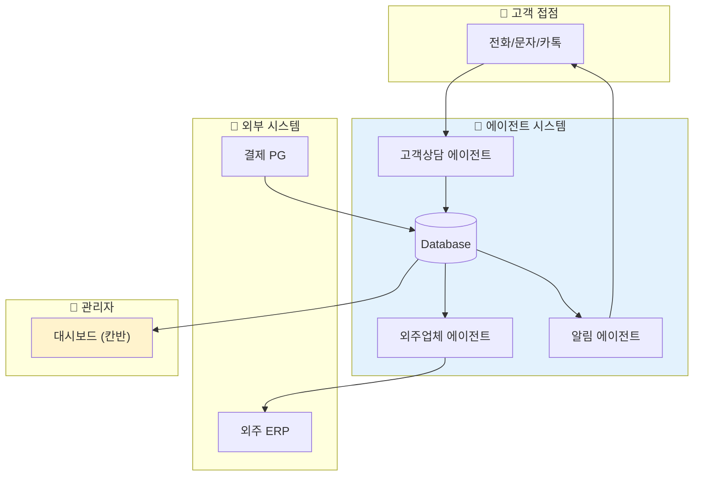
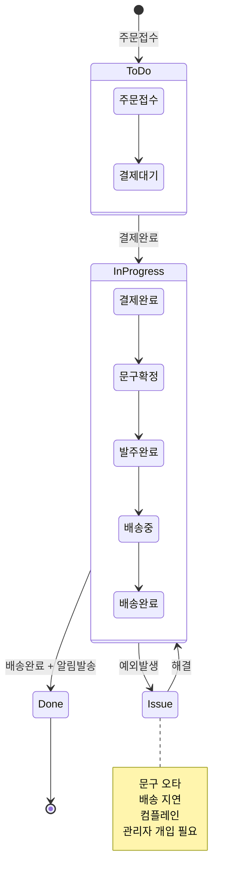
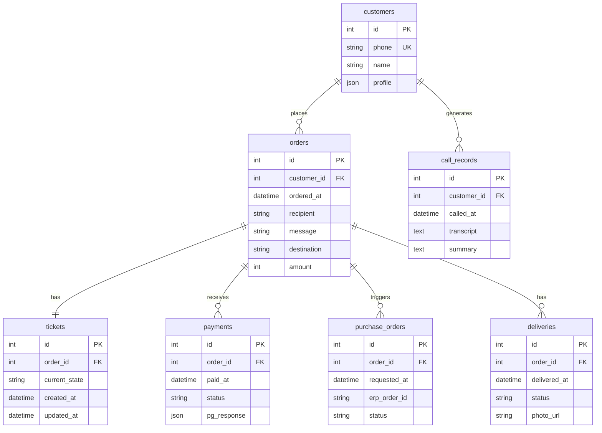

# [v1] 티켓이 상태를 따라 흐른다

갑자기 근조 화환 판매 업체라니, 의아할 수도 있습니다. 하지만 가장 직관적인 설명이 가능한 예시입니다. 같이 살펴봅시다.

## 비즈니스 모델과 수익 구조

우리는 종종 근조 화환을 보내는 일이 있습니다. 1588-XXXX 같은 전화번호에 전화를 걸고, "XXXX 장례식장에 문구는 XXX로 해서 보내주세요."라고 이야기한 뒤, 지정된 계좌번호로 입금하면 몇 시간이 지나서 배송 완료 문자가 옵니다.

판매업체 A는 고객에게 마케팅을 해서 주문을 받습니다. 하지만 모든 일을 A 업체가 하는 것은 아닙니다. 자체 배송을 해주는 업체도 있겠지만, 모든 판매 업체가 전국구 유통망을 갖추고 있을 수는 없습니다. 그래서 유통 역할을 해주는 외주업체 B가 따로 있습니다.

역할 분담:
- 판매업체 A: 판매·발주·운영(상태관리) 담당
- 외주업체 B: B2B로 주문을 받아 제작·배송·수거 수행

수익 모델:

| 구분 | 항목 | 금액 | 메모 |
|---|---|---:|---|
| 매출 | 고객 결제 | 80,000원 | 판매가 |
| 비용 | 외주 처리비 | 40,000원 | 제작·배송 원가 |
| 결과 | 남는 돈 | 40,000원 | 마진 50% |

실제 비용 계산은 더 복잡하겠지만, 핵심 구조는 단순합니다. 고객에게 8만원을 받고, 외주 처리비 4만원을 지불하면, 4만원이 남습니다.

---

## 근조화환, 왜 이 사례인가

제품 자체는 8만원짜리 한 종류로 정해져 있고, 주문마다 달라지는 건 세 가지뿐입니다:

1. 주문자 - 누가 보내는가
2. 문구 - 어떤 메시지를 담는가
3. 도착지 - 어느 장례식장으로 보내는가

이 단순한 조합이 24시간 쉬지 않고 반복됩니다. 복잡한 재고 관리도, 다양한 상품 옵션도 없습니다. 바로 그 단순함이 에이전트 시스템의 본질을 보여주기에 적합합니다.

---

## Before: 직원 C씨의 하루

판매업체 A에 근무하는 직원 C씨의 하루를 살펴보겠습니다.

새벽 6시 — 주문 전화로 하루가 시작됩니다. 잠에서 깨자마자 "오늘 XX 장례식장으로, 주문자명은 XXX, 문구는 XXX" 같은 주문을 통화로 받아 적고, 계좌번호를 불러줍니다.

오전 8시 — 다시 잠들 틈도 없이 전화·문자를 처리합니다. 주문은 하루 10건뿐인데도, 매번 주소·시간·문구를 받아 적어 결제 확인을 하고, 외주업체 B에 발주 내용을 복사해 전달하고, "진짜 들어갔나요?"를 확인하느라 시간을 씁니다.

점심 무렵 — 고객이 "문구 오타가 있어요, 수정해주세요"라며 다시 전화를 합니다. 이미 발주가 들어간 건인지 머릿속에서 더듬다가 결국 업체에 급히 연락해 재확인합니다. 어떤 건은 이미 제작·출발 단계라 문구 수정이 안 돼 "죄송합니다"를 반복하며 부분 환불과 재발주를 처리합니다.

오후 — 고객의 배송 여부 문의에 대응합니다. 외주 업체의 ERP에 접속해 주문번호를 하나씩 검색하고 '완료' 표시를 눈으로 확인한 뒤, 다시 우리 쪽 메모나 시트에 완료 상태를 손으로 옮겨 적습니다. 그래야 고객에게 알림이 갑니다. ERP 화면이 익숙하지 않아 클릭 몇 번에 시간을 허비하고, 가끔은 같은 주문을 두 번 확인하거나 반대로 누락시키기도 합니다.

저녁 — 누락된 입금과 뒤엉킨 메모를 맞추느라 하루가 끝납니다. 배송완료 되었냐고 묻는 전화가 또 옵니다.

이렇게 적어두고 보니 끔찍합니다. 하지만 어디서 많이 본 모습 아닌가요? 엑셀하다가 통화받고, 모니터에 덕지덕지 붙어있는 메모장에 이것저것 적어두고, 정리할 시간은 없고… 피곤하니 일단 퇴근합니다.

결과: 담당자 1명이 10건을 처리하는 데 반나절이 소모됩니다. 그리고 병목은 '배송'이 아닙니다. 주문·결제·발주·수정·확인·알림을 사람이 손으로 옮기는 과정이 병목입니다.

---

## After: 에이전트 도입

이 시스템에 에이전트를 도입하면 어떻게 달라질까요?

오전 10시에 출근하면 이미 밤사이 들어온 주문들이 정리되어 있습니다. 통화·문자·카톡으로 흩어져 들어온 내용은 주문별로 한곳에 모여 있고, 결제 여부와 함께 주소·시간·문구 같은 핵심 정보가 빠진 곳이 없는지 먼저 체크되어 있습니다.

주문이 확정되면 고객에게 확인 메시지가 자동으로 나갑니다:

> "입력하신 정보가 맞나요? 곧 제작·배송 절차가 시작되니 10분 안에 수정이 있으면 알려주세요."

고객이 문구나 수령인 정보를 고치면 그 변경사항이 외주업체에도 즉시 공유됩니다. 운영자는 하루에 한두 건 정도만 '예외적으로' 직접 확인해 주면 되고, 나머지는 발주가 전달되고 진행되는 동안 상태가 자연스럽게 정리됩니다.

총 업무 실질 소요시간: 30분 이내.

---

## 티켓이라는 개념

시스템 구성도를 설명하기 전에, '티켓'이라는 개념을 먼저 살펴보겠습니다.

영미권에서는 콜센터나 헬프데스크 같은 고객센터에서 상담을 처리할 때 ticket이라는 용어를 씁니다. 어떤 request, issue, case, incident가 발생하면 각 건에 고유번호(ID)를 부여하고, 그 한 건의 상태(state)를 끝까지 추적·관리하기 위해서입니다.

최근 해외의 인공지능 도입 사례를 보면 '고객센터' 관련 제품이 특히 많습니다. "인공지능은 고객응대 같은 비교적 단순한 업무에나 쓰이는 것 아닐까?"라는 오해가 생기기 쉽습니다.

하지만 여기서 중요한 포인트는 고객응대가 단순해서가 아니라, 티켓이라는 업무 단위가 명확하고 흐름이 구조화되어 있기 때문에 AI가 빠르게 성과를 내기 좋다는 점입니다.

좀 더 근본적으로 말하면, 인공지능을 도입하는 목적은 선형적으로만 확장되던 시스템을 병목 없이 비선형으로 바꾸는 것에 가깝습니다. 사람의 시간에 비례해 늘어나던 처리량을, 동시성·압축·재사용이 가능한 형태로 바꾸는 것입니다.

그리고 그 과정에서 이런 운영 모델이 만들어집니다:

> "대부분의 건은 자동으로 닫히고(close), 사람은 예외만 본다."

---

## 시스템 구성도

아래 그림은 판매업체 A의 자동화 운영 시스템을 보여줍니다.

*Figure 12-1. 근조화환 자동화 시스템 구성도*

3개 에이전트의 역할:

1. 고객상담 에이전트: 통화·문자·카톡을 통해 주문과 요청을 받아 DB에 저장
2. 외주업체 에이전트: DB 기준으로 외주 ERP에 주문을 등록하고 상태 추적
3. 알림 에이전트: 상태 변경 시 고객에게 자동 알림 발송

관리자는 대시보드(칸반)에서 To Do, In Progress, Issue, Done으로 상태를 모니터링합니다. 'Issue가 발생했다'는 알람이 발생하면, 그때만 인간이 개입하여 최소한의 대응을 합니다.

---

## 마무리

결국 핵심은 이것입니다.

> 사람이 모든 건을 일일이 처리하던 구조에서,
> 시스템이 대부분의 건을 자동으로 처리하고 사람은 예외만 보는 구조로 전환하는 것.

멀티에이전트 시스템은 바로 이 전환을 가능하게 합니다.

| | Before | After |
|---|---|---|
| 출근 시간 | 새벽 6시 | 오전 10시 |
| 일일 처리 시간 | 반나절 | 30분 이내 |
| 담당자 역할 | 모든 건 직접 처리 | 예외만 확인 |
| 퇴근 후 | 전화 대기 | 편하게 잠들기 |

하루 10건을 처리하는 데 반나절이 걸리던 업무가, 30분 이내로 줄어듭니다. 새벽 6시에 울리는 전화에 잠을 깨는 대신, 오전 10시에 출근해서 이미 정리된 주문 목록을 확인하면 됩니다.

그리고 무엇보다, 퇴근 후에는 편하게 잠들 수 있습니다.

---

> 📋 기술 부록: 워크플로우와 데이터 구조
>
> 이 섹션은 기술적 세부사항을 다룹니다. 개발 경험이 없다면 건너뛰어도 됩니다.

### 워크플로우 단계별 설명

| 단계 | 설명 | 구현 방식 |
|:---:|---|---|
| 1 | 주문접수 — 고객 전화 → 주문정보 수집 | Voice Agent (ElevenLabs 등) |
| 2 | 문구확인 및 결제안내 — 주문 내용 확인 + 결제 링크 발송 | SMS Gateway |
| 3 | 결제처리 — 카드결제 또는 무통장입금 확인 | PG Webhook |
| 4 | 주문발주 — 외주 ERP에 발주 등록 | Browser Automation 또는 Voice |
| 5 | 배송상태 확인 — 외주 ERP 상태 변경 감지 | Event Polling / Webhook |
| 6 | 배송완료 알림 — 고객에게 완료 사진 및 메시지 발송 | SMS Gateway |

현재 기술 수준으로 위의 6단계 모두 구현 가능합니다. 24시간 실행되는 서버 하나를 띄우고 데이터를 저장하기 위한 DB를 설정한 뒤, 에이전트 프레임워크를 통해 구현해 끼워넣으면 됩니다.

### 티켓 상태 변화

티켓은 다음과 같은 상태 흐름을 따릅니다:

상태별 설명:
- ToDo: 주문접수, 결제대기 상태
- InProgress: 결제완료 ~ 배송완료까지의 진행 상태
- Issue: 예외상황, 컴플레인 발생 시 분기
- Done: 고객 알림까지 완료된 최종 상태

### 데이터베이스 구조

테이블 설명:

| 테이블 | 역할 | 비고 |
|---|---|---|
| `customers` | 고객 정보 | 전화번호 기준 식별 |
| `orders` | 주문 정보 | 수령인, 문구, 도착지, 금액 |
| `tickets` | 상태 관리 | 주문 1건 = 티켓 1건 |
| `call_records` | 통화 기록 | 음성→텍스트 변환 저장 |
| `payments` | 결제 내역 | PG사 응답 포함 |
| `purchase_orders` | 발주 내역 | 외주 ERP 연동 |
| `deliveries` | 배송 내역 | 완료 사진 URL 포함 |

---

작성일: 2026-01-07
Chapter: Part 1, Chapter 1 - Case 2
키워드: 티켓, 상태관리, 멀티에이전트, 워크플로우

---
<!-- LLM Context Anchor -->
**핵심 요약**: 근조화환 사례로 멀티에이전트 시스템의 본질을 보여준다. 병목은 배송이 아니라 "사람이 손으로 옮기는 과정"이다. 티켓 개념을 도입하고 3개 에이전트(고객상담, 외주업체, 알림)가 협업하면, 하루 반나절 → 30분으로 업무가 압축된다. 핵심 원칙: 대부분의 건은 자동으로 닫히고, 사람은 예외만 본다.

**키워드**: `티켓` `상태관리` `멀티에이전트` `병목제거` `HOTL` `자동화`
