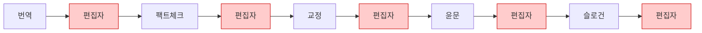
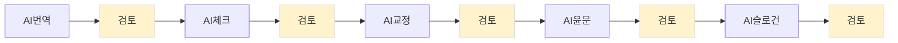
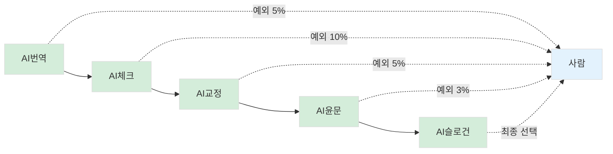
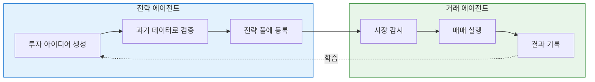

> [Note] 이 장은 출판사 사례를 다루고 있습니다. 저자가 출판 업계 전문가가 아니므로 세부 내용의 정확성이 떨어질 수 있습니다.

---

## 앞서 본 패턴

앞서 HITL, HOTL, HOOTL의 개념을 봤습니다. 그리고 근조화환 사례에서 실제로 이 전환이 어떻게 일어나는지 봤습니다.

- Before (HITL): 모든 주문을 사람이 직접 처리
- After (HOTL): 시스템이 대부분 처리, 사람은 예외만

이 패턴은 근조화환만의 이야기가 아닙니다. 업종이 달라도, 규모가 달라도, 같은 구조가 반복됩니다.

---

## 사례 1: 출판사

출판사의 책 제작 과정을 봅시다. 번역 → 팩트체크 → 교정교열 → 윤문 → 마케팅 슬로건. 정형화된 파이프라인입니다.

### 병목은 어디에?

*Figure 14-1. 수작업 시절: 편집자가 병목*

수작업 시절: 매 단계마다 편집자가 병목입니다. 처리량은 편집자 수 × 근무시간에 비례합니다.

### AI를 도입하면?

*Figure 14-2. AI 도입 후 (HITL): 여전히 매 단계 승인 필요*

HITL: AI가 초안을 만들어주지만, 여전히 매 단계마다 "편집자 승인"이 필요합니다. 처리량은 편집자가 하루에 승인할 수 있는 건수에 묶입니다.

### 승인 단위를 바꾸면?

*Figure 14-3. 승인 단위 변경 후 (HOTL): 예외만 개입*

HOTL: 예외만 개입 (전체의 5~10%만)

| 단계 | 자동 처리 조건 | 사람 개입 조건 |
|------|---------------|---------------|
| 번역 | 품질 점수 80점 이상 | 기준 미달 (5%) |
| 팩트체크 | 출처 검증 통과 | 불일치 플래그 (10%) |
| 교정교열 | 변경률 5% 미만 | 변경률 5% 이상 |
| 윤문 | 톤 일관성 유지 | 톤 이탈 알림 (3%) |
| 슬로건 | A/B테스트 예측 상위 | 최종 3개만 선택 |

핵심 전환: 개별 작업 승인("이 번역 괜찮아요?") → 배치 시스템 승인("품질 점수 80점 이상은 자동 통과")

사람은 룰을 정하고, 시스템은 룰을 실행합니다. 예외만 올라옵니다.

---

## 사례 2: 개인 트레이더

더 극단적인 사례가 있습니다.

23세 트레이더가 자취방에서 연 거래액 1조원 규모의 시스템을 운영합니다. 혼자서요.

### 먼저, 트레이딩 스타일 이해하기

주식이나 코인 거래에는 여러 스타일이 있습니다. 퀀트 업계에서는 거래 빈도(Frequency)로 분류합니다.

| 스타일 | 보유 기간 | 영문 용어 | 특징 |
|--------|----------|----------|------|
| 장기투자 | 수개월~수년 | - | 기업 가치 분석, 느긋한 대응 |
| 스윙 | 며칠~수주 | Low Frequency | 추세 따라 매매, 주기적 점검 |
| 중빈도 | 수분~수시간 | Mid Frequency (MFT) | 장중 패턴 포착, 알고리즘 보조 |
| 고빈도 | 마이크로초~초 | High Frequency (HFT) | 시장 미세구조 활용, 완전 자동화 |

> **[Note]** "초단타"라는 말이 흔히 쓰이지만, 퀀트 업계에서 진짜 HFT는 마이크로초(100만분의 1초) 단위입니다. 거래소 옆에 서버를 놓고(co-location), 광케이블 길이 몇 미터 차이로 경쟁하는 세계죠. 대부분의 개인 트레이더가 "초단타"라고 부르는 것은 MFT(중빈도)에 가깝습니다.

이 트레이더는 **중빈도 트레이딩(MFT)**을 합니다. 하루에 수천 건씩 거래하는 방식이죠. 진짜 HFT처럼 마이크로초 단위는 아니지만, 사람이 직접 하기엔 여전히 불가능한 속도입니다. 그래서 AI 시스템이 필수입니다.

### 두 종류의 에이전트

이 시스템의 핵심은 두 가지 역할 분리입니다.

*Figure 14-4. 트레이딩 시스템의 두 에이전트*

- **전략 에이전트**: "어떤 상황에서 사고팔지" 규칙을 만들고 검증합니다
- **거래 에이전트**: 실제 시장을 보면서 규칙대로 매매를 실행합니다

핵심은 **전략 풀**입니다. 한두 개 전략이 아니라, 500개 이상의 전략이 동시에 돌아갑니다. 어떤 전략은 오늘 잘 맞고, 어떤 전략은 내일 잘 맞습니다. 여러 전략을 섞어서 리스크를 분산하는 거죠.

### 진화 과정

| 단계 | 사람의 역할 | 운영 전략 수 |
|------|-----------|------------|
| Phase 1 | 직접 아이디어 찾고 검증 | 수십 개 |
| Phase 2 | AI가 찾은 걸 하나씩 승인 (HITL) | 100개 |
| Phase 3 | 품질 기준만 관리 | 200개 |
| Phase 4 | 시스템 비중 조절만 | 300개 |
| Phase 5 | 전체 방향만 관리 (HOTL) | 500개 |

Phase 2까지는 본인이 모든 전략을 하나씩 검토하고 승인했습니다. 병목은 본인의 시간이었습니다.

Phase 5에서는 달라졌습니다. 전략 에이전트가 새 아이디어를 찾고, 과거 데이터로 자동 검증하고, 좋은 것만 전략 풀에 추가합니다. 본인은 "AI 사용량"과 "전략 비중"만 조절합니다.

### 역할의 전환

> "실무를 내가 하는 게 아니라, 실무에 대한 경영을 하는 느낌으로 역할이 바뀌었다."

| 구분 | HITL 시절 | HOTL 현재 |
|------|----------|----------|
| 일일 업무 | 전략 검토, 승인, 실행 | 시스템 상태 확인, 비중 조절 |
| 운영 전략 | ~50개 | 500개 |
| 스케일링 방법 | 본인이 더 일함 | 서버/AI 비용 추가 |
| 한계 | 본인의 시간 (24시간) | 예산 |
| 역할 | 실무자 | 경영자 |

"오늘은 어떤 전략을 연구할까?"에서 "전략 에이전트에 예산을 얼마나 배분할까?"로 질문이 바뀌었습니다.

---

## 공통점

세 사례—근조화환, 출판사, 개인 트레이더—에서 같은 패턴이 보입니다.

1. 병목은 사람이 손대는 지점에서 발생합니다
2. AI를 도입해도, 매번 승인하면 병목은 그대로입니다 (HITL의 한계)
3. 승인 단위를 바꿔야 스케일이 달라집니다 (HITL → HOTL)
4. 사람의 역할은 "실행"에서 "기준 설정"으로 바뀝니다

세 사례에서 공통점이 보입니다. 이제 HITL에서 HOTL로 가는 구체적인 방법을 봅시다.

---

작성일: 2026-01-07
Chapter: Part 1, Chapter 1
키워드: 병목, 승인 단위, HITL, HOTL, 스케일링

---
<!-- LLM Context Anchor -->
**핵심 요약**: 근조화환, 출판사, 개인 트레이더—세 사례 모두 같은 패턴이 반복된다. 병목은 사람이 손대는 지점에서 발생하고, AI를 도입해도 매번 승인하면 병목은 그대로다(HITL 한계). 핵심 전환은 "개별 건 승인 → 배치 시스템 승인"으로 승인 단위를 바꾸는 것. 사람 역할은 "실행"에서 "기준 설정"으로 변화한다.

**키워드**: `병목` `승인단위` `HITL→HOTL` `스케일링` `기준설정`
