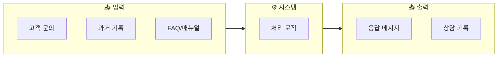
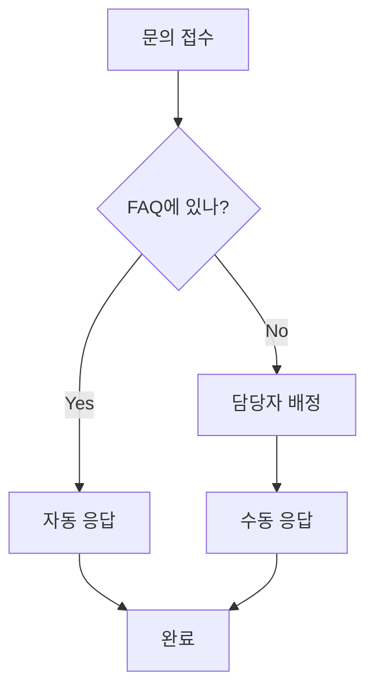
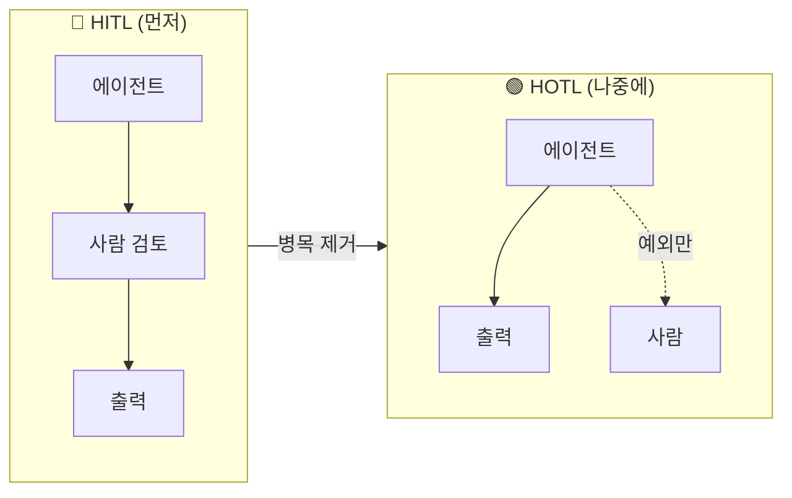

HITL과 HOTL이 무엇인지는 봤습니다. 근조화환, 출판사, 개인 트레이더 사례에서 실제 전환도 봤습니다.

이제 구체적인 방법을 봅시다. 이 흐름을 5단계로 정리하면 다음과 같습니다.

> **[TODO]** 인간도 하나의 에이전트로 병렬적으로 보았을때의 모식 섹션은 후미로 보류. 조금 더 디테일한 모식도를 그려 HITL/HOTL/HOOTL과 연결시켜 작성 예정. 인간과 조직도 에이전트라는 개념을 덧붙이면 Midjourney도 커넥터로 연결시킬 수 있으며, 더 구체적인 모델링 프레임워크가 완성됨.

---

## 핵심 원칙

시작하기 전에 한 가지를 명확히 합시다.

> HOTL이 되려면 HITL이 먼저입니다.
> 병목과 인간 개입 지점을 명확히 해야 합니다.

HOTL(Human-on-the-Loop)은 목표입니다. 하지만 처음부터 사람이 감독만 하는 시스템을 만들 수는 없습니다. 반드시 HITL(Human-in-the-Loop) 단계를 거쳐야 합니다. 사람이 루프 안에서 직접 검토하고, 병목을 찾고, 인간 개입이 필수인 지점을 파악해야 합니다.

그래야 비로소 "이 부분은 빼도 된다"는 판단이 가능해집니다.

---

## 1단계: 입출력을 정의하라

### 시스템을 함수처럼 생각하라

자동화의 시작점은 기술이 아닙니다. 입출력 정의입니다.

어떤 업무든 하나의 함수처럼 생각할 수 있습니다. 입력이 들어가면, 처리를 거쳐, 출력이 나옵니다. 이 구조가 명확하지 않으면 자동화는 불가능합니다.

### 세 가지 질문

1. 입력은 무엇인가?
   - 어떤 정보가 들어오는가?
   - 형식은 무엇인가? (텍스트, 파일, 음성 등)

2. 출력은 무엇인가?
   - 어떤 결과물이 나와야 하는가?
   - 누구에게 전달되는가?

3. 병목은 어디인가?
   - 어느 단계에서 가장 많은 시간이 드는가?
   - 사람이 손으로 옮기는 과정이 있는가?

### 예시: 고객 상담 업무

| 구분 | 내용 |
|---|---|
| 입력 | 고객 문의 메시지, 과거 상담 기록, 제품 매뉴얼/FAQ |
| 출력 | 응답 메시지, 상담 기록 저장, 필요시 에스컬레이션 티켓 |
| 병목 | 매뉴얼 찾는 시간(평균 5분), 비슷한 질문 반복 작성, 담당자별 품질 차이 |

입출력이 명확하면 자동화 가능성이 보입니다.

---

## 2단계: 워크플로우를 손으로 그려라

### 왜 손으로 그려야 하는가

GPT나 다이어그램 도구를 쓸 수도 있습니다. 하지만 일단 A4 용지에 손으로 그리십시오. 아무것도 없는 빈 책상에서 A4 용지와 마주하는 시간을 가질때 우리는 생각을 하게 됩니다. 그리고나서 잘 만들어진 워크플로우가 생기면 그것을 디지털화 하세요.

그리고 이 워크플로우 정보는 나중에 어떤 순간이 돼도 핵심이 됩니다. 에이전트를 만들든, 외주를 주든, 새 직원에게 인수인계를 하든—이 문서가 기반이 됩니다.

- 머릿속 생각을 구체화할 수 있습니다
- 빠뜨린 단계를 발견할 수 있습니다
- 팀원들과 합의할 때 가장 빠릅니다

> "새 직원이 이 문서 하나만 보면 프로세스를 이해하고 바로 수행할 수 있는 수준"
> → 이것이 에이전트가 필요로 하는 명확성입니다.

### 그릴 때 체크할 것

그리기 전에 세 가지를 점검하십시오:

- [ ] 반복되는 업무인가, 일회성인가? — 일회성이면 자동화 ROI가 낮습니다
- [ ] 너무 복잡한 시스템을 정한 건 아닌가? — 처음부터 10단계짜리 워크플로우는 실패합니다
- [ ] 종결성 있게 맺음지을 수 있는 가장 작은 예시인가? — 완전히 동작하는 최소 단위부터 시작하십시오

### 워크플로우 예시

이 과정을 통해 명확해지는 것:
- 어디서 자동화 가능한가? (FAQ 검색, 자동응답)
- 어디서 사람이 필요한가? (복잡한 문의, 예외 케이스)
- 입출력 전환점은 어디인가? (FAQ 검색 결과 → 응답 생성)

---

## 3단계: HITL 먼저 - 사람이 루프 안에

### HITL이 먼저인 이유

HITL은 사람이 루프 안에 있는 상태입니다:
- 에이전트가 초안을 만들면
- 사람이 검토하고 수정하고
- 최종 결정은 사람이 합니다

왜 HITL부터 시작하는가?

1. 문제를 명확히 이해할 수 있습니다 — 직접 해봐야 어디가 어려운지 압니다
2. 에이전트가 어디서 실수하는지 알 수 있습니다 — 패턴이 보입니다
3. 점진적으로 개선할 수 있습니다 — 한 번에 완벽할 필요 없습니다

### 서비스를 모듈로 활용

Midjourney, Claude, SORA 같은 서비스들도 모두 하나의 모듈로 취급할 수 있습니다.

- 입력을 정의하고
- 서비스(모듈)를 호출하고
- 출력을 받아서 다음 단계로 전달

서비스들을 어떻게 연결하는지, 디테일한 방법은 뒤의 커넥터 섹션에서 다룹니다. 여기서는 "모듈로 생각한다"는 개념만 이해하면 됩니다.

### HITL 구축 예시

1. Claude로 응답 초안 생성
   - 입력: 고객 문의 + FAQ + 과거 기록
   - 출력: 응답 초안

2. 담당자가 검토 및 수정
   - 입력: 응답 초안
   - 출력: 최종 응답

3. 응답 발송 및 기록
   - 입력: 최종 응답
   - 출력: 고객 응답 + 상담 기록 저장

핵심: HITL로 문제를 명확하게 해결하는 것이 자동화의 출발점입니다.

---

## 4단계: 병목을 찾아 제거하라

HITL 시스템이 돌아가기 시작하면, 이제 다음 병목을 찾아야 합니다.

### 세 가지 질문

1. 왜 사람이 개입하는가?
   - 에이전트가 확신이 없어서?
   - 규칙이 명확하지 않아서?
   - 예외 케이스 처리가 어려워서?

2. 이 개입을 제거할 수 있는가?
   - 규칙을 더 명확하게 정의하면?
   - 예외 케이스를 패턴화하면?
   - 신뢰도 임계값을 조정하면?

3. 제거했을 때 리스크는?
   - 잘못된 응답이 나가면 어떻게 되는가?
   - 롤백 가능한가?
   - 모니터링 체계가 있는가?

### 점진적 제거

한 번에 HOTL로 가는 것이 아닙니다. HITL을 점진적으로 제거해 나갑니다.

### 제거 우선순위

1. 반복적이고 단순한 것부터 — 같은 패턴이 계속 나오는 경우
2. 리스크가 낮은 것부터 — 잘못돼도 타격이 적은 경우
3. 빈도가 높은 것부터 — ROI가 빠르게 나오는 경우

---

## 5단계: 인간은 예외만 처리한다

HITL을 점진적으로 제거하면, 최종적으로 HOTL(Human-on-the-Loop) 상태에 도달합니다.

### HOTL의 모습

| 처리 유형 | 비율 | 담당 |
|---|---:|---|
| 정상 케이스 | 90% | 에이전트 자동 처리 |
| 예외 케이스 | 10% | 사람 개입 |

HOTL에서 사람의 역할:
- 예외 케이스만 처리
- 시스템 모니터링
- 지속적 개선

### 반드시 남아야 하는 인간 개입

모든 것이 HOTL일 수는 없습니다. 반드시 사람이 개입해야 하는 지점이 있습니다:

- 높은 리스크 결정 — 금융, 의료, 법률 등 실수 시 타격이 큰 영역
- 감정 처리 — 컴플레인, 위기 상황 등 인간적 터치가 필요한 영역
- 창의적 판단 — 전례 없는 케이스, 새로운 규칙이 필요한 상황

이 지점을 명확히 하는 것이 시스템 설계의 핵심입니다.

### 하지만 명심할 것

> 모든 것이 HOTL일 수는 없습니다. HITL도 필연적입니다.
> 하지만 지향점은 HOTL이어야 합니다.
> 그것을 기본으로 생각해야 실현 가능해집니다.

---

## 요약: 5단계 체크리스트

| 단계 | 핵심 질문 | 산출물 |
|:---:|---|---|
| 1 | 입출력이 명확한가? | 입출력 정의서 |
| 2 | 워크플로우를 그렸는가? | A4 다이어그램 |
| 3 | HITL로 먼저 돌아가는가? | 초기 시스템 |
| 4 | 병목을 찾았는가? | 제거 우선순위 |
| 5 | 인간 개입 지점이 명확한가? | 최종 구조 |

---

## 마무리

자동화는 기술의 문제가 아니라 사고방식의 문제입니다.

"이걸 AI가 할 수 있나?"가 아니라
"입력과 출력이 무엇인가?"부터 물어야 합니다.

AI/디지털도구를 도입하지 않았던 조직이라면 HITL로 만드는 과정에서도 일단 엄청나게 배우는 것이 많을 것 입니다. 예를들어 저는 '영어 원문을 즉시 출판 가능한 수준의 한글 원문으로 번역하는 일'을 자동화 하는 작업을 하면서, '나는 글을 어떻게 쓰고, 좋은 문장이란 무엇이고, 좋은 번역은 무엇인가?' 를 되짚어보게 되었습니다.

그리고 HITL로 시작해서, 하나씩 HOTL로 옮겨갑니다. 일단 잘 동작하게 만들었다면, 그리고 나서 병목 제거에 치열하게 집착합니다. 그 집착이 핵심입니다. 

---

작성일: 2026-01-07
Chapter: Part 1, Chapter 1
키워드: HITL, HOTL, 입출력 정의, 워크플로우, 병목

---
<!-- LLM Context Anchor -->
**핵심 요약**: HOTL 전환을 위한 5단계 방법론. (1) 입출력 정의 - 시스템을 함수처럼 생각, (2) 워크플로우 손으로 그리기 - A4 용지와 마주하는 시간, (3) HITL 먼저 - 직접 해봐야 어디가 어려운지 앎, (4) 병목 제거 - 반복적·저리스크·고빈도 순으로, (5) 예외만 처리 - 정상 90% 자동, 예외 10%만 인간. 핵심 원칙: HOTL이 되려면 HITL이 먼저.

**키워드**: `5단계방법론` `입출력정의` `워크플로우` `병목제거` `점진적전환`
