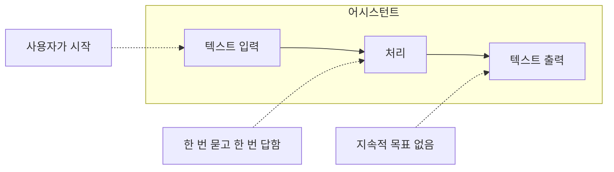

 # 범용 어시스턴트: 모델과 서비스의 구분

우리가 매일 쓰는 ChatGPT, Claude, Gemini. 이것들은 무엇일까요?

---

## 모델 ≠ 서비스

흔히 "GPT-4를 쓴다", "Claude를 쓴다"고 말합니다. 하지만 정확히 말하면, 우리가 쓰는 것은 모델이 아니라 서비스입니다.

| 구분 | 예시 | 설명 |
|------|------|------|
| 모델 | GPT-4, Claude 3.5, Gemini Pro | 학습된 인공 신경망 자체 |
| 서비스 | ChatGPT, claude.ai, Gemini | 모델 + 웹 UI + 기능들 |

자동차로 비유하면:
- 모델 = 엔진
- 서비스 = 완성된 자동차

같은 엔진이라도 어떤 차체에 넣느냐에 따라 스포츠카가 되기도, 트럭이 되기도 합니다. 마찬가지로 같은 모델이라도 서비스가 어떻게 감싸느냐에 따라 전혀 다른 사용자 경험이 됩니다.

---

## 세 가지 범용 어시스턴트

### ChatGPT (OpenAI)

가장 대중적인 AI 어시스턴트입니다.

- 가장 많은 사용자
- 플러그인/GPTs 생태계
- 이미지 생성(DALL-E), 음성 대화 통합

### Claude (Anthropic)

안전성과 장문 처리에 강점이 있습니다.

- 긴 컨텍스트 윈도우
- 코드 작성에 강함
- "Constitutional AI" 기반 안전성

### Gemini (Google)

구글 생태계와 통합된 어시스턴트입니다.

- 검색, 유튜브, 구글 독스 연동
- 멀티모달(텍스트+이미지+영상)
- Android와 Chrome 통합

---

## 아직 에이전트는 아니다

이 세 서비스는 최근 점점 "에이전틱"해지고 있습니다. 웹 검색, 코드 실행, 파일 분석 등의 기능이 추가되었죠. 당연히 에이전트로 진화하겠지만 아직은 어시스턴트입니다.

에이전트와의 차이는 Part 3에서 자세히 다루겠습니다. 여기서는 "우리가 쓰는 ChatGPT는 아직 에이전트가 아니다"라는 점만 기억하면 됩니다.

---

## 핵심 정리

| 구분 | 내용 |
|------|------|
| 모델 | 학습된 신경망 (엔진) |
| 서비스 | 모델 + UI/UX + 기능 (완성차) |
| 어시스턴트 | 질문-답변 패턴, 사용자 주도 |
| 에이전트 | 목표 지향, 자율적 행동 (Part 3에서) |

---

작성일: 2026-01-07
Chapter: Part 2, Chapter 1
키워드: 모델, 서비스, ChatGPT, Claude, Gemini, 어시스턴트

---
<!-- LLM Context Anchor -->
**핵심 요약**: 모델과 서비스는 다르다. GPT-4는 엔진이고, ChatGPT는 완성차다. ChatGPT, Claude, Gemini는 범용 어시스턴트이며, 점점 에이전틱해지고 있지만 아직 에이전트는 아니다. 핵심 구분: 어시스턴트는 질문-답변 패턴·사용자 주도, 에이전트는 목표 지향·자율적 행동.

**키워드**: `모델vs서비스` `범용어시스턴트` `ChatGPT` `Claude` `Gemini` `에이전틱`
