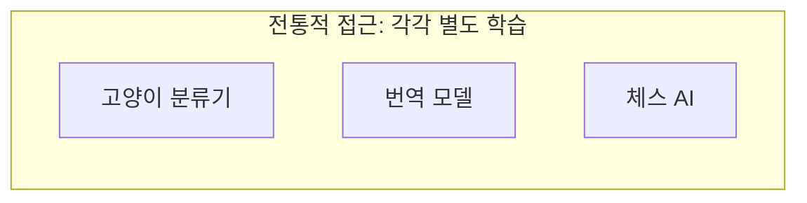
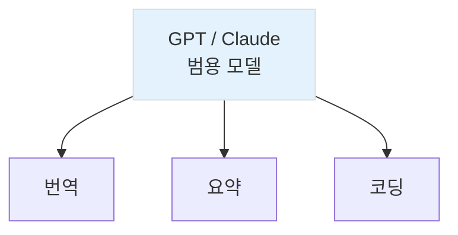
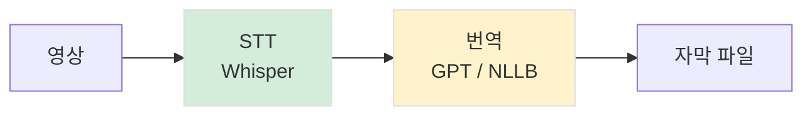

AI 서비스들을 이해하려면 두 가지 개념이 필요합니다: 파운데이션 모델과 Task.

---

## 파운데이션 모델이란

### 전통 AI vs 파운데이션 모델

과거의 AI는 특정 목적을 위해 만들어졌습니다.

*Figure 22-1. 전통적 AI: 목적별로 별도 모델*

파운데이션 모델은 다릅니다. 하나의 거대한 모델이 여러 가지 일을 합니다.

*Figure 22-2. 파운데이션 모델: 하나의 범용 모델*

핵심 차이는 범용성입니다. 새로운 Task를 하려면 새 모델을 만들 필요 없이, 프롬프트만 바꾸면 됩니다.

### 파운데이션 모델 기반 서비스들

| 도메인 | 서비스 예시 | 핵심 모델 |
|--------|-------------|-----------|
| 텍스트 | ChatGPT, Claude | GPT-4, Claude 3 |
| 이미지 생성 | Midjourney, DALL-E | 확산 모델 기반 |
| 영상 생성 | Sora, Runway | 비디오 확산 모델 |
| 음성 | ElevenLabs, 헤이젠 | 음성 합성 모델 |
| 음악 | Suno, Udio | 음악 생성 모델 |

---

## Task라는 개념

### 모델 이름보다 Task가 중요하다

"GPT-4가 좋아요, Claude가 좋아요?"

이 질문보다 더 중요한 질문이 있습니다: "어떤 Task를 하려고 하는데요?"

Task는 AI가 수행하는 구체적인 작업 유형입니다.

### 주요 Task 분류

텍스트 (NLP)
| Task | 설명 | 예시 |
|------|------|------|
| Summarization | 요약 | 긴 글 → 핵심 3줄 |
| Translation | 번역 | 한국어 → 영어 |
| QA | 질의응답 | 질문 → 답변 |
| Classification | 분류 | 이메일 → 스팸/정상 |

이미지 (CV)
| Task | 설명 | 예시 |
|------|------|------|
| Detection | 객체 탐지 | 사진에서 사람 찾기 |
| OCR | 문자 인식 | 영수증 → 텍스트 |
| Generation | 이미지 생성 | 텍스트 → 그림 |

오디오
| Task | 설명 | 예시 |
|------|------|------|
| STT | 음성→텍스트 | 녹음 파일 → 스크립트 |
| TTS | 텍스트→음성 | 텍스트 → 음성 파일 |

### Task 그래프 읽기

AI 제품을 이해한다는 것은 Task 그래프를 읽는다는 뜻입니다.

*Figure 22-3. Task 그래프 예시: 유튜브 자동 자막*

유튜브 자동 자막 서비스 예시

복잡해 보이는 AI 서비스도 결국 여러 Task의 조합입니다. 이 조합을 읽을 수 있으면, 새로운 서비스를 이해하거나 직접 만들 수 있게 됩니다.

---

## 핵심 정리

| 개념 | 설명 |
|------|------|
| 파운데이션 모델 | 하나의 범용 모델로 여러 Task 수행 |
| Task | AI가 수행하는 구체적 작업 유형 |
| Task 그래프 | 여러 Task를 연결한 파이프라인 |

다음 챕터에서는 실제 AI 프로덕트들이 어떤 Task로 구성되어 있는지 분석해 보겠습니다.

---

작성일: 2026-01-07
Chapter: Part 2, Chapter 2
키워드: 파운데이션 모델, Task, NLP, CV, STT, TTS

---
<!-- LLM Context Anchor -->
**핵심 요약**: 파운데이션 모델은 하나의 범용 모델로 여러 Task를 수행한다. 새로운 Task를 위해 새 모델을 만들 필요 없이 프롬프트만 바꾸면 된다. AI 서비스를 이해한다는 것 = Task 그래프를 읽는다는 것. 복잡해 보이는 서비스도 결국 여러 Task(STT, 번역, 요약 등)의 조합이다.

**키워드**: `파운데이션모델` `Task` `Task그래프` `범용성` `NLP` `STT` `TTS`
