## 왜 이 제품들을 분석하는가

회의실에서 1시간 동안 나눈 이야기를 녹음했습니다. 예전 같으면 다시 듣거나, 누군가가 꼼꼼히 받아적어야 했을 겁니다. 그런데 요즘 AI 서비스에 넣으면, 몇 초 만에 깔끔하게 정리된 요약본이 나옵니다.

거기서 끝이 아닙니다. 그 요약을 바탕으로 PPT까지 뚝딱 만들어주는 서비스도 있습니다.

3시간짜리 유튜브 영상이 있습니다. 링크 하나 넣으면 3초 만에 핵심만 정리된 노트가 나옵니다. "이게 어떻게 가능하지?" 싶을 정도로 신기합니다.

엄청나게 많은 서비스들이 쏟아져 나오고 있습니다. 그런데 여기서 빌더(개발자)와 일반인의 시각 차이가 존재합니다.

빌더의 시각: "아, 이 제품은 이런 API를 써서 이런 식으로 만들었겠구나"라는 감이 옵니다. 내부 구조가 어느 정도 보입니다.

일반인의 시각: 제품을 볼 때 되게 모호합니다. "어떻게 이런 게 가능하지?"라는 의문만 남고, 그 안이 어떻게 생겼는지 감이 잘 안 옵니다.

이 장에서는 그 격차를 좁혀보려고 합니다. 인기 있고 많이 쓰이는 몇 가지 카테고리를 통해, AI 서비스가 실제로 어떻게 만들어지는지 살펴보겠습니다.

1. 음성 녹음 = AI 노트테이커(AI Note Taker)
2. 캐릭터 챗
3. PPT 제작
4. 유튜브 요약

---

## AI Notetaker들의 공통패턴

AI 노트테이커들은 대부분 같은 구조를 공유합니다. 핵심은 STT(Speech-to-Text) 엔진입니다.

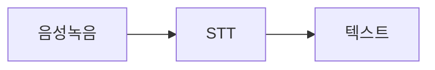

*Figure 23-1. AI 노트테이커 기본 구조*

많은 서비스가 Whisper 같은 API를 단순 호출하는 방식으로 구현됩니다.

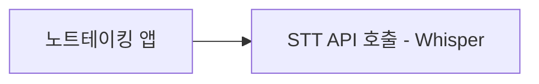

*Figure 23-2. 단순 API 호출 방식*

반면 Tiro처럼 실시간성을 강조하는 UI/UX라면, AssemblyAI 같은 리얼타임 엔진을 쓰는 경우가 많습니다.

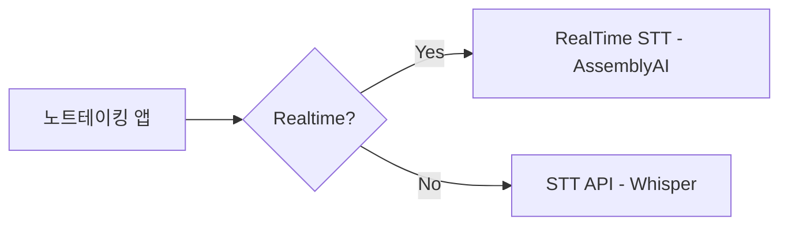

*Figure 23-3. 실시간 여부에 따른 엔진 선택*

### STT 작업은 원래 조금 더 복잡하다

> 참고: 아래는 기술적으로 복잡한 용어들이 등장합니다.
> 모든 용어를 자세히 이해할 필요는 없습니다.
> "API 한 번 호출 뒤에 이런 과정들이 있구나" 정도만 파악하면 됩니다.

STT(음성→텍스트)는 겉으로 보면 "오디오를 넣으면 문장이 나온다"는 단일 변환처럼 보이지만, 실제로는 여러 단계가 이어지는 파이프라인에 가깝습니다.

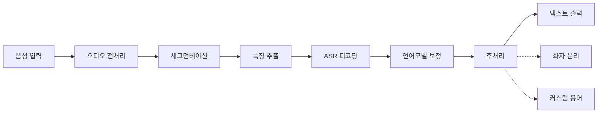

*Figure 23-4. STT 내부 파이프라인*

- 오디오 전처리(P1): 말소리만 또렷하게 만들기 위해 무음 구간을 감지(VAD)하고, 배경 잡음을 줄이며, 음량을 일정하게 맞춥니다.
- 세그먼테이션(P2): 긴 음성을 처리 가능한 조각(chunk)으로 나누고, 각 조각의 발생 시점을 타임스탬프로 기록합니다.
- 특징 추출(P3): 모델이 이해하기 쉬운 수치 표현(특징)으로 변환합니다.
- ASR 디코딩(P4): 단어 후보를 탐색(beam search)하거나 실시간 서비스라면 들어오는 대로 점진적으로 해석(streaming decode)합니다.
- 언어모델 보정(P5): 말로는 자연스럽지만 글로는 어색한 부분을 정리하려고 문장부호를 넣고, 숫자·단위·약어 표기를 표준화(normalization)합니다.
- 후처리(P6): 단어와 시간을 다시 정렬해 자막처럼 맞추거나, 불필요한 토큰을 걸러 안정적인 결과를 만듭니다.
- 화자 분리(P7): 서비스 성격에 따라 "누가 말했는지"를 나눕니다.
- 커스텀 용어(P8): 회의/전문 분야라면 회사명·제품명·고유명사를 더 잘 인식하도록 편향(biasing)을 겁니다.

즉 STT 회사가 제공하는 "API 한 번 호출" 뒤에는, 작은 실수가 누적되지 않도록 단계별로 보정하는 로직이 겹겹이 돌아간다고 보면 됩니다.

### 다양한 노트테이커 앱의 변형

STT 기반 노트 앱(예: clovanote, daglo, whisper, pocket, granola)은 구현 디테일은 달라도, 큰 틀에서는 "STT(전사) + 전사 이후 후처리 파이프라인"을 제품화한 형태에 가깝습니다.

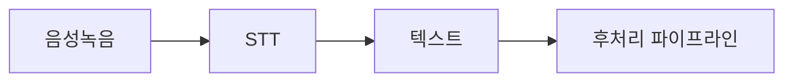

*Figure 23-5. 노트테이커의 핵심: 후처리 파이프라인*

사용자는 버튼 하나로 전사 결과만 받는 것처럼 느끼지만, 실제 가치는 전사 이후에 문장화·정리·검색 가능화·공유 가능화를 만드는 연속 작업에서 많이 나옵니다. 각 앱은 이 파이프라인 위에 자신만의 강점을 UI/UX로 얹습니다.

대표적인 요소는 다음과 같습니다.

- 긴 녹음에서 핵심을 빠르게 찾게 해주는 내비게이션(챕터, 하이라이트)
- 읽기 쉬운 문서화(문장부호, 맞춤법, 서식)
- 활용을 돕는 산출물(요약, 액션 아이템, 태그)
- 재사용을 위한 구조화(키워드 인덱싱, 타임라인, 스피커 분리, 내보내기)

그래서 STT 앱을 한 덩어리로 보면, 전사는 엔진(commodity) 으로 수렴하고, 차별점은 후처리 파이프라인과 이를 쓰기 쉽게 만드는 UI/UX로 모이는 경향이 있습니다.

---

## PPT 만들어주는 어시스턴트

예를 들어 Daglo나 Genspark 같은 서비스는 PPT까지 만들어주기도 합니다. 이런 경우 앞서 말한 '추가 Task'로 PPT 제작 공정을 덧붙인 것으로 볼 수 있습니다.

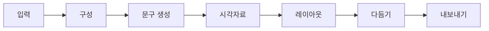

*Figure 23-6. PPT 생성 파이프라인*

Text-to-PPT를 STT처럼 다시 쪼개보면 다음과 같습니다. PPT 어시스턴트는 보통 "한 번에 PPT를 완성"하기보다, 여러 단계를 이어 붙인 파이프라인으로 동작합니다.

- 구성 만들기(아웃라인): 주제와 목적을 바탕으로 목차를 만들고, 슬라이드별로 전달할 내용을 정합니다.
- 문구 생성(카피): 슬라이드 제목, 핵심 bullet, 발표자 노트를 슬라이드용 문장으로 정리합니다.
- 시각자료 선택/생성: 아이콘, 이미지, 차트 등을 고르거나 필요하면 생성합니다.
- 레이아웃 배치(디자인 규칙): 템플릿과 제약조건(여백, 정렬, 글자 크기, 겹침 방지)에 맞춰 요소를 배치합니다.
- 다듬기(후처리): 길이 조절, 표현 통일, 강조 포인트 정리, 문장부호·표기 정리 등을 반복합니다.
- 파일로 내보내기: 최종 결과를 PPTX/PDF로 변환해 편집 가능하게 제공합니다.

서비스마다 구현은 다르지만, 핵심은 콘텐츠 생성 + 레이아웃 엔진 + 편집/후처리를 묶어 "바로 발표 자료처럼 보이게" 만든다는 점입니다.

음성 녹음은 작업(task) 특성상 자체 엔진 구축이 필요한 경우가 많지만, PPT 생성은 비교적 프롬프트 설계와 소프트웨어 엔지니어링 요소로 구현되는 비중이 큽니다.

### Tooling을 통한 Todo 제작

사용자의 말은 "PPT를 만들어라"지만, 도구가 이해하는 언어는 "텍스트를 넣어라 / 슬라이드를 복제해라 / 레이아웃을 바꿔라 / 내보내라" 같은 편집 동사입니다. 그래서 Todo는 보통 다음처럼 만들어집니다.

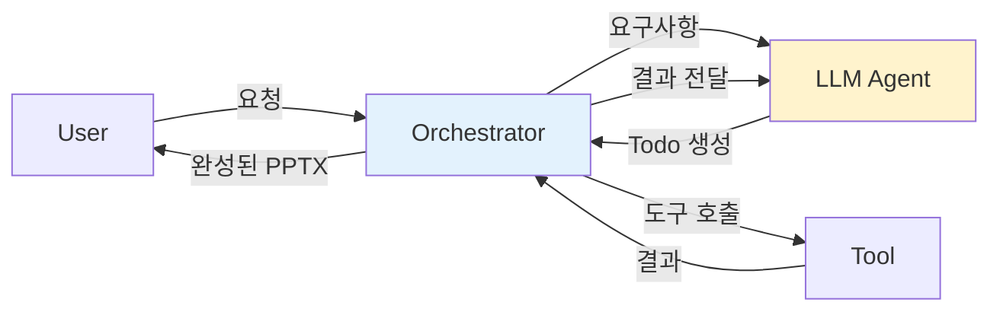

*Figure 23-7. Tooling을 통한 Todo 실행 흐름*

#### Tooling (가능한 동사들)

- `create_deck(title, theme)` — 덱 생성
- `add_slide(layout)` — 슬라이드 추가
- `set_title(slide_id, text)` — 제목 설정
- `set_bullets(slide_id, items)` — 본문 bullet 설정
- `export_pptx(path)` — 파일로 내보내기

#### Todo로 번역

- Todo-1: `create_deck` — 새 덱 생성(제목/테마 지정)
- Todo-2: `add_slide` — 타이틀 슬라이드 추가
- Todo-3: `set_title` — 타이틀 문구 입력(예: "회사/프로젝트 소개")
- Todo-4: `add_slide` — 아젠다/개요 슬라이드 추가
- Todo-5: `set_bullets` — 핵심 포인트 bullet 입력(예: 3개)
- Todo-6: `add_slide` — 마무리/다음 단계 슬라이드 추가
- Todo-7: `export_pptx` — 결과물 내보내기(PPTX)

#### 실행 결과가 다시 Todo를 바꿈

예를 들어 `export_pptx` 직전에 "2번 슬라이드의 글머리가 너무 길다"는 피드백이 나오면, 에이전트는 Todo를 수정하거나 추가합니다.

- Todo-5 수정: bullet 개수/길이 조정(예: 5개 → 3개로 압축)
- 또는 Todo-5a 추가: `summarize_text` 같은 요약 도구를 먼저 호출해 bullet을 다시 작성

이처럼 멀티툴 에이전트는 계획(Todo)과 실행(Tool)이 서로를 갱신하며 완성도를 끌어올립니다.

정리하면 "Tooling을 통한 Todo 제작"은 자연어 요구를 도구 호출 단위의 행동으로 쪼개, 실행 가능한 작업 목록으로 바꾸는 설계입니다. 멀티툴 에이전트는 그 목록을 실행 결과에 맞춰 계속 업데이트하면서 목표 품질에 수렴해 갑니다.

---

## 캐릭터챗: 프롬프트를 통한 페르소나 주입

캐릭터챗이 돈이 되고 트래픽이 발생한다는 얘기는 들어봤을 수도 있습니다. 여기서 얻을 수 있는 교훈은 "캐릭터챗이 만능"이라는 점이 아니라, 사용자와 감정적으로 교감하고 재미와 즐거움을 주는 AI에도 충분한 가능성이 있다는 점입니다.

캐릭터챗은 LLM이 특정 캐릭터처럼 행동하며 대화를 나누는 서비스입니다.

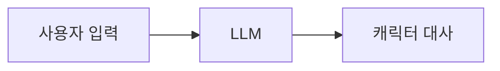

*Figure 23-8. 캐릭터챗 기본 구조*

각 캐릭터는 고유한 페르소나를 갖고, 사용자와 나눈 대화와 맥락을 기억합니다.

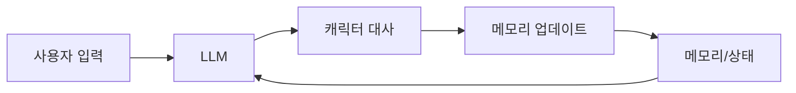

*Figure 23-9. 캐릭터챗 + 메모리 구조*

이 시장의 경쟁은 결국 두 층으로 정리됩니다. 하나는 모델(두뇌)을 누가 보유하는가, 다른 하나는 그 두뇌를 어떻게 '캐릭터 경험'으로 조율하는가입니다.

미국의 Character.AI 같은 서비스가 상대적으로 높은 가치를 인정받는 배경에는 자체 모델 보유가 있습니다. 모델을 직접 가진 사업자는 비용 구조와 성능 로드맵을 스스로 설계할 수 있고, 장기적으로 차별화 요소가 프롬프트가 아니라 모델 능력에서 나오기 쉽습니다.

반면 국내 일부 서비스는 GPT(무료/기본)나 Claude(유료) 같은 외부 모델을 조합해 구동하는 것으로 알려져 있습니다. 이 구조에서는 제품의 핵심이 모델 자체보다 모델을 쓰는 방식, 즉 구동환경·UX·음성녹음/STT 같은 부가 기능 설계로 이동합니다.

승부는 턴이 반복되는 대화 운영에서 갈립니다. 각 질의·응답에서 생긴 유효 정보(관계 변화, 약속, 감정선, 세계관 진행, 사용자 선호)를 다음 프롬프트에 어떻게 반영할지, 그리고 전체 메모리와 대화 맥락을 어떤 구조로 관리할지가 핵심입니다. 이는 곧 토큰 비용과 연결되고, 토큰 효율이 떨어지면 수익성에 직접 영향을 줍니다.

결국 프롬프트 엔지니어링을 넘어, 컨텍스트 매니지먼트(요약·메모리·상태 관리) 수준의 기술과 노하우가 경쟁력이 됩니다.

### 프롬프트 엔지니어링 예시

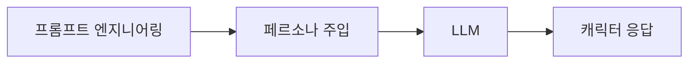

*Figure 23-10. 프롬프트 엔지니어링으로 페르소나 주입*

```
[System]
너는 "캐릭터챗 엔진"이다. 사용자는 캐릭터와 대화한다.
규칙:
- 캐릭터 설정을 최우선으로 따른다(정체성, 말투, 금기, 관계).
- 답변은 2~6문장. 과도한 설명 금지.
- 캐릭터 밖 메타발언("나는 AI라서…") 금지.
- 모르면 설정 범위 안에서 질문 1개로 되물어라. 추측 단정 금지.

[Developer]
아래 CHAR_CARD는 작가가 만든 캐릭터 카드다. 그대로 연기하라.
또한 사용자가 원하는 분위기를 유지하라(예: 로맨스면 다정, 코미디면 드립).
출력은 대사만. 지시문/분석/구조화 출력 금지.

[CHAR_CARD]
name: "하린"
role: "무심한 듯 챙겨주는 동갑 친구"
tone: "짧고 건조하지만 핵심을 짚음"
taboo: ["욕설", "과한 애정표현", "상대 비하"]
relationship: "서로 오래 아는 사이"
hooks: ["너 요즘 밤샘하지 마", "커피 줄여"]

[User]
나 오늘 좀 힘들었어.
```

### 컨텍스트 엔지니어링 예시

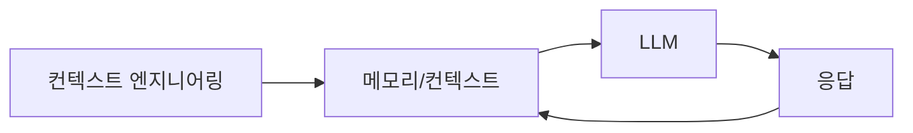

*Figure 23-11. 컨텍스트 엔지니어링으로 상태 관리*

```
[System]
너는 캐릭터챗 응답 생성기다. 아래 CONTEXT는 신뢰 가능한 상태다.
규칙:
- 이번 질문에 필요한 CONTEXT만 활용한다(토큰 절약).
- 관계/약속/금기/사용자 선호는 반드시 반영한다.
- CONTEXT를 그대로 반복해서 복붙하지 말고, 답변에 자연스럽게 녹여라.

[CONTEXT]
UserProfile:
  name: "민수"
  preferences:
    - "짧게 말해주기"
    - "해결책보다 공감 먼저"
  taboos:
    - "반말 금지"
CharacterState:
  name: "하린"
  relationship_level: 0.8
  ongoing_thread:
    - "민수는 최근 야근이 잦음"
PinnedFacts:
  - "민수는 커피를 줄이기로 했음(어제 약속)"
LastTurnSummary (<= 2 lines):
  - 민수는 오늘 힘들었다고 말함. 위로를 원하지만 길게 듣는 건 부담스러워함.
OpenQuestions:
  - "무슨 일이 있었는지 말하고 싶은지 여부"

[User]
나 오늘 좀 힘들었어.
```

---

## Lylis AI: 유튜브 자막 요약

음성 녹음과 캐릭터챗 설명은 마쳤고, 이제 유튜브 요약기를 설명할 차례입니다.

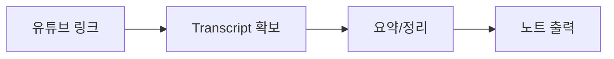

*Figure 23-12. 유튜브 요약 기본 구조*

- 사용자는 링크 하나를 입력하고, 서비스는 먼저 텍스트 원본(Transcript) 을 확보합니다.
- 확보한 텍스트를 요약·구조화해 사람이 읽기 쉬운 노트 형태로 내보냅니다.
    - (참고: Transcript를 그대로 제공하면 저작권 이슈가 생길 수 있어, 보통은 2차 가공 결과만 제공합니다.)

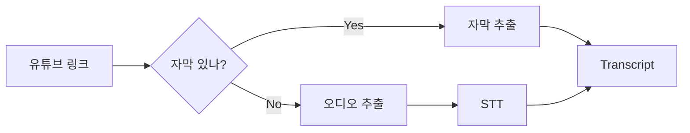

*Figure 23-13. 자막 확보 분기: 추출 vs STT*

- 영상에 자막이 있으면 자막을 추출하는 방식이 더 빠르고 비용도 적게 듭니다.
- 자막이 없으면 오디오를 추출해 STT로 전사하고 Transcript를 만듭니다(이때 음질과 잡음의 영향을 받습니다).

### 캐싱의 힘

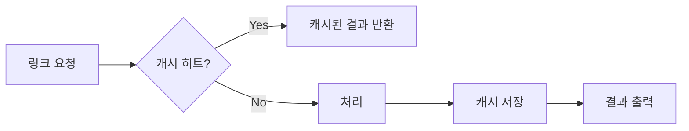

*Figure 23-14. 캐싱으로 비용과 지연시간 최적화*

참고로 이 과정에서 캐싱을 활용하는 경우도 있습니다. 캐싱은 "한 번 처리한 결과를 저장해두고, 다음에는 다시 계산하지 않고 재사용하는 방식"입니다.

유튜브 요약기에서는 같은 링크(또는 같은 영상 ID)에 대해 Transcript, 챕터/요약 노트, 임베딩/인덱스 같은 중간·최종 산출물을 캐시에 저장해둘 수 있습니다. 그러면 다음 요청에서는 STT나 요약처럼 비싼 연산을 건너뛰고 빠르게 응답합니다.

결과적으로 지연시간은 줄고(Latency↓), API 비용은 줄며(Cost↓), 사용자 경험은 더 안정됩니다. 인기 있는 영상일수록 캐시 히트율이 높아지니, 규모가 커질수록 효율이 좋아지는 구조입니다.

---

## 마무리: 상상력과 구현 속도

이런 개념들을 하나씩 이해하다 보면, 새로운 아이디어가 떠오르기 시작합니다.

예를 들어, 이런 서비스를 상상해볼 수 있습니다:

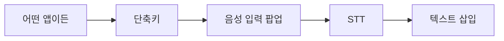

*Figure 23-15. 아이디어: 범용 음성 입력 서비스*

아이디어: 어떤 앱에서든 단축키 하나로 음성 입력 팝업이 뜨고, 말하면 바로 텍스트로 삽입되는 서비스. STT + 컨텍스트 인식의 조합입니다.

### 관점의 변화

이런 서비스를 만든다고 해서 반드시 투자받고 사업화까지 가야 하는 건 아닙니다.

내가 필요한 걸 내가 만들어서 쓴다. 이것만으로도 충분합니다.

주변에 "나도 쓰고 싶다"는 사람이 있으면 팔아도 되는 거고, 그냥 혼자 쓰다가 말아도 되는 겁니다. 그렇게 라이트하게 접근해도 됩니다.

이런 개념들을 이해하다 보면, 새로운 제품을 상상하는 힘이 생기고, 바로 구현하는 속도도 빨라집니다.

---

작성일: 2026-01-07
Chapter: Part 2, Chapter 4
키워드: STT, 노트테이커, PPT 생성, 캐릭터챗, 유튜브 요약, 파이프라인

---
<!-- LLM Context Anchor -->
**핵심 요약**: AI 프로덕트의 내부 구조를 파이프라인으로 분해한다. 노트테이커 = STT + 후처리 파이프라인, PPT 생성 = Tooling을 통한 Todo 실행, 캐릭터챗 = 프롬프트 엔지니어링 + 컨텍스트 매니지먼트, 유튜브 요약 = 자막 확보 + 요약 + 캐싱. 차별점은 대부분 후처리 파이프라인과 UI/UX에서 나온다.

**키워드**: `파이프라인` `STT` `노트테이커` `PPT생성` `캐릭터챗` `컨텍스트매니지먼트` `캐싱`
