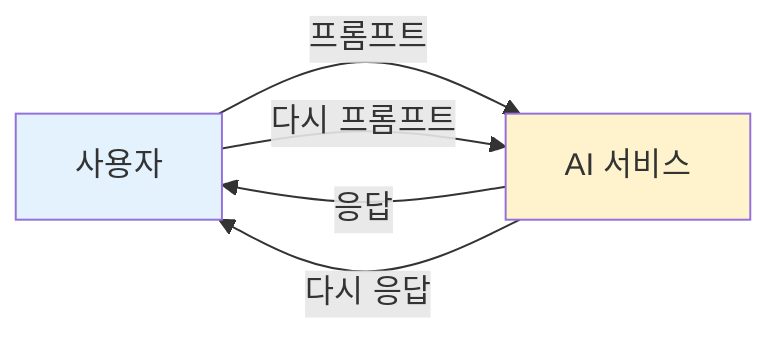
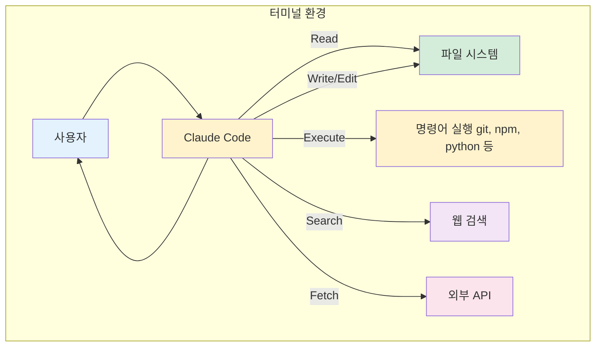
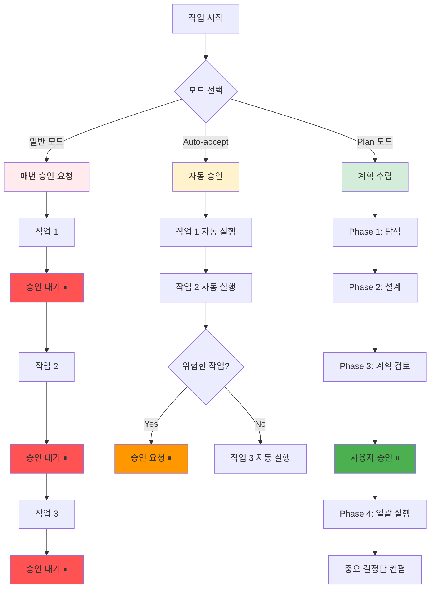
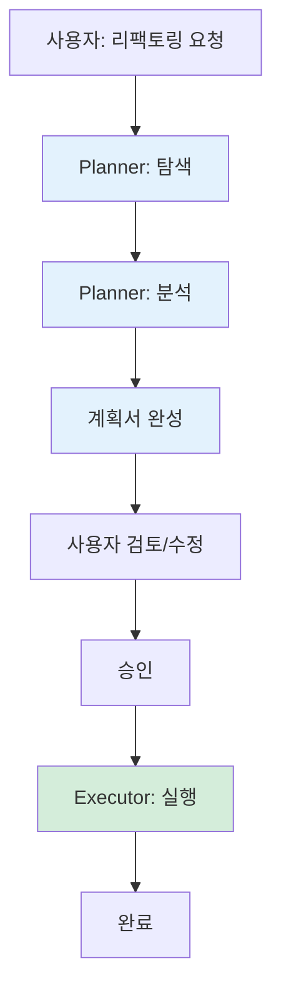
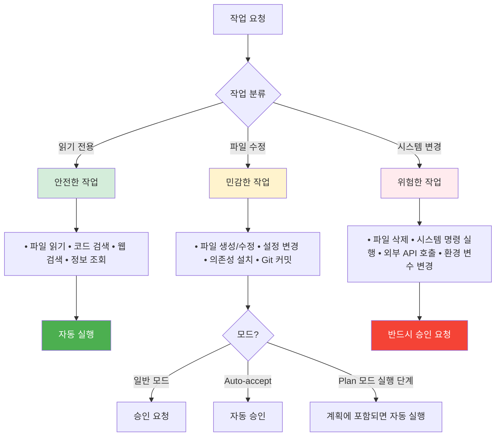

## 왜 ChatGPT는 쉬운데 Claude Code는 어려운가?

ChatGPT나 Midjourney 같은 AI 서비스를 사용하는 건 직관적입니다. 질문을 입력하면 답이 나오고, 프롬프트를 주면 이미지가 나옵니다. 사용자와 AI 사이의 단순한 주고받기. 구조가 명확합니다.

그런데 Claude Code 같은 에이전트 시스템을 처음 접하면 혼란스럽습니다. 터미널에서 실행해야 하고, Plan 모드니 Auto-accept니 하는 개념들이 나오고, 승인 요청이 뜨기도 하고 안 뜨기도 합니다. 도대체 이 시스템은 어떻게 돌아가는 걸까요?

이 혼란의 핵심은 구조의 복잡도 차이에 있습니다. ChatGPT는 단순 반복 구조지만, Claude Code는 외주 개발 업체처럼 작동합니다.

---

## 1. 단순 AI 서비스의 구조 (ChatGPT, Midjourney)

일반적인 AI 서비스는 매우 단순한 구조로 작동합니다:



*Figure 24-1. 단순 AI 서비스 구조: 질문-응답 반복*

특징:
- 사용자가 질문하면 AI가 답합니다
- 매번 사용자 입력을 기다립니다
- 상태가 거의 없습니다 (대화 히스토리만 유지)
- 실행 권한이 없습니다 (텍스트/이미지만 생성)

장점: 직관적이고 안전합니다
단점: 복잡한 작업을 자동화할 수 없습니다

---

## 2. 외주 개발 업체 비유: 왜 복잡한 구조가 필요한가?

상상해봅시다. 당신이 개발 외주를 맡긴다고 하면:

ChatGPT처럼 일하는 외주사:
```
당신: "회원가입 화면 만들어줘"
외주사: [5분 뒤] "여기요" (코드 전달)
당신: "비밀번호 확인 필드 추가해줘"
외주사: [3분 뒤] "여기요" (코드 전달)
당신: "비밀번호 강도 체크도 넣어줘"
외주사: [10분 뒤] "여기요" (코드 전달)
```
→ 매번 당신의 지시를 기다립니다. 비효율적입니다.

외주 개발 업체처럼 일하는 방식:
```
1. 요구사항 논의 (2일)
   - 회원가입 플로우 전체 설계
   - 비밀번호 정책, 이메일 인증, 소셜 로그인 등
   - 예외 케이스, 보안 요구사항

2. 기획서 작성 및 승인 (1일)
   - 개발 범위 확정
   - 일정 및 비용 산정
   - 계약 체결

3. 개발 진행 (2주)
   - 외주사가 자율적으로 개발
   - 중요한 결정만 컨펌 요청

4. 중간 검토 및 최종 인수 (3일)
```
→ 한 번의 논의로 여러 작업을 자율적으로 처리합니다. 효율적입니다.

핵심 차이:
- 단순 AI: 매번 지시 → 실행 → 대기
- 에이전트: 계획 수립 → 승인 → 자율 실행 → 필요시 컨펌

개발 중 수정의 비용:
- 계획 단계에서 수정: 비용 낮음 (문서만 고치면 됩니다)
- 개발 완료 후 수정: 비용 높음 (코드 뜯어고쳐야 합니다)

Claude Code의 Plan 모드 = 외주사의 기획 단계
- 충분히 논의하고 계획을 세웁니다
- 사용자가 승인하기 전까지는 실행하지 않습니다
- 수정 비용이 낮습니다

---

## 3. Claude Code의 구조: 왜 터미널에서 실행하나?



*Figure 24-2. Claude Code 구조: 파일 시스템과 명령어 실행*

터미널에서 실행하는 이유:

1. 파일 시스템 접근: 코드 파일을 읽고 쓰고 수정할 수 있어야 합니다
2. 명령어 실행: `git commit`, `npm install`, `pytest` 같은 개발 도구를 실행해야 합니다
3. 도구 사용: 검색, API 호출, LSP (Language Server Protocol) 같은 도구를 사용해야 합니다

ChatGPT와의 차이:
- ChatGPT: 브라우저에서 실행, 텍스트만 생성
- Claude Code: 터미널에서 실행, 실제 작업을 수행

---

## 4. 세 가지 모드: 승인 빈도와 타이밍의 차이

Claude Code는 세 가지 모드로 작동할 수 있습니다:



*Figure 24-3. 세 가지 모드 비교: 승인 빈도와 타이밍*

일반 모드:
- 매 작업마다 승인 요청
- 가장 안전하지만 가장 느립니다
- 단순 작업에는 과도한 개입

Auto-accept 모드:
- 대부분의 작업 자동 실행
- 위험한 작업(시스템 명령, 외부 API)만 승인 요청
- 빠르지만 실수 위험 존재

Plan 모드:
- 계획 수립 → 승인 → 실행
- 수정 비용이 낮습니다 (계획 단계에서 수정)
- 복잡한 작업에 최적

---

## 5. Plan 모드 심층: 24시간 계획 → 30일 후 답변

Plan 모드는 계획과 실행을 분리합니다. 이는 극단적인 시나리오도 가능하게 만듭니다:



*Figure 24-4. Plan 모드 심층: 계획과 실행의 분리*

극단적 예시가 말하는 것:
- 계획과 실행이 완전히 분리됩니다
- 계획 수립에 충분한 시간을 투자할 수 있습니다
- 실행 전까지는 비용이 거의 들지 않습니다 (수정 자유)
- 한 번 승인하면 자율적으로 실행합니다

현실적 활용:
- 대부분은 1시간 계획 → 즉시 승인 → 실행
- 복잡한 프로젝트: 하루 계획 → 다음날 검토 → 실행
- 극단적 사례: 일주일 계획 → 여러 번 논의 → 실행

---

## 6. 권한 요청 구조: 무엇이 위험하고 무엇이 안전한가?



*Figure 24-5. 권한 요청 구조: 안전-민감-위험 분류*

Auto-accept 모드에서도 요청하는 경우:
- `rm -rf` 같은 파괴적 명령
- `curl | bash` 같은 위험한 스크립트 실행
- AWS API 호출 같은 비용이 발생하는 작업
- 시스템 설정 변경

Plan 모드의 장점:
- 계획 단계에서 위험한 작업을 미리 식별
- 사용자가 계획서를 검토하며 위험 요소 파악
- 실행 단계에서는 계획에 포함된 작업만 수행

---

## 외주 개발과 비교하면

| 구분 | 외주 개발 | Claude Code Plan 모드 |
|------|----------|------------------------|
| 요구사항 수집 | 미팅, 이메일, 문서 | 대화형 프롬프트 |
| 기획 단계 | 기획서, 제안서 작성 | Plan 모드 (탐색 → 설계) |
| 승인 | 계약서 사인 | ExitPlanMode 승인 |
| 개발 | 외주사가 자율 개발 | Executor 자율 실행 |
| 중간 컨펌 | 주간 미팅 | 중요 결정만 승인 요청 |
| 수정 요청 | 추가 비용 발생 | 계획 단계는 무료, 실행 후는 비용 발생 |

외주 개발에서 배운 교훈:
- 개발 중에 요구사항을 바꾸면 비용이 큽니다
- 기획 단계에서 충분히 논의하는 게 중요합니다
- 개발자에게 자율성을 주는 게 효율적입니다

Claude Code Plan 모드가 이를 반영:
- 계획 단계에서 수정은 자유롭습니다 (토큰 비용만)
- 실행 단계에서 수정은 비쌉니다 (다시 실행 필요)
- 계획 승인 후에는 에이전트가 자율적으로 작동

---

## 결론: 복잡한 이유가 있습니다

ChatGPT가 직관적인 이유는 아무것도 실행하지 않기 때문입니다. 텍스트만 생성합니다. 안전하고 단순합니다.

Claude Code가 복잡한 이유는 실제 작업을 수행하기 때문입니다. 파일을 수정하고, 명령어를 실행하고, 외부 API를 호출합니다. 이런 권한을 가진 시스템은 당연히 더 복잡한 구조가 필요합니다.

Plan 모드의 가치:
- 외주 개발처럼 계획과 실행을 분리
- 수정 비용을 낮춤 (계획 단계에서 자유롭게 수정)
- 복잡한 작업을 체계적으로 관리
- 극단적으로는 24시간 계획 → 30일 후 실행도 가능

모드 선택 가이드:
- 간단한 질문/조회: 일반 모드
- 반복적인 코드 수정: Auto-accept 모드
- 복잡한 프로젝트/리팩토링: Plan 모드

> **[참고]** Claude Code의 설치와 실전 사용법은 [부록 A01]에서 자세히 다룹니다.

핵심 메시지:
에이전트 시스템의 복잡성은 단점이 아니라 실제 작업을 수행할 수 있는 능력의 증거입니다. 구조를 이해하면 훨씬 효율적으로 사용할 수 있습니다.

---

작성일: 2026-01-07
Chapter: 미분류
키워드: 에이전트 구조, Plan 모드, Claude Code, 권한 관리, 외주 개발 비유
상태: 미분류 (96)

---
<!-- LLM Context Anchor -->
**핵심 요약**: ChatGPT가 직관적인 이유는 아무것도 실행하지 않기 때문. Claude Code가 복잡한 이유는 실제 작업을 수행하기 때문. 외주 개발 비유: 계획 단계 수정은 비용 낮음, 실행 후 수정은 비용 높음. Plan 모드 = 계획과 실행 분리, 극단적으로 24시간 계획 → 30일 후 실행도 가능. 에이전트 시스템의 복잡성은 단점이 아니라 실제 작업 수행 능력의 증거.

**키워드**: `Plan모드` `ClaudeCode` `외주개발비유` `계획실행분리` `권한관리` `3가지모드`
