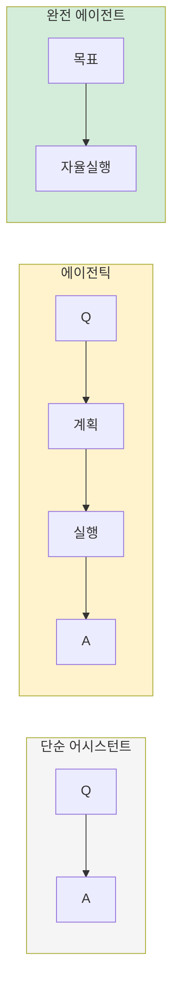
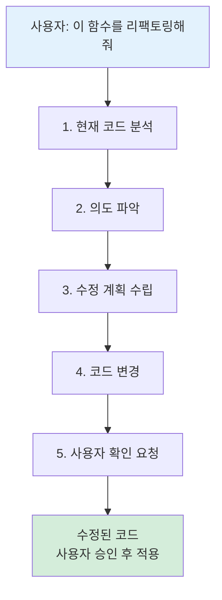

어시스턴트와 에이전트 사이에는 중간 단계가 있습니다. 에이전틱(Agentic) 어시스턴트입니다.

---

## 에이전틱 어시스턴트

### 에이전틱이란?

"에이전틱"은 "에이전트처럼 행동하는"이라는 뜻입니다. 완전한 에이전트는 아니지만, 단순 어시스턴트보다는 자율적입니다. (얼마나 에이전틱한가? 에 대해서는 '에이전트의 정의' 챕터에서 조금 더 명확히 다룰 예정입니다.)

비유로 이해하기:

| 유형 | 비유 | 예시 |
|------|------|------|
| 단순 어시스턴트 | 계산기 | "3+5는?" → "8" |
| 에이전틱 | 비서 | "내일 회의 준비해줘" → 일정 확인, 자료 정리, 알림 설정 |
| 완전 에이전트 | 매니저 | 스스로 문제를 발견하고 해결책을 실행 |

에이전틱 서비스는 사용자가 "시작" 버튼을 눌러야 움직이지만, 한 번 시작하면 여러 단계를 스스로 수행합니다.

*Figure 25-1. 단순 어시스턴트 → 에이전틱 → 완전 에이전트*

- 단순 어시스턴트: 한 번 묻고 답, 도구 없음
- 에이전틱: 여러 단계 수행, 도구 사용, 단 인간이 시작
- 완전 에이전트: 스스로 시작, 지속적 작동

### 대표 서비스들

| 서비스 | 특징 |
|--------|------|
| Genspark | 웹 검색 + 정보 종합 |
| Manus | 웹 브라우징 + 작업 수행 |
| Flowith | 워크플로우 기반 복합 작업 |
| V0 | UI 코드 생성 특화 |

이들의 공통점: 사용자가 요청하면 여러 단계를 거쳐 결과를 만들어냅니다. 하지만 여전히 사용자가 시작해야 하고, 작업이 끝나면 멈춥니다.

---

## 개발자 도구의 변화

### 개발자들이 먼저 변하고 있다

흥미로운 관찰이 있습니다. AI로 인한 직업 변화에서, 개발자들이 스스로를 먼저 대체하고 있습니다.

왜일까요? 개발자들은:
- 자동화를 좋아합니다
- 새 도구를 빨리 받아들입니다
- AI를 활용하는 데 기술적 장벽이 낮습니다

### 자동완성이란 무엇인가?

본격적으로 도구를 설명하기 전에, "자동완성"이 무엇인지 알아봅시다.

스마트폰에서 카카오톡을 칠 때, "안녕하" 까지 입력하면 "안녕하세요"가 추천되는 것을 본 적 있을 겁니다. 이게 자동완성입니다.

**일상에서의 자동완성**
- 검색창: "날씨" → "날씨 오늘", "날씨 내일", "날씨 주간"
- 메시지: "감사합" → "감사합니다"
- 이메일: "안녕하세요, 김" → "안녕하세요, 김 과장님"

코드 자동완성도 같은 원리입니다. 개발자가 코드를 몇 글자 입력하면, AI가 나머지를 추천합니다.

**코드 자동완성 예시**
- 개발자 입력: `function calculateTotal(`
- AI 추천: `function calculateTotal(items) { return items.reduce((sum, item) => sum + item.price, 0); }`

과거에는 개발자가 모든 코드를 한 글자씩 타이핑했습니다. 지금은 AI가 "아마 이걸 쓰려는 것 같은데요?" 하고 제안합니다.

### 코드 생성 도구들

| 도구 | 유형 | 특징 |
|------|------|------|
| GitHub Copilot | 자동완성 | 코드 작성 중 실시간 제안 |
| Cursor | AI IDE | 에디터 전체가 AI 통합 |
| Claude Code | CLI 에이전트 | 터미널에서 코드 수정/실행 |
| Codex | API | 개발자용 코드 생성 모델 |

### Copilot vs Cursor: 무엇이 다른가?

두 도구가 자주 비교됩니다. 간단히 설명하면:

GitHub Copilot은 "똑똑한 자동완성"입니다.
- 기존 에디터(VS Code 등)에 플러그인으로 설치
- 코드 작성 중 다음 줄을 제안
- Tab 키로 수락, 무시하면 넘어감

Cursor는 "AI가 내장된 에디터"입니다.
- 에디터 자체가 AI 중심으로 설계됨
- 채팅창에서 "이 함수 수정해줘" 라고 말할 수 있음
- 여러 파일을 동시에 수정 가능

**비유로 이해하기**
- Copilot = 옆에서 코드를 귀띔해주는 동료: "여기 이렇게 쓰면 어때?"
- Cursor = 같이 화면을 보면서 작업하는 동료: "전체적으로 이렇게 바꿔볼까?"

| 구분 | Copilot | Cursor |
|------|---------|--------|
| 방식 | 플러그인 | 독립 에디터 |
| 제안 단위 | 줄/블록 | 파일/프로젝트 |
| 대화 | 제한적 | 자연스러움 |

### 작동 방식

*Figure 25-2. Cursor 작동 방식: 분석 → 계획 → 수정 → 승인*

Cursor로 코드 작성하는 예시

---

## 어시스턴트 → 에이전트 전환점

개발자 도구들은 점점 더 "에이전틱"해지고 있습니다.

| 단계 | 도구 예시 | 사람의 역할 |
|------|----------|------------|
| 자동완성 | Copilot | 한 줄씩 검토/수락 |
| 블록 생성 | Cursor Composer | 변경사항 검토 |
| 작업 수행 | Claude Code | 결과물 검토 |
| 프로젝트 | Devin | 방향 설정만 |

아래로 갈수록 사람은 실행자에서 감독자로 바뀝니다.

이 패턴이 개발 분야에서 먼저 나타나고 있지만, 곧 다른 분야로 확산될 것입니다.

---

## 핵심 정리

| 개념 | 설명 |
|------|------|
| 에이전틱 | 에이전트처럼 행동하지만 완전한 에이전트는 아님 |
| 개발자 도구 | 자동완성 → 블록생성 → 작업수행 진화 중 |
| 전환 패턴 | 실행자 → 검토자 → 감독자로 역할 변화 |

---

작성일: 2026-01-07
Chapter: Part 2, Chapter 2.2
키워드: 에이전틱, 자동완성, Copilot, Cursor, Claude Code, 개발자 도구

---
<!-- LLM Context Anchor -->
**핵심 요약**: 에이전틱 = 에이전트처럼 행동하지만 완전한 에이전트는 아닌 중간 단계. 개발자들이 스스로를 먼저 대체하고 있다. Copilot = 똑똑한 자동완성, Cursor = AI가 내장된 에디터. 개발자 도구 진화: 자동완성 → 블록생성 → 작업수행 → 프로젝트. 아래로 갈수록 사람은 실행자에서 감독자로 변화.

**키워드**: `에이전틱` `Copilot` `Cursor` `ClaudeCode` `자동완성` `개발자도구진화`
