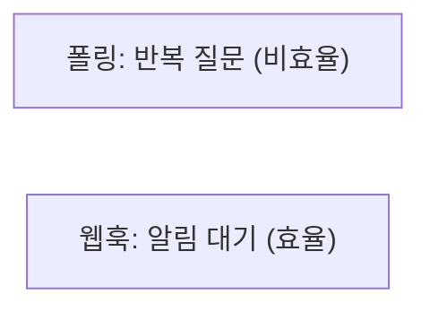
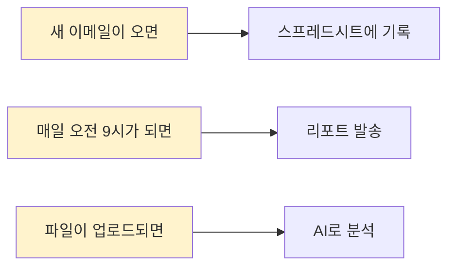
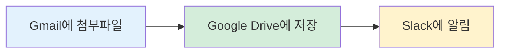
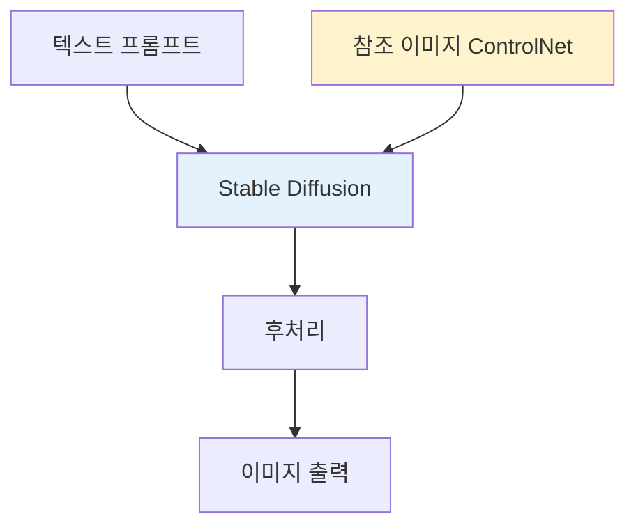
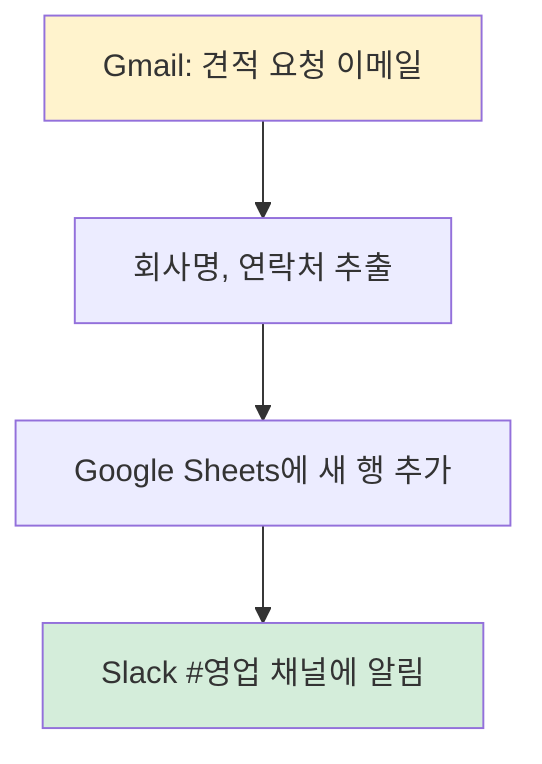
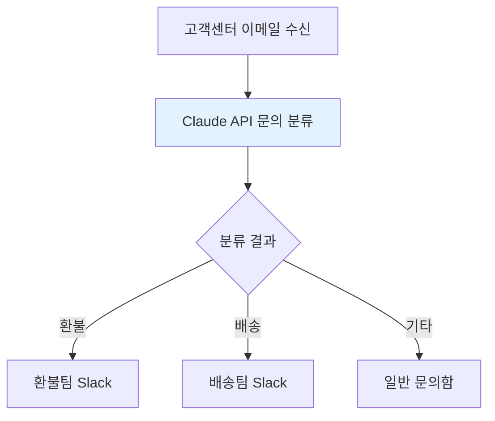

개발자가 아니어도 자동화를 할 수 있습니다. 바로 노코드(No-Code) 도구들 덕분입니다.

---

## 먼저 알아야 할 개념들

노코드 도구를 이해하려면 세 가지 개념을 알아야 합니다: API, 웹훅, 트리거.

### API란 무엇인가?

API는 프로그램들이 서로 대화하는 방법입니다.

*Figure 26-1. API 비유: 손님 → 웨이터 → 주방*

레스토랑에서 손님이 직접 주방에 들어가지 않듯이, 프로그램도 다른 서비스 내부에 직접 접근하지 않습니다. 대신 API라는 창구를 통해 요청하고 결과를 받습니다.

실제 예시:
- 날씨 앱이 기상청 API에 "서울 날씨 알려줘" 요청
- 배달 앱이 결제 API에 "10,000원 결제해줘" 요청
- Zapier가 Gmail API에 "새 메일 있어?" 요청

### 웹훅(Webhook)이란?

웹훅은 "일이 생기면 알려줘"입니다.

*Figure 26-2. 폴링(반복 질문) vs 웹훅(알림)*

API는 내가 물어봐야 답을 얻지만, 웹훅은 일이 생기면 상대방이 먼저 알려줍니다.

실제 예시:
- GitHub: "코드가 올라오면 내 서버로 알려줘"
- Stripe: "결제가 완료되면 알려줘"
- Slack: "메시지가 오면 알려줘"

### 트리거(Trigger)란?

트리거는 자동화를 시작하게 만드는 "방아쇠"입니다.

*Figure 26-3. 트리거(방아쇠) 예시*

노코드 자동화는 항상 이 구조입니다: "무엇이 일어나면(트리거), 무엇을 해라(액션)"

---

## 자동화의 두 가지 목적

노코드 자동화 도구는 크게 두 종류로 나뉩니다.

| 유형 | 목적 | 대표 도구 |
|------|------|-----------|
| SaaS 커넥터 | 기존 서비스들 연결 | Zapier, Make |
| AI 워크플로우 | AI 작업 자동화 | n8n, ComfyUI |

---

## SaaS 커넥터: Zapier, Make

### 무엇을 하는가

"A 서비스에서 무슨 일이 생기면, B 서비스에서 어떤 일을 해라"

*Figure 26-4. Zapier 자동화: Gmail → Drive → Slack*

Zapier 자동화 예시

코드 한 줄 없이, 마우스 클릭만으로 이런 자동화를 만들 수 있습니다.

### Zapier vs Make

| 구분 | Zapier | Make |
|------|--------|------|
| 난이도 | 쉬움 | 중간 |
| 유연성 | 단순 연결 | 복잡한 로직 가능 |
| 가격 | 비쌈 | 저렴 |
| 비유 | 레고 블록 | 회로 기판 |

---

## 워크플로우 빌더: n8n

### n8n의 특징

n8n은 자동화 + AI를 함께 다룰 수 있는 도구입니다.

- 오픈소스: 무료로 쓸 수 있음
- 셀프 호스팅: 내 서버에 설치 가능
- AI 노드: OpenAI, Claude 등 연동 가능

*Figure 26-5. n8n 워크플로우: 웹훅 → AI → 저장 → 알림*

n8n 워크플로우 예시

비개발자도 시각적으로 워크플로우를 만들 수 있습니다.

---

## 이미지 생성: ComfyUI

### 특수한 영역

ComfyUI는 이미지 생성에 특화된 노드 기반 도구입니다.

*Figure 26-6. ComfyUI 이미지 생성 파이프라인*

ComfyUI 워크플로우 예시

### 왜 ComfyUI인가

| Midjourney | ComfyUI |
|------------|---------|
| 간단히 쓰기 좋음 | 세밀한 제어 가능 |
| 웹 서비스 | 로컬 실행 |
| 프롬프트만 | 모델 조합, 파이프라인 |

복잡한 이미지 생성 파이프라인이 필요하면 ComfyUI를 고려해볼 만합니다.

---

## 실제 자동화 예시

### 예시 1: 이메일 → 스프레드시트

영업팀에서 자주 쓰는 자동화입니다.

*Figure 26-7. 실제 자동화: 이메일 → 스프레드시트 → 알림*

Zapier로 만든 자동화

이 자동화가 없다면? 담당자가 매일 이메일을 확인하고, 엑셀에 복사-붙여넣기 하고, 슬랙에 메시지를 보내야 합니다.

### 예시 2: AI를 활용한 자동화

n8n으로 만든 고객 문의 자동 분류입니다.

*Figure 26-8. AI 활용 자동화: 문의 자동 분류*

사람이 하루 100개의 문의를 분류하던 일을, AI가 자동으로 처리합니다.

---

## 노코드의 한계와 가능성

### 한계

- 복잡한 로직에는 한계가 있음
- 대용량 처리에 적합하지 않을 수 있음
- 플랫폼 의존성

### 가능성

- 개발자 없이도 자동화 시작 가능
- 프로토타입 빠르게 만들기
- 운영 업무 효율화

비개발자가 먼저 노코드로 시작하고, 필요하면 나중에 코드로 전환하는 것도 좋은 접근입니다.

---

## 핵심 정리

| 도구 | 용도 | 난이도 |
|------|------|--------|
| Zapier | SaaS 연결 | 쉬움 |
| Make | 복잡한 SaaS 연결 | 중간 |
| n8n | AI 워크플로우 | 중간 |
| ComfyUI | 이미지 생성 | 중상 |

---

작성일: 2026-01-07
Chapter: Part 2, Chapter 2.2
키워드: API, 웹훅, 트리거, 노코드, Zapier, Make, n8n, ComfyUI

---
<!-- LLM Context Anchor -->
**핵심 요약**: 개발자가 아니어도 자동화 가능. 핵심 개념: API(프로그램 간 대화), 웹훅(일 생기면 알려줘), 트리거(자동화 시작 방아쇠). 노코드 자동화 = "무엇이 일어나면, 무엇을 해라". 도구 분류: SaaS 커넥터(Zapier, Make) vs AI 워크플로우(n8n, ComfyUI). 비개발자가 노코드로 시작하고, 필요시 코드로 전환하는 것도 좋은 접근.

**키워드**: `API` `웹훅` `트리거` `노코드` `Zapier` `Make` `n8n` `ComfyUI`
