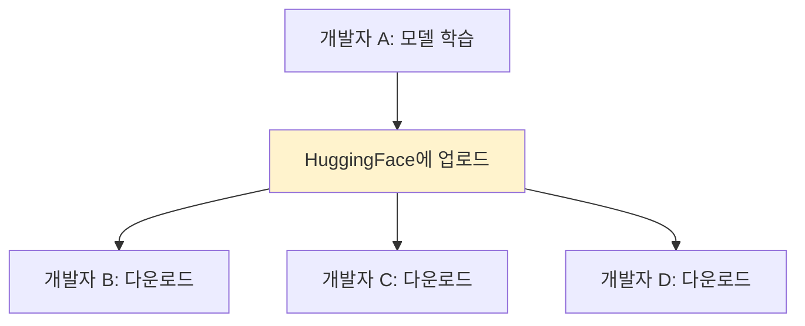
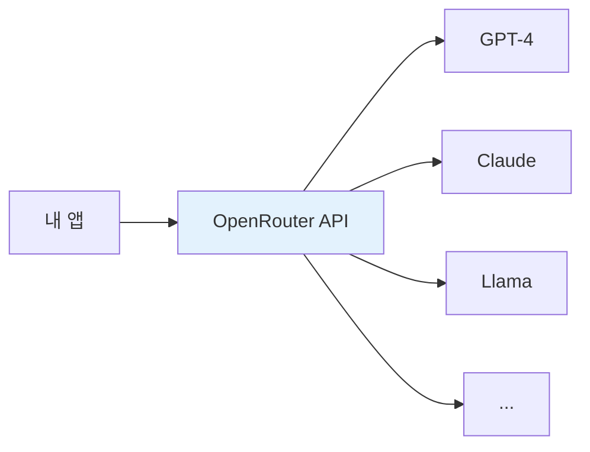
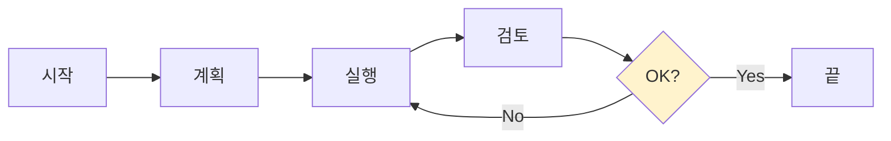
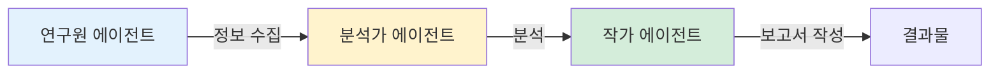
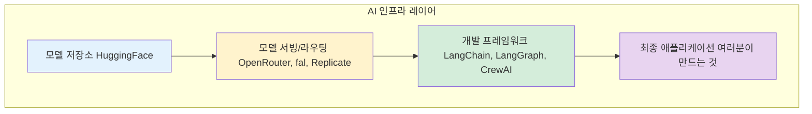

개발자들이 AI를 활용할 때 쓰는 인프라를 알아봅시다. 비개발자도 이 개념을 알면 AI 생태계가 더 잘 보입니다.

---

## 먼저 알아야 할 개념들

### 오픈소스란 무엇인가?

오픈소스는 누구나 볼 수 있도록 "설계도를 공개한" 소프트웨어입니다.

**비유: 요리 레시피**
- 비공개 (기업 비밀): 맥도날드 빅맥 소스 → 레시피 비공개, 따라 만들 수 없음
- 오픈소스 (공개): 백종원 레시피 → 유튜브에 공개, 누구나 따라 만들 수 있음

AI에서 오픈소스가 중요한 이유:

| 비공개 모델 | 오픈소스 모델 |
|-------------|---------------|
| GPT-4 | Llama |
| Claude | Mistral |
| API로만 사용 | 내 서버에 설치 가능 |
| 비용 계속 발생 | 초기 비용 후 무료 |
| 커스텀 어려움 | 원하는 대로 수정 가능 |

### 프레임워크 vs 라이브러리

두 용어가 비슷해 보이지만 다릅니다.

라이브러리(Library): 필요할 때 가져다 쓰는 "도구 상자"
- 내가 원할 때 꺼내 씀
- 내가 주도권을 가짐

프레임워크(Framework): 이미 만들어진 "집의 뼈대"
- 정해진 규칙을 따라야 함
- 프레임워크가 주도권을 가짐

**비유: 집짓기**
- 라이브러리 = 벽돌, 시멘트, 창문... 원하는 대로 조합해서 집을 지음. 내가 모든 것을 결정함
- 프레임워크 = 조립식 주택 뼈대. 이미 구조가 정해져 있음. 내가 결정하는 건 인테리어 정도

왜 프레임워크를 쓸까요? 바퀴를 다시 발명하지 않기 위해서입니다.

로그인 기능, 데이터 저장, 화면 표시... 이런 기본 기능을 매번 처음부터 만들면 시간 낭비입니다. 프레임워크를 쓰면 이런 기본은 해결되고, 진짜 중요한 기능에 집중할 수 있습니다.

---

## 모델 허브: HuggingFace

### GitHub 같은 AI 모델 저장소

HuggingFace는 AI 모델의 GitHub입니다.

- 수십만 개의 모델이 공개되어 있음
- 누구나 모델을 올리고 다운받을 수 있음
- 데이터셋, 데모(Spaces)도 공유

*Figure 27-1. HuggingFace: AI 모델의 GitHub*

HuggingFace의 역할

### 왜 중요한가

- 처음부터 학습하지 않아도 됨
- 검증된 모델을 바로 쓸 수 있음
- 커뮤니티가 모델을 개선함

---

## 모델 라우팅: OpenRouter, fal

### 문제: 어떤 모델을 어디서 쓸까?

AI 모델이 많아지면서 새로운 문제가 생겼습니다:
- GPT-4는 OpenAI에서
- Claude는 Anthropic에서
- Llama는 어디서?

### 해결: 통합 API

| 서비스 | 역할 |
|--------|------|
| OpenRouter | 여러 LLM을 하나의 API로 |
| fal | 이미지/비디오 모델 서빙 |

*Figure 27-2. OpenRouter: 하나의 API로 여러 모델*

OpenRouter 작동 방식 - 자동 라우팅

개발자는 하나의 API만 연동하면, 여러 모델을 쓸 수 있습니다.

---

## 프레임워크: LangChain, LangGraph, CrewAI

### LLM 애플리케이션을 위한 도구들

LLM으로 뭔가를 만들려면, 그냥 API만 호출하면 안 됩니다. 프롬프트 관리, 메모리, 도구 연결 등 여러 기능이 필요합니다.

| 프레임워크 | 특화 영역 |
|------------|----------|
| LangChain | LLM 앱 개발 전반 |
| LangGraph | 상태 기반 워크플로우 |
| CrewAI | 멀티 에이전트 협업 |

### LangChain

가장 널리 쓰이는 LLM 프레임워크입니다.

**LangChain이 제공하는 것**
- 프롬프트 템플릿 관리
- 메모리 (대화 기록)
- 도구 연결 (검색, API 등)
- 체이닝 (여러 단계 연결)

### LangGraph

LangChain 팀이 만든, 그래프 기반 워크플로우 도구입니다.

*Figure 27-3. LangGraph: 그래프 기반 워크플로우*

LangGraph 예시 - 복잡한 분기와 반복이 필요할 때 유용합니다.

### CrewAI

여러 에이전트가 협업하는 시스템을 쉽게 만들 수 있습니다.

*Figure 27-4. CrewAI: 멀티 에이전트 협업*

CrewAI 예시

---

## 인프라 지도

*Figure 27-5. AI 인프라 레이어 지도*

---

## 핵심 정리

| 개념 | 설명 | 예시 |
|------|------|------|
| 모델 허브 | 모델 공유 저장소 | HuggingFace |
| 라우팅 | 여러 모델을 하나의 API로 | OpenRouter |
| 프레임워크 | LLM 앱 개발 도구 | LangChain |

이 인프라들을 이해하면, "이 서비스는 어떻게 만들어졌을까?"라는 질문에 더 잘 답할 수 있게 됩니다.

---

작성일: 2026-01-07
Chapter: Part 2, Chapter 2.2
키워드: 오픈소스, 프레임워크, 라이브러리, HuggingFace, OpenRouter, LangChain, LangGraph, CrewAI

---
<!-- LLM Context Anchor -->
**핵심 요약**: AI 인프라 레이어 = 모델 저장소(HuggingFace) → 모델 서빙/라우팅(OpenRouter) → 개발 프레임워크(LangChain) → 최종 앱. 오픈소스 모델(Llama, Mistral)은 내 서버 설치, 커스텀 가능. 라이브러리 = 도구 상자(내가 주도), 프레임워크 = 집의 뼈대(규칙 따름). 이 인프라 이해하면 "이 서비스 어떻게 만들었을까?"에 답할 수 있다.

**키워드**: `HuggingFace` `OpenRouter` `LangChain` `LangGraph` `CrewAI` `오픈소스` `프레임워크`
