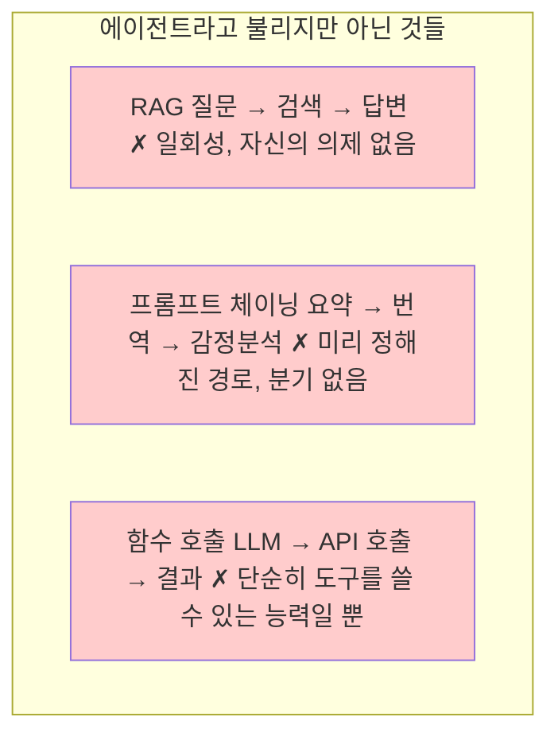

책의 핵심을 관통하는 키워드가 '에이전트'인 만큼, 정의는 살펴보고 넘어가도록 합시다.

2023년부터 '에이전트'라는 단어가 AI 업계를 휩쓸기 시작했습니다. LangChain, AutoGPT, BabyAGI... 수많은 프레임워크와 도구들이 쏟아져 나왔고, 모든 것이 '에이전트'라는 이름을 달았습니다.

그런데 정작 '에이전트가 뭔가요?'라고 물으면, 대답은 제각각입니다. 누군가는 'LLM이 도구를 쓰는 것'이라 하고, 누군가는 '스스로 계획을 세우는 AI'라 합니다. 마케팅 용어와 기술 용어가 뒤섞여 본질은 흐려졌습니다.

이 챕터는 그 본질을 살피는 과정입니다. 먼저 30년 된 학문적 정의(Part 1)를 살펴본 뒤, 오늘날 LLM 시대에 무엇이 달라졌는지(Part 2)를 다룹니다.

---

# Part 1: 전통적 정의

> 1990년대부터 쌓여온 학문적 정의를 살펴봅니다. 에이전트라는 개념의 뿌리를 이해하면, 오늘날의 혼란스러운 용어들을 더 명확하게 볼 수 있습니다.

---

## 최대정의와 최소정의

### 온도 조절기도 에이전트인가?

1995년, AI 교과서의 고전이 된 『Artificial Intelligence: A Modern Approach』에서 스튜어트 러셀과 피터 노빅은 에이전트를 이렇게 정의했습니다:

> "에이전트란 센서를 통해 환경을 인식하고, 작동기를 통해 그 환경에 행동하는 모든 것이다."
>

이 정의에 따르면, 온도 조절기도 에이전트입니다. 온도를 감지하고(센서), 히터를 켜고 끕니다(작동기). 놀라셨나요? 하지만 러셀과 노빅의 의도는 명확했습니다. 그들은 에이전트라는 개념을 가능한 넓게 정의한 뒤, 거기서 '합리적 에이전트', '지능적 에이전트'로 점점 좁혀가는 방식을 택했습니다.

그렇다면 온도 조절기와 AlphaGo의 차이는 무엇일까요? 둘 다 에이전트라면, 무엇이 '지능적' 에이전트를 구분하는 걸까요?

### 프랭클린과 그래서의 답: 자율성

1996년, 스탠 프랭클린과 아트 그래서는 "이것은 에이전트인가, 아니면 그냥 프로그램인가?"라는 도발적인 논문을 발표합니다. 그들은 프로그램과 에이전트를 구분하는 핵심 요소로 '자율성'을 제시했습니다.

> "자율 에이전트란 환경 속에 위치하여 그 일부가 되고, 환경을 감지하며 시간에 걸쳐 자신의 의제를 추구하며 행동하는 시스템이다."
>

핵심 요소들을 분해해 봅시다.

**자율 에이전트의 네 가지 요소**
- 환경에 위치함: 진공 속이 아니라 어딘가에 '있다'
- 감지: 환경의 상태를 인지한다
- 시간에 걸쳐: 일회성이 아닌 지속적 존재
- 자신의 의제: 다른 누군가가 아닌 자신의 목표

온도 조절기는 여전히 이 정의에 부합합니다. 하지만 '자신의 의제'에서 차이가 드러나기 시작합니다. 온도 조절기의 의제는 설계자가 심어준 것입니다. 반면 더 발전된 에이전트는 자신의 경험을 통해 의제를 수정할 수 있습니다.

---

## 지능적 에이전트의 네 가지 조건

1995년, 마이클 울드리지와 닉 제닝스는 '지능적 에이전트'를 정의하는 네 가지 조건을 제시했습니다. 이것이 오늘날까지 가장 널리 인용되는 정의입니다.

1. 자율성(Autonomy)

인간이 매 단계마다 개입하지 않아도 스스로 동작할 수 있어야 합니다. 중요한 건 '개입 없이'라는 부분입니다. 사람이 버튼을 누를 때만 움직이는 시스템은 자율적이지 않습니다.

하지만 완전한 자율성을 요구하진 않습니다. 인간의 감독 하에 작동하면서도, 각 세부 단계에서는 스스로 결정을 내리는 것으로 충분합니다.

2. 사회적 능력(Social Ability)

다른 에이전트(인간이든 기계든)와 상호작용할 수 있어야 합니다. 혼자 고립되어 작동하는 시스템은 에이전트라 부르기 어렵습니다.

이것이 '도구'와 '에이전트'를 구분하는 기준 중 하나입니다. 망치는 사람이 쓸 때만 작동하지만, 에이전트는 다른 존재와 '협력'하거나 '협상'합니다.

3. 반응성(Reactivity)

환경의 변화를 인지하고 적절한 시간 내에 대응해야 합니다. 환경이 바뀌어도 정해진 계획만 고집하는 시스템은 반응적이지 않습니다.

이건 단순한 if-then 규칙과 다릅니다. 예상치 못한 상황에서도 적절히 대처할 수 있어야 합니다.

4. 능동성(Proactivity)

단순히 환경에 반응만 하는 게 아니라, 목표를 향해 주도적으로 행동해야 합니다. 아무 입력이 없어도 스스로 무언가를 시작할 수 있어야 합니다.

이것이 진정한 '에이전트'와 단순한 '반응 시스템'의 차이입니다. 온도 조절기는 온도가 떨어지면 반응하지만, 스스로 '오늘 밤 춥겠네, 미리 히터 틀어놔야지'라고 판단하진 않습니다.

---

## BDI: 마음을 가진 에이전트

1980년대 말, 철학자 마이클 브랫먼의 '실용적 추론' 이론이 AI에 유입되었습니다. 그의 제자들이었던 아난드 라오와 마이클 조지프는 이를 바탕으로 BDI 모델을 만들었습니다.

BDI는 Belief(믿음), Desire(욕구), Intention(의도)의 약자입니다. 이 모델은 에이전트의 '마음 상태'를 세 가지로 분해합니다.

1. Belief: 세상에 대한 믿음

에이전트가 세상에 대해 알고 있다고 '생각하는' 것입니다. 중요한 건 이것이 '지식(knowledge)'이 아니라 '믿음(belief)'이라는 점입니다. 틀릴 수 있고, 불완전할 수 있고, 나중에 바뀔 수 있습니다.

이것이 현실 세계의 에이전트에게 필수적인 이유는 무엇일까요? 세상의 모든 것을 완벽하게 알 수 있는 에이전트는 없기 때문입니다.

2. Desire: 이루고 싶은 것

에이전트가 달성하고 싶은 목표, 선호, 가치입니다. 욕구는 서로 충돌할 수 있습니다. '건강해지고 싶다'와 '케이크 먹고 싶다'처럼요. 모든 욕구를 동시에 충족할 수 없기에, 에이전트는 선택해야 합니다.

3. Intention: 실행하기로 마음먹은 것

욕구 중에서 실제로 추구하기로 '결심'한 것이 의도입니다. 브랫먼에 따르면, 의도의 핵심은 '헌신(commitment)'입니다. 일단 의도를 품으면 쉽게 바꾸지 않고 추구합니다.

왜 이런 구분이 필요할까요? 매 순간 모든 가능성을 다시 계산하면 아무것도 못 합니다. 의도는 일종의 '자기 구속'으로, 생각의 폭을 좁혀 실제 행동을 가능케 합니다.

---
# Part 2: 실용적 정의

> 이제 LLM 시대에 에이전트가 어떻게 재정의되고 있는지 살펴봅니다. 학문적 정의와 비교하면서, 실제로 우리가 만들고 사용하는 에이전트를 이해해봅시다.

---

## LLM 시대, 무엇이 달라졌나

2022년, ReAct 논문이 발표되었습니다. 제목은 "ReAct: Synergizing Reasoning and Acting in Language Models", 즉 '추론과 행동의 시너지'였습니다.

이 논문의 핵심 아이디어는 간단합니다. LLM이 '생각'과 '행동'을 번갈아 하게 만드는 것입니다:

그리고 이 사이클을 반복합니다. 단순해 보이지만, 이것이 LLM '에이전트'의 출발점이 되었습니다.

### 학문적 정의와의 비교

ReAct 에이전트를 울드리지-제닝스의 네 조건에 대입해 봅시다:

| 울드리지-제닝스 조건 | ReAct 에이전트 |
|---------------------|----------------|
| 자율성? | △ 부분적. 루프 안에서는 자율적, 하지만 인간이 시작해야 함 |
| 사회적 능력? | △ 도구와 '상호작용'하지만, 다른 에이전트와 협상하진 않음 |
| 반응성? | ✓ 관찰 결과에 따라 계획 수정 가능 |
| 능동성? | ✓ 목표를 향해 주도적으로 행동 |

결론적으로, LLM 에이전트는 '부분적' 에이전트입니다. 학문적 정의를 완전히 충족하진 않지만, 핵심 요소 일부는 갖추고 있습니다.

### 그럼 뭐가 진짜 새로운 걸까?

LLM이 가져온 진짜 혁신은 '범용성'입니다. 기존 에이전트들은 특정 도메인에 특화되어 있었습니다. 체스 두는 에이전트, 로봇 팔 제어 에이전트, 주식 거래 에이전트처럼요.

LLM은 언어를 통해 거의 모든 도메인에 대응할 수 있습니다. 특별한 재프로그래밍 없이도요. 이것이 '에이전트'라는 개념이 갑자기 대중적으로 주목받게 된 이유입니다.

---

## 에이전트 아닌 것들

이제 반대로, '에이전트'라고 불리지만 실제로는 에이전트가 아닌 것들을 살펴봅시다.

### RAG는 에이전트인가?

RAG(Retrieval-Augmented Generation)는 질문이 들어오면 관련 문서를 검색하고, 그 정보를 바탕으로 답변을 생성합니다. 에이전트일까요?

아닙니다. RAG는 단일 요청-응답 패턴입니다. '시간에 걸쳐' 작동하지 않고, '자신의 의제'도 없습니다. 그저 질문에 답할 뿐입니다. 정보 검색 도구이지, 에이전트가 아닙니다.

### 프롬프트 체이닝은?

여러 LLM 호출을 순차적으로 연결하는 것입니다. 예를 들어: 요약 → 번역 → 감정 분석.

이것도 에이전트가 아닙니다. 단계가 미리 정해져 있고, 결과에 따라 경로를 바꾸지 않습니다. 그냥 파이프라인입니다. 공장 조립 라인이 에이전트가 아닌 것처럼요.

### 함수 호출(Function Calling)은?

LLM이 외부 함수를 호출하는 것입니다. 날씨 API를 부르거나, 계산기를 쓰거나.

이것 자체는 에이전트가 아닙니다. 단순히 '도구를 쓸 수 있는 능력'일 뿐입니다. 에이전트가 되려면 이 능력을 자율적으로, 목표 지향적으로 활용해야 합니다. 도구를 가졌다고 에이전트가 되는 건 아닙니다.

---

## 에이전트를 스펙트럼으로 바라보기

러셀과 노빅의 말을 다시 떠올려 봅시다:

> "에이전트라는 개념은 시스템을 분석하기 위한 도구이지, 세상을 에이전트와 비에이전트로 나누는 절대적 구분이 아니다."
>

이 관점이 실용적입니다. "이건 에이전트다/아니다"라는 이분법 대신, "얼마나 에이전트적인가"라는 스펙트럼으로 보는 거죠.

### 스펙트럼의 다섯 단계

실무에서 유용하게 쓸 수 있도록, 다음과 같은 단계를 제안합니다:

레벨 0: 단순 호출
사용자가 질문하면 LLM이 답변합니다. 한 번의 요청, 한 번의 응답. ChatGPT의 가장 기본적인 사용 방식입니다.

레벨 1: 도구 사용
LLM이 외부 도구를 호출할 수 있습니다. 계산기, 검색, API 등. 하지만 언제 어떤 도구를 쓸지는 여전히 단일 턴 안에서 결정됩니다. Function Calling이 여기에 해당합니다.

레벨 2: 반복적 추론
LLM이 여러 단계에 걸쳐 생각하고 행동합니다. ReAct 패턴이 대표적입니다. 관찰 결과에 따라 다음 행동을 조정할 수 있지만, 전체 과정은 하나의 세션 안에서 끝납니다.

레벨 3: 지속적 에이전트
세션을 넘어 상태를 유지합니다. 메모리가 있고, 이전 상호작용을 기억하며, 장기적 목표를 향해 점진적으로 진행합니다. 하지만 여전히 인간의 트리거가 필요합니다.

레벨 4: 자율 에이전트
스스로 작동을 시작하고, 환경을 모니터링하며, 필요할 때 행동합니다. 인간은 감독자 역할만 합니다. 현재 기술로는 제한된 도메인에서만 가능합니다.

### 실무적 함의

이 스펙트럼이 왜 유용할까요?

첫째, 과대평가를 막아줍니다. "에이전트를 도입했다"고 할 때, 레벨 1인지 레벨 3인지에 따라 기대치가 완전히 달라져야 합니다.

둘째, 설계 방향을 잡아줍니다. 모든 문제에 레벨 4가 필요한 건 아닙니다. 단순한 문제에는 레벨 1이면 충분하고, 오히려 더 안정적입니다. 레벨이 올라갈수록 복잡성과 실패 가능성도 함께 올라갑니다.

셋째, 점진적 발전 경로를 보여줍니다. 처음부터 완전 자율 에이전트를 만들려고 하면 실패합니다. 레벨 1에서 시작해서, 필요에 따라 레벨을 올려가는 게 현실적인 접근입니다.

결국 에이전트는 목적지가 아니라 방향입니다. 우리가 만드는 시스템이 그 방향으로 얼마나 나아갔는지, 그리고 얼마나 더 나아가야 하는지를 판단하는 도구로 이 스펙트럼을 하나의 프레임으로 활용하시면 됩니다.

---
<!-- LLM Context Anchor -->
**핵심 요약**: 에이전트의 학문적 정의(러셀&노빅의 최대정의, 울드리지-제닝스 4조건: 자율성/사회적능력/반응성/능동성, BDI 모델: 믿음/욕구/의도)부터 LLM 시대 ReAct까지. 에이전트는 "있다/없다" 이분법이 아니라 "얼마나 에이전틱한가" 스펙트럼(레벨 0~4)으로 바라보기. RAG, 프롬프트 체이닝, 함수 호출 자체는 에이전트가 아님.

**키워드**: `울드리지-제닝스` `BDI모델` `ReAct` `에이전트스펙트럼` `자율성` `반응성` `능동성`
