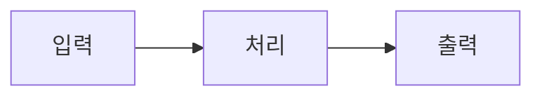
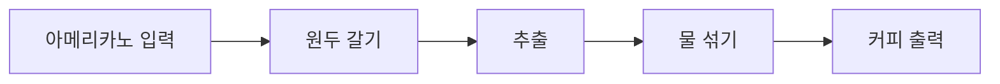
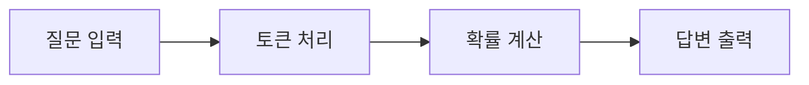
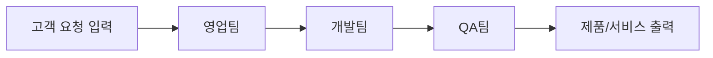

그런데 이 스펙트럼적 프레임보다 더 유용한 프레임을 제안하고 싶습니다. 바로 '시스템'이라는 렌즈입니다.

## 모든 것은 시스템이다

ChatGPT도 시스템입니다. 미드저니도 시스템입니다. 여러분이 일하는 회사도 시스템입니다.

이 말이 너무 당연하게 들릴 수 있습니다. 하지만 이 관점을 진지하게 받아들이면, 전혀 다른 것처럼 보이는 것들이 같은 구조로 보이기 시작합니다.

시스템이란 무엇일까요? 가장 단순하게 말하면 이렇습니다:

*Figure 32-1. 시스템의 기본 구조*

커피숍을 생각해 봅시다:

*Figure 32-2. 커피숍도 시스템*

ChatGPT도 똑같습니다:

*Figure 32-3. ChatGPT도 시스템*

회사도 마찬가지입니다:

*Figure 32-4. 회사도 시스템*

이렇게 보면, 에이전트를 이해하는 일이 갑자기 친숙해집니다. 에이전트는 그냥 특별한 종류의 시스템일 뿐입니다. 다만 그 '처리' 부분이 조금 더 복잡하고, 조금 더 자율적일 뿐이죠.

### 손으로 그릴 수 있어야 이해한 것이다

저는 무언가를 이해했는지 확인하는 간단한 테스트가 있습니다. 종이에 다이어그램으로 그릴 수 있는가?

**시스템 다이어그램의 기본 문법**
- ○ 시작/끝: "여기서 시작해서 여기서 끝난다"
- □ 처리 단계: "누군가/뭔가가 일을 한다"
- ◇ 판단/분기: "조건에 따라 갈라진다"
- → 흐름: "다음 단계로 넘어간다"
- ⟳ 반복: "조건 만족할 때까지 되돌아간다"

트리거(시작점)가 있고, 박스들(처리 단계)이 있고, 화살표(흐름)가 있고, 최종 산출물이 있습니다. 이걸 엔드투엔드로 그릴 수 있다면, 그 시스템을 이해한 겁니다.

에이전트도 마찬가지입니다. 복잡해 보이는 AI 시스템도 결국 이 다이어그램으로 그릴 수 있습니다. 그리고 그릴 수 있다면, 설계할 수 있고, 개선할 수 있습니다.

---
<!-- LLM Context Anchor -->
**핵심 요약**: 시스템 = 입력→처리→출력. 커피숍, ChatGPT, 회사 모두 같은 구조. 에이전트는 특별한 종류의 시스템일 뿐, 처리 부분이 더 복잡하고 자율적인 것. 다이어그램 문법(○시작/끝, □처리, ◇분기, →흐름, ⟳반복)으로 그릴 수 있으면 이해한 것.

**키워드**: `시스템` `입력-처리-출력` `다이어그램` `엔드투엔드`
