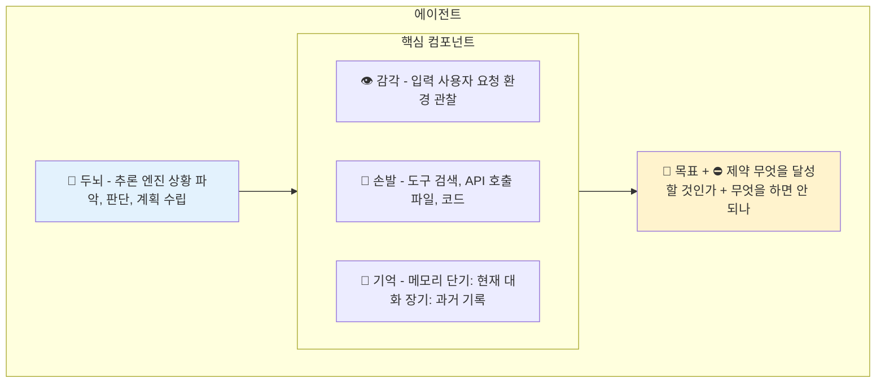

그렇다면 에이전트라는 시스템의 내부에는 무엇이 있을까요?

사람을 비유로 들어봅시다. 사람이 일을 하려면 무엇이 필요한가요? 생각하는 두뇌, 세상을 인식하는 감각, 행동하는 손발, 경험을 저장하는 기억, 그리고 무엇을 해야 하는지 아는 목표 의식. 에이전트도 정확히 이 다섯 가지를 가지고 있습니다.

*Figure 33-1. 에이전트의 다섯 가지 컴포넌트*

### 1. 두뇌: 추론 엔진

사람에게 두뇌가 있듯, 에이전트에게는 추론 엔진이 있습니다. 현재 대부분의 에이전트에서 이 역할을 하는 것이 LLM(대규모 언어 모델)입니다.

두뇌의 역할은 '생각하는 것'입니다. 상황을 파악하고, 무엇을 해야 할지 판단하고, 계획을 세웁니다.

여기서 중요한 점이 있습니다. 두뇌가 똑똑하다고 해서 일을 잘하는 건 아닙니다. 아무리 천재라도 눈이 없으면 앞을 볼 수 없고, 손이 없으면 물건을 집을 수 없습니다. 마찬가지로 LLM이 아무리 뛰어나도, 다른 컴포넌트들이 갖춰지지 않으면 쓸모있는 에이전트가 되지 못합니다.

### 2. 감각: 입력 처리

사람에게 오감이 있듯, 에이전트에게는 입력을 받아들이는 방법이 있습니다.

가장 기본적인 감각은 사용자의 요청입니다. "이 문서를 요약해줘", "내일 날씨 알려줘" 같은 것들이죠. 하지만 더 발전된 에이전트는 환경도 '관찰'합니다. 이전에 어떤 행동을 했고 그 결과가 어땠는지, 지금 사용할 수 있는 도구가 무엇인지, 시간이 얼마나 지났는지.

이 '관찰' 능력이 단순한 챗봇과 에이전트를 구분하는 요소 중 하나입니다. 챗봇은 사용자 말만 듣습니다. 에이전트는 자신의 행동 결과도 보고, 그에 따라 다음 행동을 조정합니다.

### 3. 손발: 도구와 액션

생각만 하고 행동하지 않으면 아무 일도 일어나지 않습니다. 에이전트에게 '손발'은 도구(tools)와 액션(actions)입니다.

**에이전트가 쓸 수 있는 도구들**
- 🔍 웹 검색: 인터넷에서 정보 찾아옴
- 🧮 계산기: 수학 계산 수행
- 📁 파일 읽기/쓰기: 문서를 열거나 저장
- 🔌 API 호출: 외부 서비스와 소통
- 💻 코드 실행: 프로그램을 직접 돌려봄

중요한 건, 도구가 많다고 좋은 게 아니라는 점입니다. 적재적소에 맞는 도구를 선택하는 능력이 핵심입니다. 마치 요리사에게 백 가지 칼이 있어도, 지금 써야 할 칼이 뭔지 아는 게 중요한 것처럼요.

### 4. 기억: 단기와 장기

사람의 기억이 단기 기억과 장기 기억으로 나뉘듯, 에이전트의 메모리도 그렇습니다.

| 구분 | 단기 기억 | 장기 기억 |
|------|----------|----------|
| 내용 | 현재 대화 내용 방금 검색한 결과 이전 단계 결정사항 | 사용자 선호도 과거 프로젝트 기록 학습된 패턴 |
| 유지 | 작업 끝나면 사라짐 | 저장되어 나중에도 활용 |

단기 기억은 지금 진행 중인 대화나 작업의 맥락입니다. "방금 사용자가 뭐라고 했지?", "아까 검색 결과가 뭐였지?" 같은 것들이죠. 이건 작업이 끝나면 사라집니다.

장기 기억은 세션을 넘어 유지되는 정보입니다. "이 사용자는 보고서를 bullet point로 좋아해", "지난주에 이 프로젝트에 대해 이야기했었지" 같은 것들. 이건 저장되어 나중에도 활용됩니다.

현재 LLM 기반 에이전트의 가장 큰 약점 중 하나가 바로 이 기억입니다. 특히 장기 기억을 효과적으로 관리하는 것이 어렵습니다. 사람도 모든 걸 기억하진 못하지만, 중요한 건 기억하고 사소한 건 잊죠. 에이전트에게 이런 '선택적 기억'을 가르치는 게 아직 풀리지 않은 문제입니다.

### 5. 목표와 제약: 판단의 기준

마지막으로, 에이전트에게는 '왜 이 일을 하는가'에 대한 기준이 필요합니다.

목표는 달성하려는 것입니다. "사용자 질문에 정확히 답하기", "보고서 초안 작성하기", "버그 찾아서 수정하기" 같은 것들이죠.

제약은 하지 말아야 할 것, 또는 지켜야 할 것입니다. "거짓 정보를 만들어내지 않기", "개인정보를 외부에 노출하지 않기", "10분 안에 끝내기" 같은 것들입니다.

이 목표와 제약이 명확하지 않으면, 에이전트는 엉뚱한 방향으로 갑니다. 마치 "일 좀 해와"라고만 말하고 구체적인 지시를 안 하면 직원이 뭘 해야 할지 모르는 것처럼요.

---

이제 에이전트의 내부 구조를 이해했으니, 실제 스타트업들이 이 에이전트를 어떻게 활용하고 있는지 두 개의 사례를 살펴보겠습니다.

---
<!-- LLM Context Anchor -->
**핵심 요약**: 에이전트 5컴포넌트 = 두뇌(추론엔진/LLM) + 감각(입력/관찰) + 손발(도구/액션) + 기억(단기/장기) + 목표&제약. 두뇌가 똑똑해도 다른 컴포넌트 없으면 무용지물. 현재 LLM 에이전트의 최대 약점은 장기 기억 관리(선택적 기억).

**키워드**: `추론엔진` `도구` `메모리` `단기기억` `장기기억` `목표` `제약`
