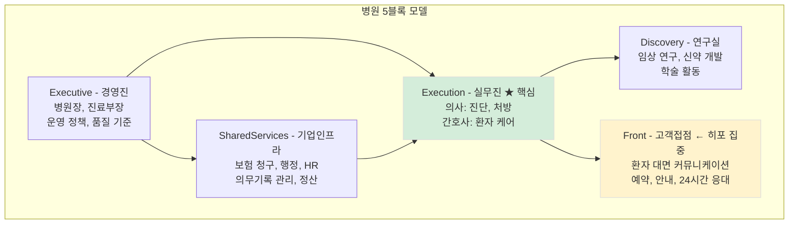
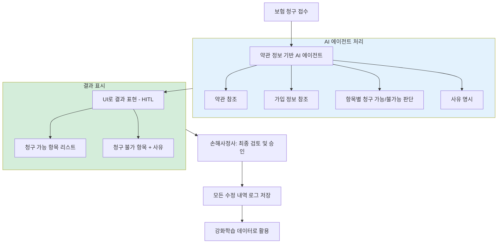
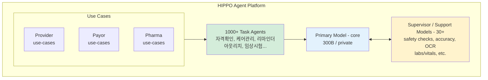
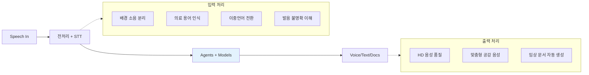
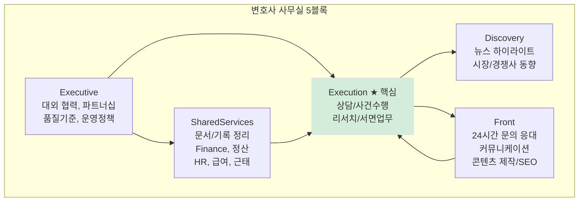

[ ] 해당 파트는 아직 부족한 점이 많아 개선이 필요

## 주장

- 도메인 버티컬 AI/에이전트 스타트업은 겉모습(인프라/SaaS/워크플로우)이 달라도 본질적으로 조직의 인력구조를 재편합니다. 고객센터 자동화처럼 "한 기능 최적화"가 아니라, 도메인 업무를 깊게 파서 조직 전체를 5개 기능 블록 관점에서 재배치합니다. 히포(Hippocratic AI)가 대표적인 예입니다.
- 이 제품군의 가치 제안은 비용 절감이 아니라 처리량 증폭(SuperStaffing)입니다. "사람을 덜 쓰는" 것이 아니라 "같은 사람 수로 더 많은 사건/건/프로젝트를 처리"하도록 설계됩니다. 히포의 경우 "의료 인력을 10배 늘리는 방법"을 찾습니다.

## 사례

### 대표사례: 변호사 사무실

(메모. 정신과 병원 사례도 추가할 수 있음 설명이 더 쉬워서)

사건 수임과 수행(Execution)이 가치의 핵심이고, SharedServices(정산/문서/기록), Front(문의/커뮤니케이션/콘텐츠), Discovery(리서치/학습), Executive(정책/품질기준/파트너십)가 얇게 둘러싼 구조라 5블록 모델이 가장 선명하게 드러납니다. (꼭 변호사 사무실 아니어도 되는데 떠오르는 게 이거였습니다. 전문직 의사 변호사 중에 뒤에 의사는 설명할 거니깐. 사무직은 출판사 또 쓰긴 애매하고, 다른 것들은 이해가 각각 다르고 해서. 전문직으로.)

### 대표사례: Hippocratic AI (의료 버티컬)

> 이 책의 공동저자 중 한 명이 보험사 에이전트 형상을 직접 개발한 경험이 있습니다. 히포는 그 경험과 맞닿아 있는 대표적인 사례입니다.

#### 회사 개요

Hippocratic AI는 간호사를 대체하는 환자 대면 AI 에이전트를 만드는 회사입니다. 핵심은 "대체"가 아니라 "증폭"입니다. 미국 간호사 평균 시급이 $40~90인데, 히포의 AI 간호사는 시간당 $9입니다. 1/10 비용.

투자와 규모:
- Nvidia, Google, a16z 등에서 5,500억원 투자
- 기업가치(Valuation): $3.5B (약 4.5조원)
- 클리브랜드 클리닉, 노스웨스턴 메디슨 등 미국 50개 이상 대형 의료 시스템과 파트너십
- 글로벌 상위 8개 제약사 중 3곳과 협업

창업팀: 스탠퍼드 AI 석사 출신 연쇄창업자(CEO), NVIDIA 딥러닝 연구 디렉터(CTO), Microsoft Research 수석연구원(CSO), Johns Hopkins 출신 의사(CMO), Google 출신 클리니컬 사이언티스트 등. 기술과 의료 양쪽에서 최고 수준입니다.

---

#### SuperStaffing: 인력 10배 증폭

히포가 말하는 SuperStaffing은 이 책의 핵심 주장과 정확히 일치합니다.

문제 정의:
- 미국 전체 간호사 수: 약 300만 명
- 2개 이상 만성질환을 가진 환자: 6,800만 명
- 이상적으로는 환자 1명당 전담 간호사 1명이 있어야 하지만, 현실적으로 불가능합니다

기존 접근의 한계:
기존 방식은 제로섬 게임이었습니다. 한 간호사를 특정 소외 계층에 배정하면, 다른 곳에서 인력이 부족해집니다. 인력을 한정된 자원으로 보는 관점입니다.

히포의 접근:
SuperStaffing의 목표는 효율성을 10% 높이는 게 아닙니다. 의료 인력을 10배 늘리는 방법을 찾는 것입니다. "사람을 덜 쓰는" 게 아니라 "같은 사람 수로 더 많은 환자를 돌보는" 설계입니다.

유전 상담사 사례:
미국에서는 특정 유전자 검사 시 결과를 보기 전에 유전 상담사를 만나야 합니다. 그런데 유전 상담사가 절대적으로 부족합니다. 진료 대기가 몇 달씩 걸립니다. 유전 상담사의 역할은 진단이 아니라 결과 해석과 설명입니다. 이건 LLM이 잘하는 영역입니다. 히포는 유전 상담사 1,000명이 모델을 평가하고 "투입 준비 완료"라고 인정한 뒤에야 현장에 배포합니다.

---

#### 5블록 모델 적용: 병원

병원에 5블록 모델을 적용하면 히포가 어디를 공략하는지 명확해집니다.

*Figure 34-1. 병원 5블록 모델: 히포의 Front 집중*

히포는 Front에 집중합니다. 왜? 병원에서 가장 반복적이고, 사람이 지치기 쉽고, 그러면서도 환자 경험에 직접 영향을 미치는 영역이기 때문입니다. 그리고 여기서 확보한 데이터는 Execution과 Discovery까지 영향을 미칩니다.

---

#### 다중 이해당사자 구조

히포가 흥미로운 점은 병원만 고객이 아니라는 것입니다. 의료 생태계의 세 가지 주체를 모두 커버합니다.

세 가지 고객 세그먼트:

| 세그먼트 | 역할 | 에이전트 예시 |
|----------|------|--------------|
| Provider (의료기관) | 병원, 클리닉 | 퇴원 후 관리, 만성질환 체크, 수술 전 안내 |
| Payor (보험사) | 건강보험사 | 자격 확인, 혜택 안내, ID카드 교체, 클레임 처리 |
| Pharma (제약사) | 제약회사 | 임상시험 스크리닝, 복약 순응도 확인, 부작용 모니터링 |

조직 목표별 에이전트 분류:
히포 홈페이지에는 1,000개 이상의 에이전트가 목표별로 분류되어 있습니다.

- Quality Improvement (품질 개선)
- Care Management (환자 관리)
- Readmission Prevention (재입원 방지)
- Health Equity (의료 형평성)
- Compliance (규정 준수)
- Call Center Management (콜센터 관리)
- Member Experience (회원 경험)
- Pharmacy (약국 연계)

각 에이전트는 특정 세그먼트에 공용으로 쓰이거나, 특정 고객에 전용으로 커스터마이징됩니다.

---

#### 공동저자의 Payor 에이전트 개발 경험

> 이 책의 공동저자 중 한 명이 실제로 한국에서 보험사 대상 AI 에이전트를 개발했습니다. 히포의 Payor 세그먼트와 정확히 겹치는 영역입니다.

보험 청구 손해사정사 AI 에이전트

손해사정사는 전문 라이센스가 필요한 직종입니다. 고객이 보험 청구를 하면, 손해사정사가 해당 청구 건을 검토합니다.

기존 프로세스:
1. 고객이 어떤 보험에 가입했는지 확인
2. 어떤 특약에 가입했는지 확인
3. 각 보험의 약관을 읽고 항목별 정보 파악
4. 청구 항목별로 유효성 판단 (진료비, 마취비, 수술비, 검사비 등)
5. 약관에 따라 청구 가능/불가를 체크하여 최종 금액 산정

문제점:
- 휴먼 에러 다수 발생
- 건별 손해사정 금액이 커서 실수 시 손실 큼
- 건당 20~30분 소요
- 로그 없이 엑셀로 수동 처리 → 데이터 디지털화 안 됨 → 사고 발생해도 추적 불가

AI 에이전트 도입 후:

*Figure 34-2. 보험 청구 AI 에이전트 처리 흐름*

도입 효과:

| 항목 | Before | After |
|------|--------|-------|
| 처리 시간 | 20~30분/건 | 5분 이내 |
| 휴먼 에러 | 다수 발생 | 대폭 감소 |
| 데이터 추적 | 불가능 (엑셀) | 전수 로그 |
| 학습 | 불가능 | 수정 내역으로 강화학습 |

추가적인 데이터 가치:
- 진료 항목별 금액 데이터 축적
- 손해사정사 처리 데이터 축적
- → 보험사의 손해율 계산에 활용
- → 신규 보험 상품 개발 참고 자료

이것이 HITL(Human-in-the-Loop)의 전형적인 구현입니다. AI가 1차 판단을 하고, 전문가가 최종 승인합니다. 그리고 전문가의 수정 내역이 다시 AI 학습 데이터가 됩니다.

---

#### Constellation Architecture: 4.1T+ 파라미터

히포의 기술 아키텍처는 Constellation(별자리)이라 부릅니다. 하나의 거대 모델이 아니라 여러 모델이 협력하는 구조입니다.

*Figure 34-3. Hippocratic AI Constellation 아키텍처*

각 계층의 역할:

| 계층 | 역할 | 예시 |
|------|------|------|
| Primary Model (300B) | 핵심 의료 추론 | 환자 대화의 맥락 이해, 적절한 응답 생성 |
| Supervisor Models (30+) | 안전/정확성 체크 | 약물 중단 확인, 투여량 체크, 오프라벨 경고 |
| Task Agents (1000+) | 특정 업무 수행 | 퇴원 후 전화, 복약 확인, 임상시험 스크리닝 |

Supervisor Models 상세:
- Multi-call Memory: 여러 통화에 걸친 맥락 기억
- Escalations: 위험 상황 에스컬레이션
- Labs & Vitals: 검사 수치 해석
- Med Stoppage: 약물 중단 확인
- Medication Identification: 약물 식별
- Overdose: 과다복용 경고
- Do No Harm Guardrail: 가장 중요한 안전장치

입출력 흐름:

*Figure 34-4. 히포 입출력 처리 흐름*

EHR 연동: Epic, MEDITECH, Oracle Cerner, athenahealth 등 주요 전자의무기록 시스템과 양방향 연동. 환자 정보를 읽어오고, 통화 결과를 다시 기록합니다.

---

#### 에이전트가 하는 일 (하지 않는 일)

히포의 가장 중요한 원칙: 진단과 처방은 일절 하지 않습니다.

하지 않는 일 (전문 의료 영역):
- 질병 진단
- 약물 처방
- 치료 방침 결정
- 의학적 판단이 필요한 모든 것

하는 일 (간호사/사회복지사가 전화로 하던 반복 업무):

| 영역 | 구체적 업무 |
|------|------------|
| 퇴원 후 관리 | 약 복용 체크, 상태 확인 전화 |
| 만성질환 관리 | 당뇨, 고혈압 등 주기적 체크 |
| 수술 전 안내 | 금식 여부, 준비 사항 전달 |
| 임상시험 관리 | 참가자 스크리닝, 복용 효과/부작용 확인, 이탈 방지 |
| 보험 업무 | 자격 확인, 혜택 설명, ID카드 교체 안내 |

임상시험 관리 상세 (제약사 협업):
1. 수천 명의 잠재적 참가자에게 전화 → 참여 조건 충족 확인
2. 임상시험 중 약물 복용 효과/부작용 확인
3. 환자 이탈 방지: 일정 관리, 상태 모니터링
4. 이상 환자 1차 모니터링: 문제 발생 시 책임자에게 리포트

---

#### AI의 강점 (인간 대비)

히포가 강조하는 AI의 강점은 "사람보다 저렴하다"가 아닙니다.

**1. 맥락 기억**
- 간호사: 여러 환자를 담당하면서 모든 환자의 특이사항, 대화 이력을 기억하기 어려움 → 단순 업무만 가능
- AI: 대화 내용 저장, 맥락을 모두 기억하여 참조 → 휴먼 에러 감소, 일관성 있는 응대

**2. 피로 없는 감정 응대**
고령 환자들은 같은 질문을 반복하고, 불안해하고, 설명을 여러 번 요청합니다. 인간 간호사는 지칩니다. AI는 지치지 않습니다. 히포는 이 점을 살려 고령 환자 대상 user-friendly 기술에 특히 집중합니다.

**3. 다국어 지원**
Spanish Preventive Care Reminders처럼 특정 언어권 환자를 위한 맞춤 서비스를 쉽게 확장할 수 있습니다.

**4. 24/7 가용성**
환자가 새벽 3시에 불안해도 전화를 받을 수 있습니다.

---

#### 운영 지표

15개월간 실적:
- 1억 1,500만 건의 환자 상호작용 및 데이터 확보
- 만족도 10점 만점 8.9점
- 1,000개 이상의 임상 유스케이스 확보

이 숫자들이 의미하는 것: 히포의 에이전트는 더 이상 실험이 아닙니다. 이미 대규모로 돌아가고 있고, 환자들이 만족하고 있습니다.

---

#### 히포 사례가 보여주는 것

히포는 5블록 모델의 완벽한 예시입니다.

1. Front에 집중: 가장 반복적이고 확장 가능한 영역
2. Execution은 건드리지 않음: 진단/처방은 의사의 영역
3. SharedServices와 연동: EHR 통합으로 행정 부담 감소
4. 데이터 → Discovery: 상호작용 데이터가 임상 연구에 활용

그리고 가장 중요한 것: SuperStaffing. 비용 절감이 아니라 처리량 증폭. "간호사를 자르자"가 아니라 "간호사 한 명이 10배 더 많은 환자를 돌볼 수 있게 하자".

이것이 도메인 버티컬 AI 스타트업의 진짜 가치 제안입니다.

---

### YC, a16z, AI2, ProductHunt Startups 엄청 많이

따라서 해외 스타트업(YC/a16z/AI2/ProductHunt 등)을 비교해도, 도메인에 깊이 들어가는 팀은 대체로 5블록 중 어디를 레버리지하는지로 분류·분석 가능합니다(Front만 하는지, Execution을 건드리는지, SharedServices/Discovery까지 데이터화하는지).

## 설명

### 5블록 모델의 본질

5블록 모델은 "조직을 기능 단위로 쪼개는 도식"이 아니라, 어떤 블록이 병목이며 어디에 데이터가 쌓이고 어디에서 부가가치가 발생하는지를 한 번에 보게 해주는 분석 프레임입니다.

### 5블록 모델

조직을 다섯 덩어리로 보면 패턴이 선명해집니다. 도메인 생산성 솔루션이 겨냥하는 지점을 이해하기 위해, 기업을 다음의 5개 기능 블록으로 모델링해봅시다.

- 경영진(Executive) → Governance + C Level
- 기업인프라(SharedServices) → Legal + Finance + HR + Compliance 등 전문직 기반의 공통 지원 기능
- 실무진(Execution) → PM + Build + Run(Service Operation) 등 '업무를 실제로 수행하고 결과물을 만드는' 핵심 실행부
- 연구실(Discovery) → Research / Laboratory 성격의 실험·조사·학습 영역
- 고객접점 프론트(Front) → Go-to-Market(Sales/Marketing) + Customer Operation(CRM) + Support

### 변호사 사무실을 5블록 모델에 대입

이 구분의 장점은 간단합니다. 어떤 조직이든 규모와 업종을 막론하고, 일을 자세히 들여다보면 대체로 이 다섯 영역의 조합과 비중으로 설명이 됩니다. 히포는 병원을 예로 들었지만, 여기서는 더 작은 단위의 조직으로 '변호사 1명 + 사무직원 1명' 법률사무실을 떠올려봅시다. 법률사무실이 아니더라도 업무를 이런 식으로 분해해보면 유사한 구조가 반복됩니다.

*Figure 34-5. 변호사 사무실 5블록 모델*

**Execution 상세:**
- 상담/사건수행: 인테이크, 초기 상담, 자료 정리, 타임라인, 증거목록
- 리서치/서면업무: 법령/판례 리서치, 서면 초안, 쟁점 도출

**Front 상세:**
- 24시간 온라인/전화문의 응대
- 수임 전/후 커뮤니케이션
- 사례 기반 콘텐츠 제작, SEO/AIEO 최적화

요약하면, AI는 고객센터 같은 특정 기능에만 도입되는 것이 아니라 조직 전반으로 영향력이 확장될 수 있습니다. 특히 실질적인 사업 부가가치가 만들어지는 지점은 Front보다도 Execution일 수 있으며, 이를 뒷받침하는 Shared Services는 반복 업무를 정리·자동화해 시간을 절약해주고, Discovery는 정보 축적과 학습을 통해 장기적인 품질과 잠재력을 끌어올립니다. 나아가 이 모든 업무가 프로세스화되고 데이터화되면, Executive는 감보다 수치와 근거에 기반해 의사결정을 고도화하고, 외부 협력과 레버리지를 통해 더 큰 부가가치 창출에 집중할 수 있습니다. 인력 해고가 아닌 증강과 증폭입니다. 조직이 2명이건 10명이건 100명이건 패턴은 유사합니다.

## 시각화 (연구 필요)

### 변호사 사례 딥다이브

- 5블록 조직도(1장): Executive / SharedServices / Execution / Discovery / Front를 한 화면에 배치하고, "부가가치 생성 중심=Execution"을 강조 표시
- 변호사 사무실 사례 맵(1장): 블록별 실제 업무 항목을 카드로 배치(인테이크/쟁점/서면/정산/문의/콘텐츠 등)
- 병목 이동 다이어그램(1장): Front 자동화 전후 병목이 Execution으로 이동하는 흐름, 그리고 Execution 자동화 시 처리량이 확장되는 흐름
- SuperStaffing 지표 보드(1장): 처리량(건/주), 리드→수임 전환율, 평균 응답시간, 재작업률/오타율, 미수금 회수 리드타임 등 "증폭"을 보여주는 KPI 프레임

### 다양한 현재 진행형 스타트업들

- 5블록 프레임으로 정규화해서 끼워맞춰서 표현하기

---
<!-- LLM Context Anchor -->
**핵심 요약**: 5블록 모델(Executive, SharedServices, Execution, Discovery, Front)로 조직 분석. 도메인 버티컬 AI의 진짜 가치 = 비용 절감이 아니라 처리량 증폭(SuperStaffing). Hippocratic AI 사례: 간호사 대체 아닌 증폭, $9/시간으로 의료인력 10배 확장. Front에 집중하되 Execution(진단/처방)은 건드리지 않음. HITL로 전문가 최종 검토, 수정 데이터로 강화학습.

**키워드**: `5블록모델` `SuperStaffing` `HippocraticAI` `Front` `Execution` `HITL` `도메인버티컬`
