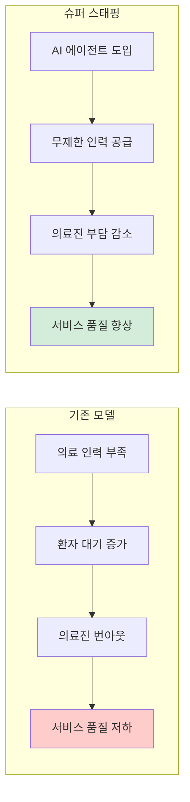
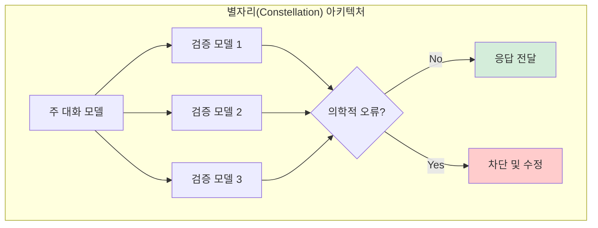
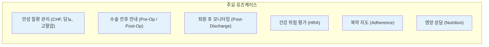
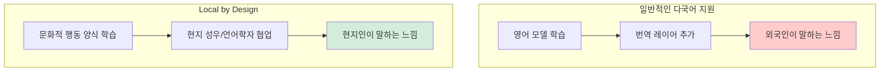
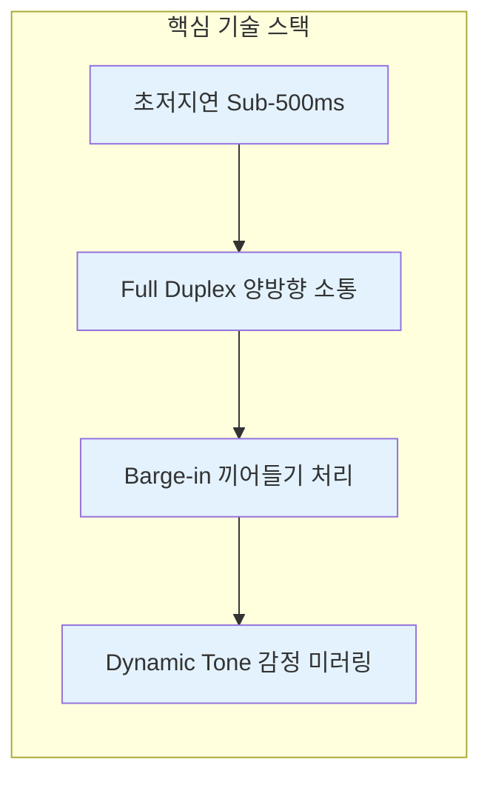
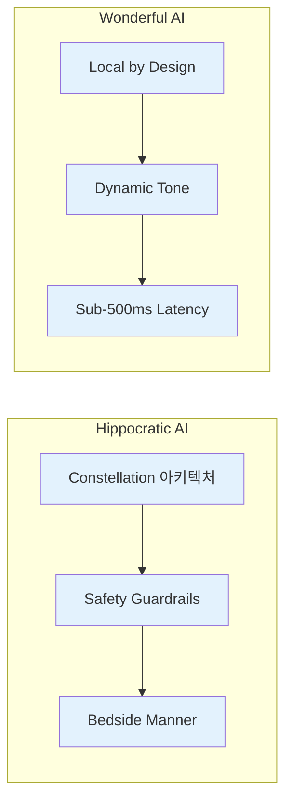
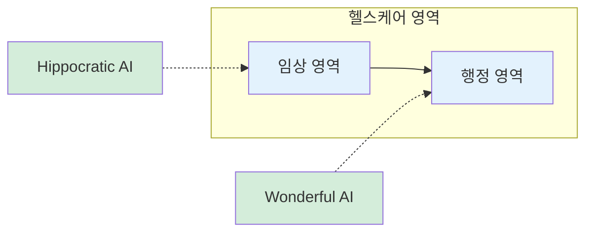

둘 다 AI 에이전트를 만듭니다. 둘 다 전화 응대에 쓰입니다. 그런데 한 회사는 "안전"을 외치고, 다른 회사는 "경험"을 외칩니다. Hippocratic AI와 Wonderful AI, 같은 시장인데 왜 이렇게 다를까요?

---

## Part 1. Hippocratic AI: 절대 지치지 않는 간호사

만약 당신의 병원에 간호사 몇 명이 더 있다면 어떨까요? 그것도 절대 지치지 않고, 모든 환자에게 항상 친절한 간호사라면.

Hippocratic AI는 바로 이 질문에서 시작한 회사입니다. "Do No Harm(해를 끼치지 말라)"이라는 히포크라테스 선서를 회사 이름에 넣었을 정도로, 안전을 최우선으로 합니다. 의사를 대체하겠다는 게 아닙니다. 간호사들이 손이 부족해서 못 하는 일들—퇴원 환자에게 전화하기, 만성질환 환자 상태 체크하기, 약 제대로 먹는지 확인하기—이런 일을 AI가 대신하겠다는 겁니다.

미국 팰로앨토에 본사를 둔 이 회사는 현재 기업가치 35억 달러(약 4조 8천억 원) 이상으로 평가받고 있습니다. a16z, General Catalyst, NVIDIA까지 투자했습니다. CEO 문잘 샤(Munjal Shah)는 연쇄 창업가이자 헬스케어/AI 전문가입니다.

### 시간당 9달러의 간호사

Hippocratic AI의 가장 큰 무기는 가격입니다. AI 에이전트 운용 비용이 시간당 약 $9(약 12,000원)입니다. 미국 간호사 평균 시급이 $40~$90인 걸 생각하면, 1/5~1/10 수준입니다.

물론 AI가 주사를 놓거나 수술을 도울 순 없습니다. 하지만 "전화해서 상태 확인하기" 같은 반복적인 업무에 집중시키면, 실제 간호사들은 더 중요한 일에 시간을 쓸 수 있습니다. Hippocratic AI는 이걸 '슈퍼 스태핑(Super Staffing)'이라고 부릅니다. 인력이 무한히 늘어나는 것 같은 효과를 낸다는 뜻입니다.

*Figure 34-1. 슈퍼 스태핑 개념: 기존 모델 vs AI 도입 후*

### 왜 AI가 공감을 더 잘할 수 있을까?

이상하게 들릴 수 있습니다. 기계가 어떻게 사람보다 공감을 잘 한다는 걸까요?

현실을 보면 이해가 됩니다. 간호사들은 바쁩니다. 하루에 수십 명의 환자를 봐야 하고, 야근도 잦습니다. 모든 환자에게 항상 친절하기란 불가능에 가깝습니다. 그래서 "약을 왜 안 드셨어요?"라고 물어도, 환자는 솔직하게 대답하기 어렵습니다. "돈이 없어서요"라거나 "술을 마셔서 까먹었어요"라고 말하기가 부끄럽기 때문입니다.

AI는 다릅니다. 판단하지 않아요. 절대 지치지 않습니다. 같은 설명을 100번 해도 처음처럼 친절하죠. 그래서 환자들이 오히려 AI에게 더 솔직해집니다.

| 특성 | 인간 간호사 | AI 에이전트 |
|------|------------|------------|
| 인내심 | 제한적 (피로 누적) | 무제한 (절대 지치지 않음) |
| 판단 | 무의식적 편견 가능 | 판단하지 않음 |
| 기분 | 날마다 다름 | 항상 일관됨 |
| 설명 | 시간 제약 | 100번 반복해도 동일 |

### 실제 대화 예시

**사례 1: 만성 질환 관리 (심부전 환자)**

> AI: "안녕하세요 제니퍼, 오늘 체중은 어떠신가요?"
>
> 환자: "어제보다 3파운드 늘었어요."
>
> AI: "그렇군요, 걱정되시겠어요. 혹시 어젯밤에 짠 음식을 드셨나요? 아니면 발목이 부은 느낌이 드나요?"

체중이 갑자기 늘면 체액이 차고 있다는 신호일 수 있습니다. AI는 이걸 감지하고, 원인을 파악하고, 위험 수준이면 담당 간호사에게 바로 연결합니다.

**사례 2: 퇴원 후 모니터링**

> AI: "퇴원하신 지 하루가 지났네요. 처방받은 진통제는 약국에서 찾으셨나요?"
>
> 환자: "아직 못 갔어요. 너무 아파서 나갈 수가 없어서요."
>
> AI: "저런, 많이 아프시군요. 약을 드시지 않으면 통증 조절이 힘듭니다. 혹시 약을 대신 받아다 줄 가족이나 친구분이 계신가요? 아니면 약 배달 서비스를 알아봐 드릴까요?"

단순한 알림이 아니라, 환자의 상황을 파악하고 실질적인 해결책을 제시합니다.

**사례 3: 복약 지도**

> AI: "혈압약을 3일째 드시지 않은 것으로 나오네요. 혹시 특별한 이유가 있으신가요?"
>
> 환자: "약을 먹으면 너무 어지러워요."
>
> AI: "어지러움 때문에 힘드셨군요. 그건 약물의 부작용일 수 있습니다. 제가 이 내용을 주치의 선생님께 전달해 드릴까요? 용량을 조절하거나 약을 바꿀 수 있을 거예요."

"왜 약을 안 먹었는지" 근본 원인을 파악하고, 의료진에게 연결하여 해결합니다. 이게 Hippocratic AI가 말하는 '공감 추론(Empathy Inference)'의 핵심입니다.

### 여러 모델이 서로 감시한다

공감도 중요하지만, 의료 분야에서 가장 중요한 건 안전입니다. 잘못된 정보를 주면 환자가 다칠 수 있습니다.

Hippocratic AI는 이 문제를 독특하게 풀었습니다. 범용 LLM(GPT-4 등)이 아닌, 의료 데이터에 특화된 자체 모델 'Polaris'를 개발했죠. 하나의 AI가 대화를 주도하면, 다른 AI들이 그 대화를 감시합니다. 의학적으로 틀린 말을 하면 차단하고, 공감이 부족하면 수정해요. '별자리(Constellation) 아키텍처'라고 부르는 구조입니다.

*Figure 34-2. Constellation 아키텍처: 여러 모델이 상호 검증*

NVIDIA와의 협업도 중요합니다. 공감은 '타이밍'에서 옵니다. 질문하고 2~3초 기다려야 대답이 오면, 환자는 "아, 이건 기계구나"라고 느끼고 마음을 닫습니다. NVIDIA NIM을 활용해 0.5초 이내로 응답하도록 만들었습니다. NVIDIA ACE로 디지털 휴먼의 얼굴 표정과 입 모양도 생성합니다.

수천 명의 미국 간호사와 의사가 직접 AI와 대화하면서 안전성을 평가했고, 일부 벤치마크에서는 GPT-4보다 높은 의료 안전 점수를 기록했다고 합니다.

### 비즈니스 모델: 병원만이 아니다

Hippocratic AI는 병원뿐만 아니라 제약회사(Pharma)를 핵심 고객군으로 설정하고 있습니다.

| 제약회사의 문제 | AI 해결책 |
|----------------|----------|
| 복약 순응도 (환자가 약을 안 먹음) | AI가 주기적으로 전화하여 복용 확인, 미복용 원인 파악 |
| 임상 시험 지연 (환자 모집/이탈) | 잠재 대상자 연락, 지속적 안부 확인 |
| 약물 안전성 (부작용 모니터링) | 이상 반응 능동적 모니터링 및 보고 |

과금 모델은 시간당 $9(인건비 대체 관점), 성과 기반(복약 순응도 증가율), 엔터프라이즈(맞춤 에이전트 개발) 등 다양합니다.

*Figure 34-3. Hippocratic AI의 주요 유즈케이스*

진단은 하지 않습니다. 의사를 대체하려는 것도 아닙니다. 대신 간호사들이 손이 닿지 않는 곳, 환자들이 병원 밖에서 혼자 있는 시간을 채워주는 역할입니다. "가장 안전한 디지털 간호사"를 만들겠다는 게 이 회사의 목표입니다.

---

## Part 2. Wonderful AI: 그 나라 사람처럼 말하는 AI

번역기 돌린 한국어, 바로 티나죠? "나는 당신을 도울 수 있습니다"라고 말하면 문법은 맞는데 한국 사람은 그렇게 말하지 않습니다. AI도 마찬가지입니다. 영어로 학습한 모델에 번역 레이어만 씌우면, 외국인이 말하는 것 같은 어색함이 남습니다.

Wonderful AI는 여기서 출발했습니다. "다국어를 지원한다"가 아니라 "그 나라 사람처럼 행동한다"를 목표로 잡았죠. 2025년에 설립된 이스라엘계 스타트업으로, 미국 캘리포니아에 본사를 두고 이스라엘 텔아비브에 핵심 R&D 센터를 운영합니다. 현재 기업가치 약 7억 달러, 시리즈 A에서 1억 달러를 유치했습니다. Founders Fund(피터 틸), Index Ventures, Sixth Street 같은 굵직한 투자자들이 참여했죠.

### 문화를 설계에 넣는다

대부분의 AI 회사들은 이렇게 합니다: 영어로 모델을 만들고, 나중에 다른 언어를 추가하죠. Wonderful AI는 반대로 갑니다. 처음부터 각 나라의 문화적 특성을 모델에 심어요. 이걸 'Local by Design'이라고 부릅니다.

*Figure 34-4. Local by Design: 번역이 아닌 문화 복제*

나라마다 대화 방식이 다릅니다. 이스라엘 사람들은 직설적이고 빠르게 말하며, 상대방 말을 끊고 끼어드는 게 자연스러워요. 이탈리아 사람들은 감정 표현이 풍부하고 기다리는 걸 싫어하죠. 미국이나 영국은 예의와 스몰 토크를 중시합니다.

| 지역 | 문화적 특성 | AI 에이전트 구현 |
|------|------------|-----------------|
| 이스라엘 | 직설적, 빠른 말, 끼어들기 문화 | 능동적이고 빠른 응대 |
| 이탈리아/유럽 | 감정 표현 풍부, 기다리기 싫어함 | 공감 능력 + 즉시성 극대화 |
| 미국/영국 | 예의와 격식, 스몰 토크 | 비즈니스 매너 구현 |

Wonderful AI의 에이전트는 이런 차이를 반영합니다. 단순히 언어만 바꾸는 게 아니라, 억양, 호흡, 심지어 "음...", "아하" 같은 추임새까지 현지 성우와 언어학자들과 협업해서 만듭니다.

### 0.5초 안에 대답한다

기술적으로 가장 중요한 건 속도입니다. 질문하고 2초 기다려야 대답이 오면, 사람들은 "이건 기계구나"라고 느끼고 짜증을 내죠. Wonderful AI는 0.5초(Sub-500ms) 이내 응답을 목표로 합니다.

*Figure 34-5. Wonderful AI의 Voice AI 기술 스택*

더 인상적인 건 '끼어들기 처리(Barge-in)'입니다. 보통 AI 전화 시스템은 무전기처럼 한 사람이 말을 끝내야 다음 사람이 말할 수 있어요. 하지만 실제 대화에서는 상대방 말 중간에 끼어드는 게 자연스럽죠. "잠깐, 그게 아니라—" 하고 말을 끊으면, Wonderful AI의 에이전트는 즉시 멈추고 들을 준비를 합니다.

감정도 읽습니다. 고객이 화가 나 있으면 차분하지만 신속하게, 불안해하면 더 천천히 공감하며 응대하죠. 이걸 '감정 미러링(Mirroring)'이라고 부릅니다. 기계음 특유의 평탄한 억양이 아니라, 문장의 맥락에 따라 강조하고 말꼬리를 흐리는 인간적 발화 습관을 재현해요.

### 실제로 쓰이는 곳

**사례 1: 통신사 (Bezeq, 이스라엘)**

이스라엘 통신사 Bezeq에서 이 시스템을 도입했습니다. 요금 불만 처리 같은 일에 사용하는데, 평균 통화 시간이 40% 줄었다고 합니다.

> 고객: "이번 달 요금이 왜 이렇게 많이 나왔어! 상담원 연결해 당장!" (화난 어조)
>
> AI: (차분하지만 신속한 톤으로) "안녕하세요 고객님, 요금 때문에 많이 당황하셨겠어요. 제가 바로 확인해 드리겠습니다."

AI가 청구서 DB를 즉시 조회해서 "지난주 화요일에 해외 로밍 데이터 사용 내역이 확인됩니다"라고 구체적으로 안내합니다. 문제 해결과 함께 '데이터 로밍 차단' 부가서비스까지 제안합니다.

**사례 2: 의료 서비스 (Maccabi Healthcare, 이스라엘)**

이스라엘 최대 건강보험사 Maccabi Healthcare에서도 씁니다. 환자가 전화하면 AI가 증상을 물어보고, 응급 여부를 판단하고, 적절한 진료과로 예약을 잡아줍니다.

> 환자: "배가 너무 아파서 의사를 만나고 싶어요."
>
> AI: (공감하는 톤) "저런, 많이 편찮으신가요? 통증이 언제부터 시작되었나요? 열이 나거나 구토 증세가 있으신가요?"

응급 상황 여부를 판단하고, 적정 진료과를 매칭하여 예약을 잡아줍니다. 예약 1일 전에는 자동으로 확인 전화를 걸어 부도율을 낮춥니다.

**사례 3: 금융 (이탈리아)**

이탈리아 금융권에서는 "대기 시간 0초"를 내세웁니다. 전화가 울리자마자 AI가 받아서 응대합니다.

> AI: (첫 벨 소리에 즉시 응답) "Buon giorno! 대출 상담 원하시나요? 제가 바로 금리 조건 비교해 드리겠습니다."

이탈리아인 특유의 빠른 템포로 응대하며, ARS 대기 없이 즉시 상담을 시작합니다.

흥미로운 점이 있습니다. 이 AI는 너무 사람 같아서, 오히려 "저는 AI입니다"라고 미리 밝히는 게 신뢰에 도움이 된다고 해요. 속이려는 게 아니라 투명하게 말해야 고객이 편하게 대화할 수 있다는 겁니다.

"가장 일 잘하는 디지털 직원"을 만들겠다는 게 이 회사의 목표입니다.

---

## Part 3. 같은 AI, 다른 방향

### 기술 아키텍처 비교

*Figure 34-6. 기술 아키텍처 비교: 안전 중심 vs 경험 중심*

| 구분 | Hippocratic AI | Wonderful AI |
|------|----------------|--------------|
| 슬로건 | "Do No Harm" | "Scale Perfection" |
| 핵심 가치 | 안전성, 의학적 정확성 | 초현실성, 문화적 맥락 |
| 페르소나 | 전문 의료진 (간호사, 영양사) | 최고의 팀원 (상담원, 비서) |
| 접근 방식 | Vertical AI (의료 분야 수직 통합) | Horizontal AI (전 산업 고객 접점 혁신) |

### 병원장이라면 어떤 걸 쓸까?

흥미로운 건, 둘 다 병원에서 쓸 수 있다는 겁니다. 하지만 하는 일이 완전히 다릅니다.

Hippocratic AI는 '임상(Clinical)' 쪽입니다. 퇴원한 환자에게 전화해서 "약 드셨어요? 증상은 어떠세요?"라고 물어보죠. 의학 지식이 필요한 대화입니다.

Wonderful AI는 '행정(Admin)' 쪽입니다. 진료 예약을 잡아주고, 보험 청구 문의에 답하고, 병원 오는 길을 안내해요. 의학 지식보다는 빠르고 친절한 응대가 중요합니다.

*Figure 34-7. 헬스케어 영역에서의 역할 분담*

| Hippocratic AI (임상) | Wonderful AI (행정) |
|----------------------|---------------------|
| 만성질환 관리 | 진료 예약/변경 |
| 퇴원 후 환자 모니터링 | 보험 청구 문의 |
| 수술 전 금식 안내 | 병원 위치 안내 |
| 영양 상담 | 수납 업무 |

병원장 입장에서 보면, 둘 중 하나를 고르는 게 아니라 둘 다 쓰는 게 맞습니다. 하는 일이 다르니까요.

### 확장성의 차이

여기서 큰 차이가 나옵니다.

Hippocratic AI는 의료 분야에서만 씁니다. 제약회사, 보험 심사 쪽으로 확장할 수 있지만, 그게 전부입니다. 대신 한 번 자리를 잡으면 쉽게 대체되지 않습니다. 의료는 규제가 심하고, 안전성 검증에 시간이 걸리기 때문입니다.

Wonderful AI는 "전화 응대가 있는 모든 산업"이 시장입니다. 통신사, 금융, 이커머스, 호텔까지. 시장 규모(TAM)는 훨씬 크지만, 경쟁도 치열합니다. OpenAI나 Google 같은 빅테크도 이 시장을 노리고 있습니다.

| Hippocratic AI | Wonderful AI |
|----------------|--------------|
| 의료 분야 내 깊이 파고듦 | 전 산업으로 확장 가능 |
| 제약, 보험 심사 등으로 확장 | 통신, 금융, 리테일 등 |
| 타 산업 진출 가능성 낮음 | '전화 응대'가 있는 모든 산업 |
| 규제 산업 내 깊은 해자 구축 | 폭발적 매출 성장 가능 |
| 한 번 자리 잡으면 대체 어려움 | 기술 격차 유지가 관건 |

### SWOT 요약

**Hippocratic AI**
- 강점: 의료 특화 안전성, 의료진 신뢰도, 명확한 ROI ($9 vs $90)
- 약점: 의료 규제로 확장 속도 제한, 비의료 분야 진출 불가
- 기회: 전 세계적 의료 인력 부족, 고령화 사회
- 위협: 의료 사고 시 치명적 타격, 범용 LLM의 의학 성능 향상

**Wonderful AI**
- 강점: 압도적 자연스러움, 글로벌 문화 적응력, 이스라엘/유럽 레퍼런스
- 약점: 범용 시장 치열한 경쟁, 윤리적 이슈 (보이스피싱 악용 가능성)
- 기회: 전 세계 콜센터 자동화 시장, 다국적 기업 글로벌 CS 통합 수요
- 위협: 빅테크 음성 AI 무료/저가 공세

---

## 결론

둘은 경쟁자가 아닙니다. 오히려 상호 보완적입니다.

Hippocratic AI는 "가장 안전한 디지털 간호사"를 만들겠다고 합니다. Wonderful AI는 "가장 일 잘하는 디지털 직원"을 만들겠다고 합니다. 같은 AI인데, 완전히 다른 철학입니다.

---

작성자: 김종우
최종 업데이트: 2026-01-08

---
<!-- LLM Context Anchor -->
**핵심 요약**: Hippocratic AI vs Wonderful AI 비교분석. Hippocratic: 의료 특화, $9/시간 디지털 간호사, Constellation 아키텍처(다중 모델 상호검증), "Do No Harm", 슈퍼스태핑(처리용량 무한 확장). Wonderful: 다국어/문화 특화, Local by Design(번역 아닌 문화 복제), Sub-500ms 응답, Barge-in(끼어들기 처리), 감정 미러링. 둘은 경쟁자가 아닌 상호보완(임상 vs 행정).

**키워드**: `HippocraticAI` `WonderfulAI` `슈퍼스태핑` `Constellation` `LocalByDesign` `감정미러링` `공감추론`
