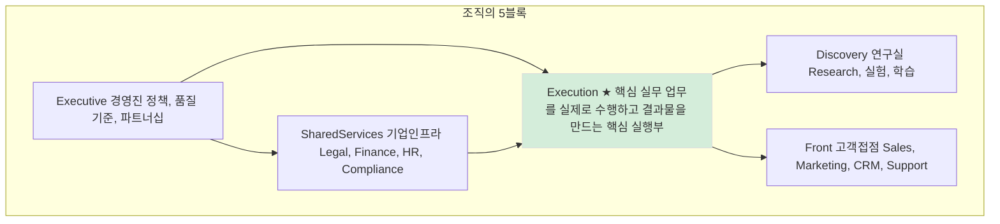
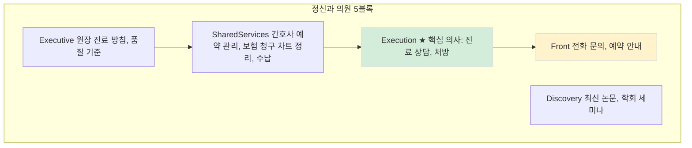
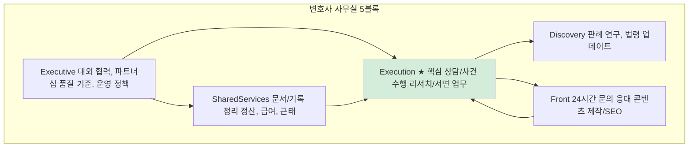

앞서 두 스타트업 사례를 통해 AI 에이전트가 실제로 어떻게 활용되는지 살펴봤습니다. 이제 한 발 물러서서, 조직 전체를 바라보는 프레임워크를 소개합니다. 이 프레임으로 보면 AI 에이전트가 조직의 어디에 들어가고, 어떤 가치를 만드는지 더 명확해집니다.

---

## 5블록 모델이란?

조직을 다섯 덩어리로 보면 패턴이 선명해집니다. 어떤 조직이든 규모와 업종을 막론하고, 일을 자세히 들여다보면 대체로 이 다섯 영역의 조합과 비중으로 설명됩니다.

*Figure 35-1. 조직의 5블록 모델*

**5블록 정의:**
- **경영진(Executive)**: 정책, 품질 기준, 외부 협력
- **기업인프라(SharedServices)**: 법무, 재무, HR, 컴플라이언스 등 공통 지원
- **실무진(Execution)**: 핵심 업무 수행, 결과물 생산 - **가치 창출의 중심**
- **연구실(Discovery)**: 리서치, 실험, 학습
- **고객접점(Front)**: 영업, 마케팅, 고객 응대

5블록 모델은 "조직을 기능 단위로 쪼개는 도식"이 아닙니다. **어떤 블록이 병목이며, 어디에 데이터가 쌓이고, 어디에서 부가가치가 발생하는지**를 한 번에 보게 해주는 분석 프레임입니다.

---

## 예시 1: 정신건강의학과

가장 쉬운 예시부터 시작해봅시다. 의사 1명과 간호사 1명이 운영하는 작은 정신과 의원입니다.

*Figure 35-2. 정신과 의원 5블록 모델*

**핵심 포인트:**
- **Execution(진료)이 가치의 핵심**: 환자는 의사의 진료를 받으러 옵니다
- **Front가 병목이 되기 쉬움**: 전화 문의, 예약 안내에 시간이 많이 소요
- **SharedServices도 반복적**: 보험 청구, 차트 정리

AI 에이전트를 도입한다면 어디에 넣을까요? **Front**(24시간 예약 안내, 증상 사전 문진)나 **SharedServices**(보험 청구 자동화)부터 시작하는 게 자연스럽습니다. Execution(진료)은 의사의 전문 영역으로 남겨둡니다.

앞서 살펴본 Hippocratic AI가 바로 이 구조에서 Front를 공략하는 사례입니다. 진단과 처방은 건드리지 않고, 환자 대면 커뮤니케이션에 집중합니다.

---

## 예시 2: 변호사 사무실

조금 더 복잡한 예시로 '변호사 1명 + 사무직원 1명'인 법률사무실을 살펴봅시다.

*Figure 35-3. 변호사 사무실 5블록 모델*

**Execution 상세:**
- 상담/사건수행: 인테이크, 초기 상담, 자료 정리, 타임라인, 증거목록
- 리서치/서면업무: 법령/판례 리서치, 서면 초안, 쟁점 도출

**Front 상세:**
- 24시간 온라인/전화문의 응대
- 수임 전/후 커뮤니케이션
- 사례 기반 콘텐츠 제작, SEO 최적화

**핵심 포인트:**
- **사건 수임과 수행(Execution)이 가치의 핵심**: 변호사는 사건을 수행해서 돈을 법니다
- **나머지 블록은 Execution을 지원**: SharedServices(정산/문서), Front(문의 응대), Discovery(판례 연구)

---

## 5블록으로 보는 AI 도입 전략

정신과 의원이든 변호사 사무실이든, 패턴은 동일합니다.

**1. Front부터 시작하기 쉬움**
- 반복적이고 예측 가능한 업무
- 24시간 대응이 필요하지만 사람이 지치기 쉬운 영역
- 실수해도 치명적이지 않음 (안내, 예약 등)

**2. Execution은 신중하게**
- 전문가의 판단이 필요한 핵심 영역
- AI는 보조 역할 (초안 작성, 리서치 지원)
- HITL(Human-in-the-Loop) 구조 필수

**3. 데이터 흐름을 따라가기**
- Front에서 축적된 데이터 → Execution 품질 향상
- SharedServices 자동화 → Executive 의사결정 고도화

요약하면, AI는 고객센터 같은 특정 기능에만 도입되는 것이 아니라 조직 전반으로 영향력이 확장될 수 있습니다. 특히 실질적인 사업 부가가치가 만들어지는 지점은 Front보다도 Execution일 수 있으며, 이를 뒷받침하는 SharedServices는 반복 업무를 정리·자동화해 시간을 절약해주고, Discovery는 정보 축적과 학습을 통해 장기적인 품질과 잠재력을 끌어올립니다.

나아가 이 모든 업무가 프로세스화되고 데이터화되면, Executive는 감보다 수치와 근거에 기반해 의사결정을 고도화하고, 외부 협력과 레버리지를 통해 더 큰 부가가치 창출에 집중할 수 있습니다.

**인력 해고가 아닌 증강과 증폭입니다.** 조직이 2명이건 10명이건 100명이건 패턴은 유사합니다.

---
<!-- LLM Context Anchor -->
**핵심 요약**: 5블록 모델(Executive, SharedServices, Execution, Discovery, Front)로 조직 분석. Execution이 가치 창출의 중심. AI 도입은 Front부터 시작하기 쉬움(반복적, 예측 가능). Execution은 HITL 구조로 신중하게. 인력 해고가 아닌 증강과 증폭.

**키워드**: `5블록모델` `Front` `Execution` `SharedServices` `HITL` `조직분석`
