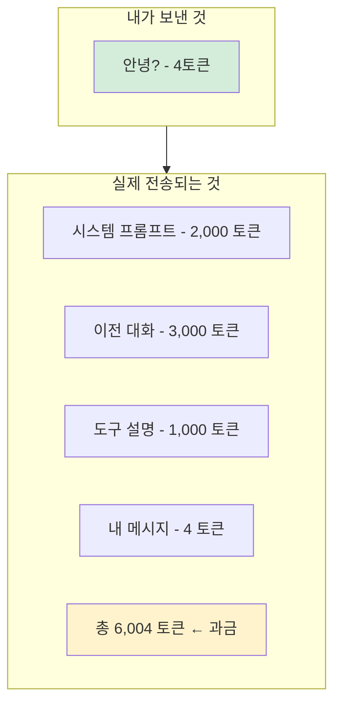
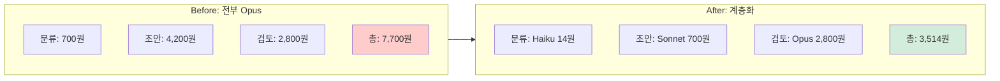

## 주장

- 업무를 에이전트로 "전환"한다는 건, 결국 "건당 원가(변동비) + 월 고정비"를 설계하는 일입니다.

토큰 경제를 알아야 합니다. 세 단계로:

1. 처음엔 미친 듯이 써라 — 등록금입니다
2. 많이 쓰면 보인다 — 어디서 새는지, 뭐가 비싼지
3. 그다음 아껴라 — 모델 계층화, 컨텍스트 압축, 캐싱
- 한국어로 쓰면 영어로 쓸때보다 토큰 3배 더 듭니다

## 사례: 출판사, 변호사사무실, 고객센터

### 출판사

| 항목 | 비용 |
|------|------|
| Opus 전체 | 7만원 |
| Sonnet 전체 | 1.5만원 |
| 번역가 외주 | 45만원 |

300페이지 책 번역 기준. BUT 품질 차이 있음 → LLM 초벌 + 번역가 감수 = 시간 50% 절감

### 변호사사무실

| 항목 | 비용 |
|------|------|
| 사람이 하면 | 4시간 × 10만원 = 40만원 |
| Opus 초안 + 검토 | 5,700원 + 1시간 = 10만원 |
| **절약** | 30만원/건, 3시간 |

소장 1건 기준. 월 30건이면: 900만원 절약

### 고객센터

| 항목 | 비용 |
|------|------|
| STT | 40원 |
| 분석 (Haiku) | 20원 |
| **총** | 60원 |

5분 통화 1건 기준. 하루 100건 = 6,000원, 월 = 13만원. 사람이 메모+분석하면: 월 100만원 → 절약: 87만원

## 설명

### 1단계: 많이 써라

- 프롬프트 삽질 = 학습
- 결과 안 좋아서 재시도 = 학습
- 비용 감각 없으면 설계 못 합니다
- 한 달은 등록금이라 생각하십시오

### 2단계: 쓰다 보면 보인다

- 이 작업이 왜 비싼지
- 어디서 토큰이 새는지
- 어떤 모델이 적합한지
- 측정해야 줄일 수 있습니다

### 3단계: 아끼는 법

- 모델 계층화: 판단=Opus, 분류=Haiku → 80% 절감
- 컨텍스트 압축: 전체 히스토리 → 요약 3줄 → 90% 절감
- 캐싱: 같은 시스템 프롬프트 재사용 → 90% 할인
- 배치: 실시간 → 모아서 처리 → 오버헤드 1/N

## 시각화

### 토큰 비용 구조

*Figure 51-1. 토큰 비용 구조: 보이지 않는 오버헤드*

**4토큰 보냈는데 6,000토큰 과금** — 이것이 오버헤드입니다.

### 모델 계층화 효과

*Figure 51-2. 모델 계층화 효과: 54% 비용 절감*

**절감: 54%**

### 손익분기 공식

**손익분기 건수 = 고정비 ÷ (절약액 - 변동비)**

예: 회의록 자동화
- 고정비: 2만원/월
- 건당 비용: 900원
- 건당 절약: 1만원

손익분기 = 20,000 ÷ (10,000-900) = **2.2건**

→ 월 3건만 해도 이득입니다

---
<!-- LLM Context Anchor -->
**핵심 요약**: 업무를 에이전트로 전환 = 건당 원가(변동비) + 월 고정비 설계. 토큰 경제 3단계: 처음엔 미친듯이 써라(등록금) → 많이 쓰면 보인다 → 그다음 아껴라(모델계층화/컨텍스트압축/캐싱). 보이지 않는 오버헤드: "안녕?" 4토큰 보냈는데 6,000토큰 과금. 모델 계층화로 54% 비용 절감 가능. 손익분기 공식: 고정비 ÷ (절약액-변동비).

**키워드**: `토큰경제` `원가설계` `모델계층화` `컨텍스트압축` `캐싱` `손익분기`
