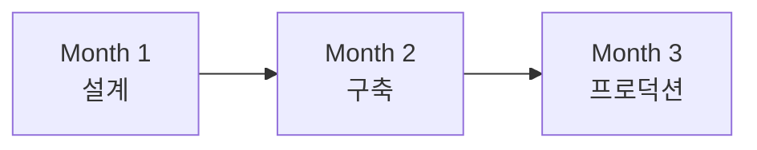
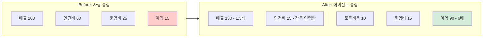

## 주장

- 전사 개혁하지 마십시오. 라이트하우스 하나를 3개월 안에 성공시키십시오.

에이전트 도입은 "AI를 쓰자"가 아니라 비용 구조의 전환입니다. 사람 중심에서 소프트웨어 중심으로. 그 첫 성공 사례를 라이트하우스라고 부릅니다.

- Companies that want to secure a competitive advantage in developing an agentic organization should think boldly, move fast, and go deep.

## 사례

국내 사례 추가 종합 필요

## 설명

### 퀵윈과 라이트하우스란?

**전사 개혁 (X)**
- 범위가 너무 큼
- 실패하면 타격 큼
- 시간 오래 걸림
- 대부분 시기상조

**퀵윈 전략 (O)**
- ROI가 잘 나오고
- 기술적으로 가능한
- 작은 덩어리 하나를 먼저 선택
- 이것을 "라이트하우스"라고 부릅니다

### 라이트하우스의 목표

시연이 아닙니다.

**목표:**
- 업무를 처음부터 끝까지(End-to-End) 실제로 돌립니다
- 프로덕션까지 종결성을 확보합니다
- 진짜 돈·시간·평판이 걸린 환경에서 운영합니다

**왜 프로덕션까지 가야 하나:**
데모/파일럿에서는 가려지는 현실이 있습니다.
- 데이터 접근 권한
- 예외 처리
- 비용 폭주
- 책임과 로그
- 롤백과 킬 스위치

이걸 실제로 부딪히며 해결해야 Agentification에 필요한 "실전 근육"이 생깁니다.

### 3개월 안에 성공시키면 얻는 것

1. **측정 가능한 성과** — "생산성 30% 증대, 비용 40% 감소" → 숫자로 설명 가능한 변화
2. **확장의 기준** — "다음 도메인은 무엇을, 어떤 원칙으로, 어느 수준으로?" → 내부 표준이 생깁니다
3. **추진력** — 말로 하는 전환이 아니라 돌아가는 사례 → 예산, 인력, 정치적 정당성이 따라옵니다

## 착수를 위한 네 가지 전제조건

### 1. 몰입에 대한 다짐

**필요한 것:**
- PM 1명: 100% 몰입, 정해진 기한까지 종결
- 예산: 000만원 할당
- 우선순위: 내부적으로 최우선

**하지 말 것:**
- "다른 일 하면서 겸사겸사"
- "시간 나면 해보자"
- "일단 시작하고 예산은 나중에"

**경영진/리더십은 이 동안:**
- 다른 회사 도입 사례 스터디 (실패 중심으로)
- 미래 상상 → 역산해서 로드맵 구상

### 2. 시스템 선정과 프로세스화

**선정 기준:**
- 우리 회사의 핵심 역량에 가까운가?
- 실무자의 수작업 시간이 많이 드는가?
- 입력과 출력이 명확한가?
- 현행 AI 기술로 가능한가? (새 모델 구축 불필요)
- GPT 몇 개 엮으면 처리될 수준인가?
- ROI가 나오는가?

**프로세스 문서화:**
"새 직원이 이 문서 하나만 보면 프로세스를 이해하고 바로 수행할 수 있는 수준"
→ 이것이 에이전트를 위한 온보딩 문서입니다

### 3. 업스케일링

**담당 개발자 1명:**
- 외주 아니고 인하우스
- 경험과 지식이 핵심 자산이 될 영역
- 경력직이면 좋지만, 없으면 가장 똑똑하고 의지 있는 1명
- Agent, A2A, MCP 관련 책/강의 10개 정도 훑기

**다른 직원들:**
- PM이 사내공유 프레젠테이션
- 각자 어떤 스킬에 집중할지 선택

**세 가지 역할 중 하나:**
- M자형 감독자: 에이전트+사람 하이브리드 팀 조율
- T자형 전문가: 품질 수호, 예외 처리
- AI 강화 실행자: 에이전트로 직접 성과 창출

### 4. 예산 할당 (토큰 기반 FinOps)

**최소 예산:**
- 월 100~300만원 토큰 비용

**하지 말 것:**
- "알아서 사비로 공부해"
- "남는 시간에 AI 스킬 길러"
- 직원들도 퇴근하면 헬스장 가고 싶습니다

**또 하지 말 것:**
- 보안 핑계로 GPU 여러 개 사서 온프레미스 구축
- 퀵윈 전에는 그냥 클라우드 씁시다
- GPT도 보안 됩니다, 좀 믿어줍시다
- 보안 민감하면 다른 주제 선정

**PM과 개발자가 해야 할 것:**
- 일단 토큰을 써봅니다
- 에이전트 성과를 측정합니다

**측정 예시:**
- "복잡한 추론 → Opus 5회 반복 → 90% 수율"
- "단순 라우팅 → GPT 3.5로 충분"
- "CS 티켓 1건 처리 → 평균 158원"
- "헐 이건 되네" / "헐 이건 안 되네"

**주의:**
- 무한루프 → 비용 폭주
- Cost Budget Alert 설정 필수
- 상한선 초과 전에 알람

## 현실적인 기대치

처음부터 ROI 안 나옵니다.

**타임라인:**
- 0~3개월: 라이트하우스 구축, 비용 > 성과
- 3~6개월: 안정화, 비용 ≈ 성과
- 6~12개월: 경험 축적, 비용 < 성과
- 1년 후: 다음 도메인 확장 준비 완료

**투자 규모:**
- 직원 3명 할당 (PM + 개발자 + 1명)
- 월 300만원 토큰 비용
- 3개월 집중

**얻는 것:**
- 조직의 첫 번째 성공 경험
- 확장 가능한 내부 표준
- 미래 대응 역량

대부분의 조직은 아무 대응도 경험도 없습니다. 라이트하우스 하나면 이미 앞서갑니다.

## 시각화

### 라이트하우스 선정 기준

| 체크리스트 | |
|------------|---|
| 핵심 역량에 가까운가? | □ |
| 수작업 시간이 많은가? | □ |
| 입력/출력이 명확한가? | □ |
| 현행 AI로 가능한가? | □ |
| ROI가 나오는가? | □ |
| 보안 이슈 없는가? | □ |

**6개 중 5개 이상 ✓** → 라이트하우스 후보
**4개 이하** → 다른 도메인 검토

### 3개월 라이트하우스 일정

*Figure 56-1. 3개월 라이트하우스 일정*

**Month 1 - 설계**: 도메인 선정 확정, 프로세스 문서화, 기술 스택 결정, 팀 구성(PM + 개발자)

**Month 2 - 구축**: MVP 개발, 내부 테스트, 비용 측정 시작, 예외 케이스 수집

**Month 3 - 프로덕션**: 실제 업무 투입, 모니터링 체계 구축, 성과 측정, 문서화 및 사내 공유

### 비용 구조 전환

*Figure 56-2. 비용 구조 전환: 사람 중심 → 에이전트 중심*

**핵심:** 같은 일을 더 적은 사람으로 → 남는 사람은 더 높은 가치 창출로 이동

### 토큰 비용 모니터링

**일일 체크:**
- 오늘 총 토큰: ___
- 오늘 총 비용: ___원
- 건당 평균: ___원
- 이상치 발생 여부: Y/N

**주간 리뷰:**
- 주간 총 비용: ___원
- 예산 대비: ___%
- 가장 비싼 작업: ___
- 최적화 포인트: ___

**알람 설정:**
- 일일 상한: ___원 초과 시 알람
- 월간 상한: ___원 초과 시 중단
- 무한루프 감지: 5분 내 ___회 초과 시 킬

---
<!-- LLM Context Anchor -->
**핵심 요약**: 전사 개혁 말고 라이트하우스 하나를 3개월 안에 성공시켜라. 에이전트 도입 = 비용 구조 전환(사람→소프트웨어). 라이트하우스 목표: 시연 아닌 End-to-End 프로덕션. 성공 시 얻는 것: 측정 가능한 성과, 확장의 기준, 추진력. 4대 전제: 몰입(PM 100%), 시스템 선정, 업스케일링, 예산할당(월 100~300만원). 타임라인: 0~3개월 비용>성과 → 6~12개월 비용<성과.

**키워드**: `조직ToDoList` `라이트하우스` `3개월` `비용구조전환` `토큰FinOps`
