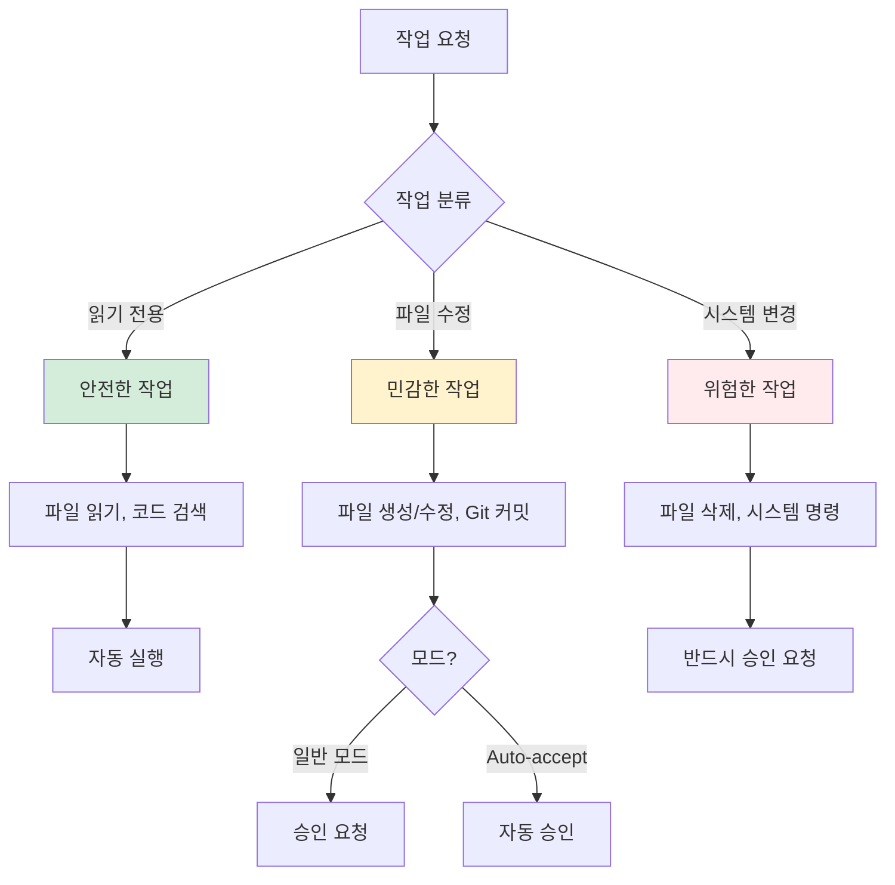
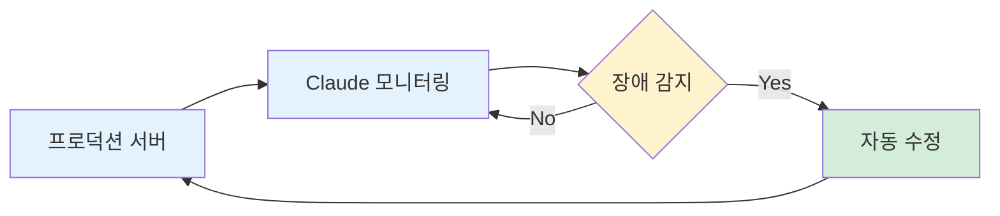

Claude Code가 어떤 에이전트 서비스인지, 왜 복잡한 구조인지는 24장에서 설명했습니다. 여기서는 실제로 설치하고 사용하는 방법만 다룹니다.

---

## 1. 기본 개념

### 터미널이란?

터미널이란 개발자들이 사용하는 그 까만 창을 말합니다. 영화에서 해커들이 빠르게 타이핑하는 그 화면을 떠올리면 됩니다.

- **윈도우**: 명령 프롬프트, PowerShell, Git Bash
- **맥**: 터미널 앱

웹 브라우저에서 사용하는 일반 클로드와 달리, Claude Code는 내 컴퓨터에서 직접 실행됩니다.

### 프로젝트 폴더 구조

작업을 시작하기 전에 프로젝트 폴더를 만들어야 합니다.

- **윈도우**: `C:\Projects` 처럼 최상위에 가까운 곳
- **맥**: `~/Projects` (홈 디렉토리 아래)

이 프로젝트 폴더 안에 개별 폴더를 하나씩 만들면서 각각의 프로젝트를 진행합니다. 예를 들어 웹사이트를 만든다면 `my-website`, 데이터 분석을 한다면 `data-analysis` 같은 식으로.

---

## 2. 요금제와 모델 선택

### 요금제 비교

| 플랜 | 가격 | 특징 |
|------|------|------|
| **Pro** | $20/월 | 맛보기, 풀 오퍼스로 30분~1시간에 소진 |
| **Max** | $100 또는 $200/월 | 5배 이상, 본격적인 개발에 충분 |

가볍게 체험해보거나 간단한 작업에는 Pro로 충분합니다. 본격적으로 무언가를 만들어내려면 Max를 추천합니다.

### 모델 선택 명령어

```bash
# 풀 오퍼스 (추천) - 코드까지 전부 오퍼스
claude --model opus --permission-mode acceptEdits

# 오퍼스 플랜 - 플래닝만 오퍼스, 코드는 소넷
claude --model opusplan --permission-mode acceptEdits
```

**추천**: "그냥 풀 오퍼스. 가능하다면 코드 짤 때도 소넷 쓰지 마세요. 오퍼스 미쳤어요."

---

## 3. 실전 워크플로우

### 7단계 워크플로우

```
1. 렛터리(음성메모)로 3분간 고민 풀어놓기
2. 피그마 영역 드래그 → Ctrl+C → 붙여넣기
3. 노션 문서 통째로 Ctrl+C → 붙여넣기
4. 고민 그대로 입력
5. 플래닝 모드에서 대화
6. AI가 질문 5개 주면 → 1,2,3,4,5 답변
7. 실행 → 테스트 → 완료
```

### "코드 직접 안 짜기" 마인드셋

- "코드를 하나도 직접 안 짜는 걸로"
- "글 쓴다가 아니라 인풋만 준다"
- "완벽주의자는 AI가 1,2,3,4 옵션 주면 그중 고르게 하는 게 나음"
- "플래닝 모드에서 대화 많이 나누고, 질문 더 많이 해달라고"

### MCP/API 연동

- "피그마 MCP 연동해줘" 한마디면 알아서 연결됨
- API만 열려있으면 MCP 없어도 연결 가능
- 예: Ghost 블로그 (MCP 미제공, API만 있음) → "고스트랑 연결해줘" 한마디로 연결 완료

---

## 4. 효율화 설정

### Auto Accept 모드

처음에는 모든 작업에 일일이 승인을 해줘야 합니다. 익숙해지면 Auto Accept를 켤 수 있습니다:

```bash
claude --permission-mode acceptEdits
```

파일 편집 같은 일반적인 작업은 자동 승인되고, 위험한 명령어만 확인을 요청합니다.

### 권한 요청 구조



*Figure A01-1. 권한 요청 구조: 작업별 승인 분류*

### 알림 시스템

**왜 필요한가?**

Auto Accept를 켜도 클로드가 중간에 질문하거나 작업이 끝나는 경우가 있습니다. 이때 알림이 없으면:
- 클로드가 대기 중인지 모르고 시간을 낭비
- 다른 작업에 집중하다가 돌아올 시점을 놓침
- 멀티태스킹 효율이 떨어짐

알림 시스템을 설정하면 클로드가 응답을 기다릴 때 소리로 알려줍니다.

**복붙용 프롬프트**

아래 프롬프트를 Claude Code에 붙여넣으면 자동으로 설정됩니다:

```
Claude Code에서 네가 나한테 응답을 기다릴 때 자동으로 알림음을 재생하는 설정을 해줘.
~/.claude/settings.json 파일에 Hooks 설정 추가해줘.
- Notification 이벤트: 응답 대기 시 알림음
- Stop 이벤트: 작업 중단 시 알림음
```

이 프롬프트를 실행하면 Claude가 알아서 OS에 맞는 설정을 해줍니다.

### 멀티태스킹

터미널 창을 여러 개 열어서 각각 다른 프로젝트 폴더에서 Claude Code를 실행하면, 여러 워커가 독립적으로 일하게 됩니다.

- 이론적으로는 최대 8개 가능
- 현실적으로는 **3개 정도까지**가 효율적으로 관리 가능
- 하나가 작업하는 동안 다른 하나의 결과를 검토하는 식의 파이프라이닝

---

## 5. 알아두면 좋은 것들

### Spinner Words

클로드 코드를 쓰다 보면 이상한 단어들이 나타납니다:

```
[Opus] Noodling...
[Opus] Shimmering...
[Opus] Pondering...
```

| 메시지 | 의미 |
|--------|------|
| Noodling | 탐색하며 처리 중 |
| Shimmering | 반짝이며 처리 중 |
| Pondering | 깊게 생각 중 |
| Cogitating | 사고 중 |
| Healing | 버그 수리 중 |

전부 "처리 중이에요, 잠시만요!"라는 뜻입니다. 무작위로 선택되며, Anthropic 개발자들이 넣어놓은 재미있는 로딩 표시입니다.

### 상태 표시줄

```
[Opus] 📁 my-project | 🌿 main | Cost: $0.012 | Context: 45%
```

- 📁: 현재 디렉토리
- 🌿: Git 브랜치
- Cost: 세션 비용
- Context: 컨텍스트 사용률

### 유용한 단축키

- `Ctrl+O`: 상세 출력 토글 (도구 사용 내역 보기)
- `/status`: 현재 세션 정보 확인

---

## 6. Git 환경설정

모든 작업은 Git으로 기록해야 합니다. Claude Code는 자동으로 커밋을 생성할 수 있지만, 먼저 Git 저장소가 초기화되어 있어야 합니다.

### 왜 Git이 필요한가


*Figure A01-2. Git 롤백: 문제 발생 시 복구*

- **롤백**: 뭔가 잘못되면 이전 상태로 돌아갈 수 있습니다
- **히스토리**: 모든 변경 사항이 기록됩니다
- **협업**: 다른 사람과 작업을 공유할 수 있습니다

### 기본 설정

프로젝트 폴더에서 한 번만 실행하면 됩니다:

```bash
# 프로젝트 폴더로 이동
cd C:\Projects\my-project

# Git 초기화
git init

# 사용자 정보 설정 (처음 한 번만)
git config user.name "내 이름"
git config user.email "my@email.com"
```

### Claude Code에게 커밋 맡기기

Claude Code는 "커밋해줘" 한마디로 알아서 처리합니다:

1. 변경된 파일 확인 (`git status`)
2. 변경 내용 분석 (`git diff`)
3. 적절한 커밋 메시지 작성
4. 커밋 실행

단, 처음 Git을 설정하는 것은 사용자가 직접 해야 합니다.

---

## 7. 개발자 꿀팁

서버 개발자의 관점에서 Claude Code를 실무에 활용하는 방법을 공유합니다. 단순히 코드를 생성하는 것을 넘어, 개발 워크플로우 전체를 자동화하는 팁입니다.

### 꿀팁 1: PostgreSQL과 Python 연동

#### 왜 PostgreSQL인가?

요즘 해외 개발자들 사이에서 PostgreSQL 사용이 크게 늘었습니다. MongoDB도 써보고 MySQL도 많이 썼지만, Python 라이브러리와의 연동 측면에서 PostgreSQL이 압도적으로 편해요.

#### Claude Code와의 시너지

Claude Code에게 데이터베이스 작업을 시킬 때 PostgreSQL을 사용하면 다음과 같은 이점이 있습니다.

| 작업 | MySQL | PostgreSQL |
|------|-------|------------|
| 스키마 설계 | 가능 | 가능 |
| 테이블 생성 | 가능 | 가능 |
| Python 연동 테스트 | 제한적 | 원활 |
| API 결과 대신 DB 직접 확인 | 불편 | 편리 |

실제로 저는 이렇게 개발합니다:

1. Claude Code에게 "이런 데이터 구조가 필요해"라고 설명
2. Claude가 테이블 스키마를 설계하고 생성
3. 테스트할 때 API 응답 대신 DB에 직접 들어간 데이터를 확인

API 결과를 보면서 디버깅하는 것보다 DB를 직접 확인하는 방식이 훨씬 빠르고 정확합니다.

### 꿀팁 2: 영어로 프롬프트 쓰기

#### 토큰 비용 차이

한국어와 영어는 토큰 소모량이 약 3배 차이가 납니다. 같은 의미를 전달해도 한국어가 훨씬 많은 토큰을 사용하죠.

```
"테스트 코드를 작성해줘" → 약 15 토큰
"Write test code" → 약 5 토큰
```

#### 체감되는 품질 차이

영어로 프롬프트를 작성하면 비용 절감 외에도 미묘한 차이가 있습니다. 영어로 지시했을 때 Claude가 더 많은 권한을 갖고 적극적으로 행동하는 느낌을 받았어요.

한국어로 시켰을 때 "이건 못해요"라고 하던 것들이 영어로 하면 되는 경우도 있었습니다. 명확한 이유는 알 수 없지만, 실무에서 체감되는 차이입니다.

### 이야기 1: 백그라운드 터미널 자동 디버깅

#### Claude Code의 핵심 장점

Copilot이나 Cursor와 Claude Code의 가장 큰 차이점은 터미널에 대한 읽기/쓰기 권한이에요.

저는 로컬에서 개발할 때 이렇게 합니다:

```
나: "백그라운드에서 이거 돌려"
Claude: (서버를 백그라운드에서 실행하고 로그를 모니터링)
나: "개발해봐"
Claude: (코드를 수정하면서 발생하는 에러를 자동으로 감지하고 수정)
```

#### 자동 디버깅 플로우


*Figure A01-3. 백그라운드 터미널 자동 디버깅 플로우*

Claude가 백그라운드에서 로그를 계속 보고 있기 때문에, 제가 로그를 직접 확인하지 않아도 돼요. Syntax Error나 Runtime Error가 발생하면 Claude가 자동으로 감지해서 수정합니다.

이게 Claude Code를 쓰는 가장 큰 이유입니다. 터미널에 대한 접근 권한이 다른 AI 코딩 도구와의 결정적인 차이점이죠.

### 이야기 2: 원격 서버 배포 자동화

#### 로컬-리모트 연동

백엔드 개발자는 로컬에서 개발한 후 리모트 서버(AWS 등)에 배포해야 합니다. 최근에는 Claude Code에게 서버 접속 정보를 직접 주고 배포까지 자동화하고 있어요.


*Figure A01-4. 로컬-리모트 배포 자동화 플로우*

이 플로우가 혁신적인 이유는:

1. 로컬에서 코드 수정
2. Claude가 자동으로 Push
3. 리모트 서버에서 Pull
4. 리모트에서 테스트 실행
5. 리모트에서 발생한 문제를 로컬에서 수정

리모트 서버에서 발생하는 문제점을 Claude가 감지하고, 로컬에서 수정해서 다시 Push하는 것까지 자동으로 돼요.

#### 미래 아이디어: 서버 상주 에이전트

백엔드 개발자가 가장 힘든 일 중 하나는 장애 대응입니다. 새벽에 문제가 터지면 당직자가 깨어나서 해결해야 하죠. 경험이 많아야 짧은 시간 안에 문제를 파악하고 해결할 수 있습니다.

그래서 생각한 아이디어가 있습니다:

서버에 Claude Code를 NPM으로 설치해서 상시 모니터링하게 하면 어떨까요?



*Figure A01-5. 서버 상주 에이전트 구상*

문제가 생길 때마다 Claude가 코드를 직접 고쳐서 서비스가 계속 돌아가게 하는 겁니다. 아직 구현 전이지만, 이번 주에 떠오른 아이디어예요.

### 핵심 메시지

Claude Code는 단순한 코드 생성 도구가 아닙니다. 터미널에 대한 완전한 접근 권한을 가지고 있기 때문에, 개발 워크플로우 전체를 자동화할 수 있어요.

- PostgreSQL과 Python 연동으로 DB 작업 자동화
- 영어 프롬프트로 비용 절감 + 기능 확장
- 백그라운드 터미널 모니터링으로 자동 디버깅
- 로컬-리모트 배포 파이프라인 자동화

이런 접근 방식이 가능한 이유는 Claude Code가 터미널을 읽고 쓸 수 있기 때문입니다. 이것이 다른 AI 코딩 도구와의 결정적인 차이점입니다.

*작성자: 김종우*

---

## 핵심 정리

| 개념 | 요약 |
|------|------|
| Claude Code | 터미널에서 실행, 실제 작업 수행 |
| Plan 모드 | 계획 → 승인 → 실행, 수정 비용 최소화 |
| Auto-accept | 위험한 작업만 승인 요청 |
| 모델 선택 | 풀 오퍼스 추천 (`--model opus`) |
| 요금제 | 본격적 사용은 Max 권장 |
| Git | 모든 작업 기록, 롤백 가능 |
| 마인드셋 | 코드 직접 안 짜기, 인풋만 주기 |

---

작성일: 2026-01-10
Chapter: 부록 A01
키워드: Claude Code, Plan 모드, Auto-accept, 워크플로우, 실전 가이드

---
<!-- LLM Context Anchor -->
**핵심 요약**: Claude Code 실전 사용법. 개념/구조는 24장 참조. 요금제: Pro($20), Max($100~200) 권장. 7단계 워크플로우. Auto Accept + 알림 시스템 설정. Git 필수. 마인드셋: "코드 직접 안 짜기, 인풋만 준다".

**키워드**: `ClaudeCode` `Plan모드` `Auto-accept` `풀오퍼스` `실전가이드`
