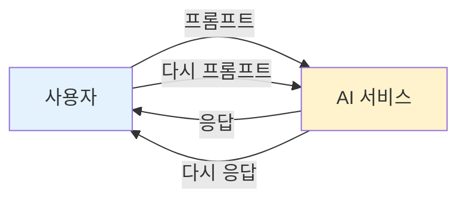
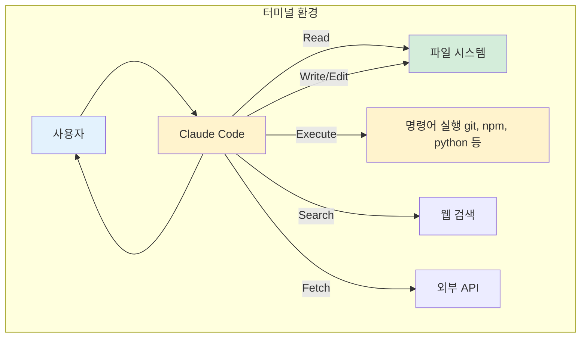
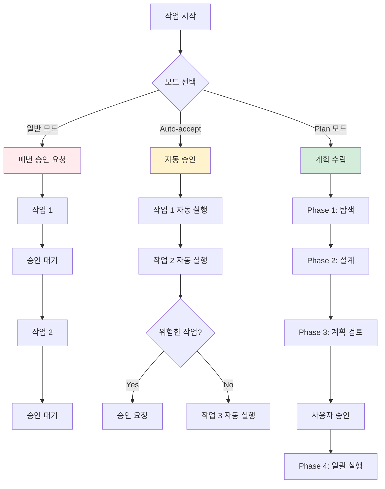
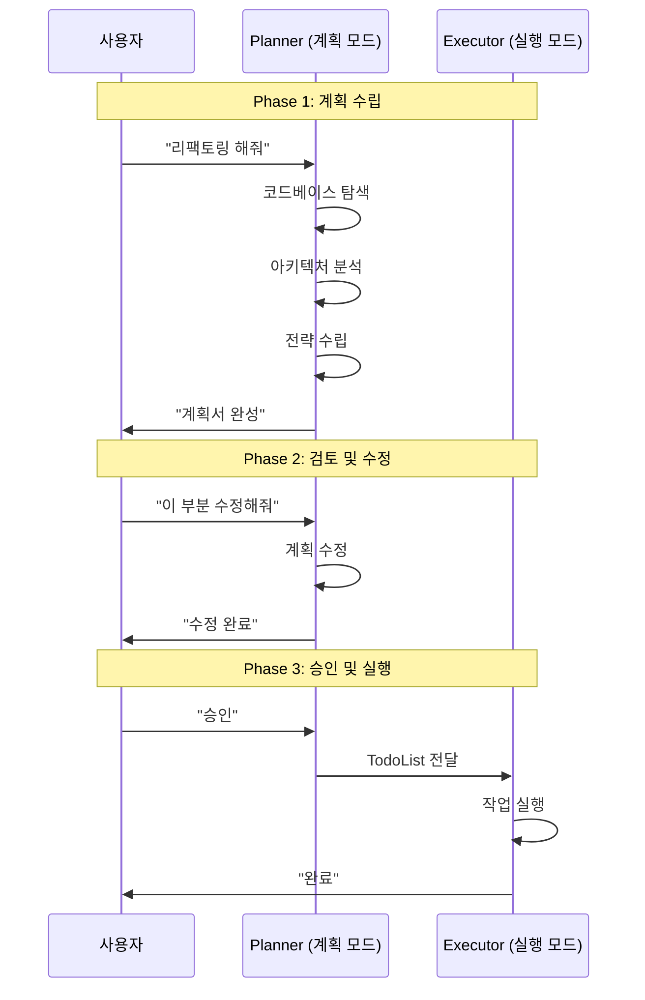
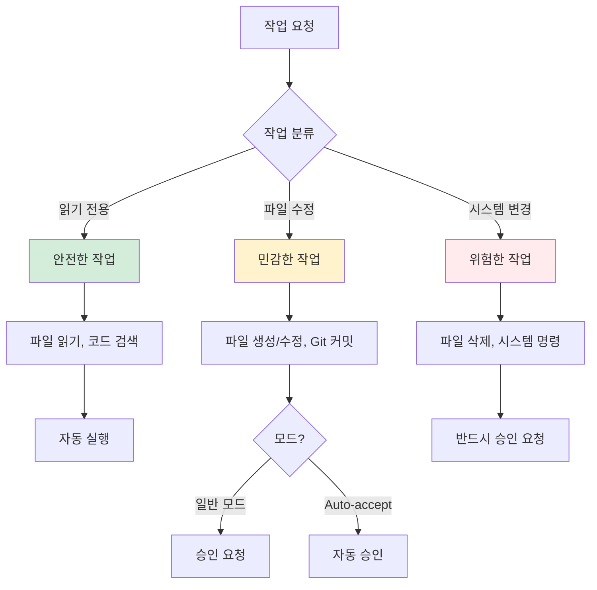

Claude Code를 처음 접하는 분들을 위한 실전 가이드입니다.

---

## 1. 왜 ChatGPT는 쉬운데 Claude Code는 어려운가?

ChatGPT나 Midjourney 같은 AI 서비스를 사용하는 건 직관적입니다. 질문을 입력하면 답이 나오고, 프롬프트를 주면 이미지가 나옵니다. 사용자와 AI 사이의 단순한 주고받기. 구조가 명확합니다.



*Figure A01-1. 일반 AI 서비스의 단순 반복 구조*

그런데 Claude Code 같은 에이전트 시스템을 처음 접하면 혼란스럽습니다. 터미널에서 실행해야 하고, Plan 모드니 Auto-accept니 하는 개념들이 나오고, 승인 요청이 뜨기도 하고 안 뜨기도 합니다.

이 혼란의 핵심은 **구조의 복잡도 차이**에 있습니다. ChatGPT는 단순 반복 구조지만, Claude Code는 외주 개발 업체처럼 작동합니다.

### 외주 개발 업체 비유

ChatGPT처럼 일하는 외주사:
```
당신: "회원가입 화면 만들어줘"
외주사: [5분 뒤] "여기요" (코드 전달)
당신: "비밀번호 확인 필드 추가해줘"
외주사: [3분 뒤] "여기요" (코드 전달)
```
→ 매번 당신의 지시를 기다립니다. 비효율적입니다.

외주 개발 업체처럼 일하는 방식:
```
1. 요구사항 논의 → 기획서 작성 → 승인
2. 외주사가 자율적으로 개발
3. 중요한 결정만 컨펌 요청
4. 최종 인수
```
→ 한 번의 논의로 여러 작업을 자율적으로 처리합니다.

**Claude Code의 Plan 모드 = 외주사의 기획 단계**

---

## 2. 기본 개념

### 터미널이란?

터미널이란 개발자들이 사용하는 그 까만 창을 말합니다. 영화에서 해커들이 빠르게 타이핑하는 그 화면을 떠올리면 됩니다.

- **윈도우**: 명령 프롬프트, PowerShell, Git Bash
- **맥**: 터미널 앱

웹 브라우저에서 사용하는 일반 클로드와 달리, Claude Code는 내 컴퓨터에서 직접 실행됩니다.

### 프로젝트 폴더 구조

작업을 시작하기 전에 프로젝트 폴더를 만들어야 합니다.

- **윈도우**: `C:\Projects` 처럼 최상위에 가까운 곳
- **맥**: `~/Projects` (홈 디렉토리 아래)

이 프로젝트 폴더 안에 개별 폴더를 하나씩 만들면서 각각의 프로젝트를 진행합니다. 예를 들어 웹사이트를 만든다면 `my-website`, 데이터 분석을 한다면 `data-analysis` 같은 식으로.

---

## 3. Claude Code의 구조



*Figure A01-2. Claude Code의 터미널 환경 구조*

터미널에서 실행하는 이유:

1. **파일 시스템 접근**: 코드 파일을 읽고 쓰고 수정할 수 있어야 합니다
2. **명령어 실행**: `git commit`, `npm install`, `pytest` 같은 개발 도구를 실행해야 합니다
3. **도구 사용**: 검색, API 호출 같은 도구를 사용해야 합니다

ChatGPT와의 차이:
- **ChatGPT**: 브라우저에서 실행, 텍스트만 생성
- **Claude Code**: 터미널에서 실행, 실제 작업을 수행

---

## 4. 세 가지 모드

Claude Code는 세 가지 모드로 작동할 수 있습니다:



*Figure A01-3. Claude Code의 세 가지 모드 비교*

| 모드 | 특징 | 적합한 상황 |
|------|------|------------|
| 일반 모드 | 매 작업마다 승인 요청 | 처음 사용할 때, 안전이 최우선일 때 |
| Auto-accept | 위험한 작업만 승인 요청 | 반복적인 코드 수정 |
| Plan 모드 | 계획 수립 → 승인 → 실행 | 복잡한 프로젝트, 리팩토링 |

### Plan 모드 심층



*Figure A01-4. Plan 모드의 단계별 흐름*

**핵심**: 계획 단계에서 수정하면 비용이 낮습니다 (문서만 고침). 실행 후 수정하면 비용이 높습니다 (코드 뜯어고침).

---

## 5. 요금제와 모델 선택

### 요금제 비교

| 플랜 | 가격 | 특징 |
|------|------|------|
| **Pro** | $20/월 | 맛보기, 풀 오퍼스로 30분~1시간에 소진 |
| **Max** | $100 또는 $200/월 | 5배 이상, 본격적인 개발에 충분 |

가볍게 체험해보거나 간단한 작업에는 Pro로 충분합니다. 본격적으로 무언가를 만들어내려면 Max를 추천합니다.

### 모델 선택 명령어

```bash
# 풀 오퍼스 (추천) - 코드까지 전부 오퍼스
claude --model opus --permission-mode acceptEdits

# 오퍼스 플랜 - 플래닝만 오퍼스, 코드는 소넷
claude --model opusplan --permission-mode acceptEdits
```

**추천**: "그냥 풀 오퍼스. 코드 짤 때 소넷 쓰지 마세요. 오퍼스 미쳤어요."

### 리셋 주기

5시간마다 할당량이 리셋됩니다:
- 아침 9시 첫 작업 시작
- 점심 2시쯤 리셋
- 저녁 7시쯤 다시 리셋

스파르타 루틴에 딱 맞습니다.

---

## 6. 실전 워크플로우

### 7단계 워크플로우

```
1. 렛터리(음성메모)로 3분간 고민 풀어놓기
2. 피그마 영역 드래그 → Ctrl+C → 붙여넣기
3. 노션 문서 통째로 Ctrl+C → 붙여넣기
4. 고민 그대로 입력
5. 플래닝 모드에서 대화
6. AI가 질문 5개 주면 → 1,2,3,4,5 답변
7. 실행 → 테스트 → 완료
```

### "코드 직접 안 짜기" 마인드셋

- "코드를 하나도 직접 안 짜는 걸로"
- "글 쓴다가 아니라 인풋만 준다"
- "완벽주의자는 AI가 1,2,3,4 옵션 주면 그중 고르게 하는 게 나음"
- "플래닝 모드에서 대화 많이 나누고, 질문 더 많이 해달라고"

### MCP/API 연동

- "피그마 MCP 연동해줘" 한마디면 알아서 연결됨
- API만 열려있으면 MCP 없어도 연결 가능
- 예: Ghost 블로그 (MCP 미제공, API만 있음) → "고스트랑 연결해줘" 한마디로 연결 완료

---

## 7. 효율화 설정

### Auto Accept 모드

처음에는 모든 작업에 일일이 승인을 해줘야 합니다. 익숙해지면 Auto Accept를 켤 수 있습니다:

```bash
claude --permission-mode acceptEdits
```

파일 편집 같은 일반적인 작업은 자동 승인되고, 위험한 명령어만 확인을 요청합니다.

### 권한 요청 구조



*Figure A01-5. 권한 요청 구조: 작업별 승인 분류*

### 알림 시스템

Auto Accept를 켜도 클로드가 중간에 질문하거나 작업이 끝나는 경우가 있습니다. 알림 시스템을 설정하면 다른 일을 하다가도 돌아올 시점을 알 수 있습니다.

**Windows (PowerShell)**:
```powershell
powershell -Command "(New-Object System.Media.SoundPlayer 'C:\Windows\Media\Alarm02.wav').PlaySync()"
```

**Mac**:
```bash
afplay /System/Library/Sounds/Glass.aiff
```

Hooks 설정으로 자동화할 수 있습니다. `~/.claude/settings.json`에 Notification, Stop 이벤트에 알림음을 연결하면 됩니다.

### 멀티태스킹

터미널 창을 여러 개 열어서 각각 다른 프로젝트 폴더에서 Claude Code를 실행하면, 여러 워커가 독립적으로 일하게 됩니다.

- 이론적으로는 최대 8개 가능
- 현실적으로는 **3개 정도까지**가 효율적으로 관리 가능
- 하나가 작업하는 동안 다른 하나의 결과를 검토하는 식의 파이프라이닝

---

## 8. 알아두면 좋은 것들

### Spinner Words

클로드 코드를 쓰다 보면 이상한 단어들이 나타납니다:

```
[Opus] Noodling...
[Opus] Shimmering...
[Opus] Pondering...
```

| 메시지 | 의미 |
|--------|------|
| Noodling | 탐색하며 처리 중 |
| Shimmering | 반짝이며 처리 중 |
| Pondering | 깊게 생각 중 |
| Cogitating | 사고 중 |
| Healing | 버그 수리 중 |

전부 "처리 중이에요, 잠시만요!"라는 뜻입니다. 무작위로 선택되며, Anthropic 개발자들이 넣어놓은 재미있는 로딩 표시입니다.

### 상태 표시줄

```
[Opus] 📁 my-project | 🌿 main | Cost: $0.012 | Context: 45%
```

- 📁: 현재 디렉토리
- 🌿: Git 브랜치
- Cost: 세션 비용
- Context: 컨텍스트 사용률

### 유용한 단축키

- `Ctrl+O`: 상세 출력 토글 (도구 사용 내역 보기)
- `/status`: 현재 세션 정보 확인

---

## 9. Git 환경설정

모든 작업은 Git으로 기록해야 합니다. Claude Code는 자동으로 커밋을 생성할 수 있지만, 먼저 Git 저장소가 초기화되어 있어야 합니다.

### 왜 Git이 필요한가


*Figure A01-6. Git 롤백: 문제 발생 시 복구*

- **롤백**: 뭔가 잘못되면 이전 상태로 돌아갈 수 있습니다
- **히스토리**: 모든 변경 사항이 기록됩니다
- **협업**: 다른 사람과 작업을 공유할 수 있습니다

### 기본 설정

프로젝트 폴더에서 한 번만 실행하면 됩니다:

```bash
# 프로젝트 폴더로 이동
cd C:\Projects\my-project

# Git 초기화
git init

# 사용자 정보 설정 (처음 한 번만)
git config user.name "내 이름"
git config user.email "my@email.com"
```

### Claude Code에게 커밋 맡기기

Claude Code는 "커밋해줘" 한마디로 알아서 처리합니다:

1. 변경된 파일 확인 (`git status`)
2. 변경 내용 분석 (`git diff`)
3. 적절한 커밋 메시지 작성
4. 커밋 실행

단, 처음 Git을 설정하는 것은 사용자가 직접 해야 합니다.

---

## 핵심 정리

| 개념 | 요약 |
|------|------|
| Claude Code | 터미널에서 실행, 실제 작업 수행 |
| Plan 모드 | 계획 → 승인 → 실행, 수정 비용 최소화 |
| Auto-accept | 위험한 작업만 승인 요청 |
| 모델 선택 | 풀 오퍼스 추천 (`--model opus`) |
| 요금제 | 본격적 사용은 Max 권장 |
| Git | 모든 작업 기록, 롤백 가능 |
| 마인드셋 | 코드 직접 안 짜기, 인풋만 주기 |

---

작성일: 2026-01-08
Chapter: 부록 A01
키워드: Claude Code, Plan 모드, Auto-accept, 워크플로우, 실전 가이드

---
<!-- LLM Context Anchor -->
**핵심 요약**: Claude Code = 터미널에서 실행, 실제 작업 수행. ChatGPT는 단순 반복, Claude Code는 외주 개발 업체처럼 작동. 3가지 모드: 일반(매번 승인), Auto-accept(위험한 것만 승인), Plan(계획→승인→실행). Plan 모드가 핵심 = 계획 단계 수정이 저렴. 요금제: Pro($20), Max($100~200) 권장. 마인드셋: "코드 직접 안 짜기, 인풋만 준다".

**키워드**: `ClaudeCode` `Plan모드` `Auto-accept` `풀오퍼스` `외주개발업체비유`
