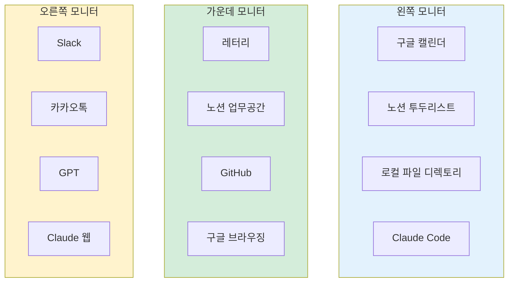
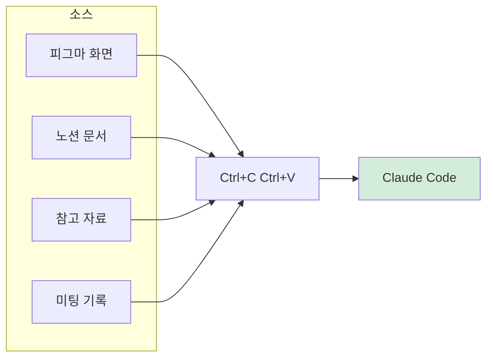
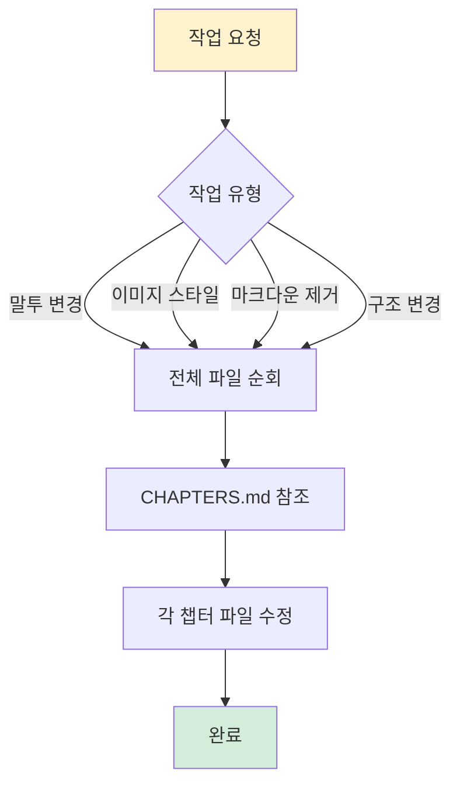
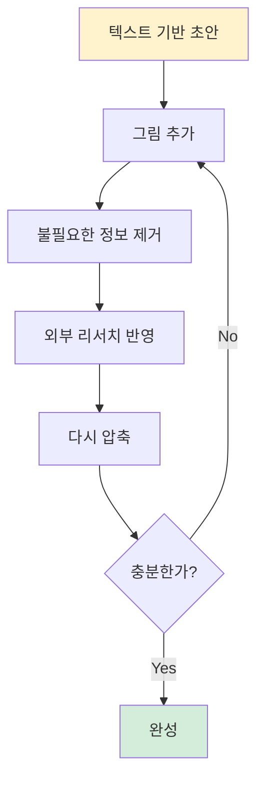
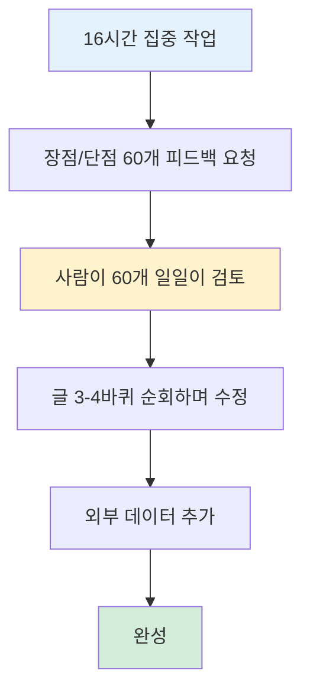

이 책을 어떻게 썼는지에 대한 이야기입니다.

---

## 1. 300페이지를 혼자서

300페이지가 넘는 문서를 혼자서 빠르게 작성했습니다. Claude Code와 체계적인 시스템 덕분입니다.

핵심은 두 가지입니다:
- AI를 도구로 활용하는 것
- 반복 가능한 시스템을 만드는 것

---

## 2. 작업 환경: 12개 창의 오케스트라

모니터 3대를 사용합니다. 각 모니터는 4개의 창으로 분할됩니다.

*Figure A02-1. 12개 창의 작업 환경 배치*

각 창에는 역할이 있습니다:

| 위치 | 창 | 역할 |
|------|-----|------|
| 왼쪽 | Claude Code | 메인 작업 도구 |
| 가운데 | 레터리 | 음성 입력 |
| 가운데 | 노션 | 정보 정리 |
| 가운데 | GitHub | 버전 관리 |
| 오른쪽 | Claude 웹/GPT | 보조 AI |

---

## 3. 정보 수집: 음성에서 텍스트로

생각을 글로 바꾸는 파이프라인입니다.

*Figure A02-2. 정보 수집 파이프라인: 음성에서 글로*

레터리(Lettery)는 음성을 텍스트로 바꿔주는 앱입니다. 3분간 생각을 풀어놓으면 텍스트가 됩니다. 이걸 노션에 정리하고, Claude에게 전달합니다.

평소에도 생각이 떠오르면 기록합니다:
- 카카오톡 나에게 보내기
- 레터리에 한 마디 던져놓기
- 한 줄이라도 메모

한 달치 생각이 쌓이면, 그게 책의 디테일이 됩니다.

---

## 4. 입력의 철학: 일단 다 때려박기

입력 방식은 단순합니다. **Ctrl+C → Ctrl+V**.

*Figure A02-3. 입력 방식: Ctrl+C, Ctrl+V로 통합*

피그마 영역을 드래그해서 복사하고, 노션 문서를 통째로 복사하고, 참고 자료를 복사해서 붙여넣습니다. "대충 그래도 얘가 이해를 한다"는 마인드입니다.

미팅 기록 15개에서 에센스를 추출하고, 50개 블로그의 최근 게시글을 엑셀로 정리해서 던지기도 합니다. 일단 다 넣고, AI가 정리하게 합니다.

---

## 5. 일괄 처리: 300페이지를 한 번에

300페이지 문서 전체에 적용되는 작업들이 있습니다.

*Figure A02-4. CHAPTERS.md 기반 일괄 처리*

예시:
- "모든 파일에서 경어체를 비격식체로 바꿔줘"
- "모든 다이어그램을 Mermaid로 변환해줘"
- "각 챕터 끝에 핵심 정리 표를 추가해줘"

CHAPTERS.md 파일이 목차 역할을 합니다. Claude는 이 파일을 보고 어떤 파일들을 순회해야 하는지 파악합니다.

---

## 6. 외부 연동: API만 있으면 된다

Ghost 블로그에 글을 발행하고 싶었습니다. Ghost는 MCP를 제공하지 않습니다. 하지만 API는 있습니다.

"Ghost 블로그랑 연결해줘" 한마디로 연결됐습니다.

핵심: **MCP나 공식 커넥터가 없어도, API만 있으면 연결 가능합니다.**

---

## 7. 스킬화: 반복을 자동화

자주 반복하는 작업은 스킬로 만들 수 있습니다.

*Figure A02-5. 스킬화: 반복 작업의 자동화*

예시: **윤문 번역기** (https://aiden.ghost.io/seukilhaeseol-koreanrewriter/)

번역된 한국어를 원어민처럼 다듬는 스킬입니다:
- "번역 냄새" 제거
- 원저자 목소리 유지
- 구체적 규칙: 조사 선택, 부사 최소화, 무생물 주어 피하기

DIAGRAM-RULES.md 같은 규칙 문서도 같은 원리입니다. 반복되는 실수를 방지하고, 일관된 품질을 유지합니다.

장점:
- 재반복 사용 가능
- 컨텍스트 윈도우 효율적 관리
- 자주 반복하는 실수 방지
- 일관된 품질 유지

---

## 8. 커밋 스토리: 3일간 132건

이 책을 쓰는 동안 3일간 132개의 Git 커밋이 생성됐습니다.

| 분류 | 건수 | 예시 |
|------|------|------|
| 구조/인덱스 변경 | ~25건 | 인덱스 재정렬, 파일 분리, 파트 이동 |
| 다이어그램 작업 | ~35건 | SVG 추가, ASCII→Mermaid 변환, 렌더링 버그 수정 |
| 글 수정/개선 | ~40건 | 문체 수정, 내용 재편, 경어체 통일 |
| 시스템 관리 | ~20건 | CHAPTERS.md, GALLERY.md, DIAGRAM-RULES.md |
| 부록/기타 | ~12건 | 부록 통합, 에셋 정리 |

대표 커밋 메시지들:
- "31번 파일 세 개로 분리: 전통적 정의, 실용적 정의, 컴포넌트"
- "ASCII art → Mermaid 다이어그램 일괄 변환 (13개 파일)"
- "Mermaid 렌더링 버그 전면 수정 (6개 파일)"
- "Part 4 인덱스 재정렬: 44-45 신설, 46으로 이동"

*Figure A02-6. 커밋 스토리: 3일간 132건의 기록*

모든 작업이 기록됩니다. 문제가 생기면 롤백할 수 있습니다.

---

## 9. 펼치고 압축하고

글쓰기의 핵심 사이클입니다.

*Figure A02-7. 글쓰기 사이클: 펼치고 압축하고 반복*

프로세스:
1. 텍스트 기반으로 기본 글 작성
2. 적합한 그림 추가
3. 불필요한 정보 제거/압축
4. 외부 리서치 반영 (50개 블로그/사이트 최근 게시글)
5. 미팅 기록 15개에서 에센스 추출
6. 다시 압축
7. 반복...

**펼치고 압축하고 → 사람의 흔적 더하기 → 한 줄 한 줄이 귀한 문장**

AI가 작성한 글에 사람의 경험과 판단을 더합니다. 그래야 진짜 글이 됩니다.

---

## 10. Claude 피드백 60개 반영

16시간 동안 Claude와 붙어서 글을 씁니다. 그 후 피드백을 요청합니다.

*Figure A02-8. Claude 피드백 60개 반영 프로세스*

핵심은 **사람이 60개를 일일이 검토**하는 것입니다. AI의 피드백을 맹신하지 않습니다. 맞는 것만 반영합니다.

---

## 11. 행동 권장: 한 달 집중 프로젝트

Claude Code를 제대로 활용하려면:

*Figure A02-9. 행동 권장: 한 달 집중 프로젝트 흐름*

"한 달만 딱 결제하고 끊어도 된다"

집중 작업 기간을 확보하는 게 중요합니다. 한 달 동안 Max를 켜고, 하나의 프로젝트에 올인합니다.

---

## 핵심 정리

| 개념 | 요약 |
|------|------|
| 작업 환경 | 3대 모니터 × 4창 = 12개 창 |
| 정보 수집 | 레터리 → 노션 → Claude |
| 입력 방식 | Ctrl+C, Ctrl+V로 다 때려박기 |
| 일괄 처리 | CHAPTERS.md 기반 전체 순회 |
| 외부 연동 | MCP 없어도 API만 있으면 됨 |
| 스킬화 | 반복 작업을 규칙으로 정의 |
| 글쓰기 사이클 | 펼치고 압축하고 반복 |
| 피드백 | AI 60개 피드백 + 사람 검토 |

---

작성일: 2026-01-08
Chapter: 부록 A02
키워드: 글쓰기 시스템, 작업 환경, 정보 수집, 일괄 처리, 스킬화, 피드백 반영

---
<!-- LLM Context Anchor -->
**핵심 요약**: 300페이지 책 쓰는 시스템. 작업환경: 3대 모니터×4창=12개. 정보수집: 레터리(음성)→노션→Claude. 입력방식: Ctrl+C, Ctrl+V로 다 때려박기. 일괄처리: CHAPTERS.md 기반 전체 순회. 스킬화: 반복 작업을 규칙으로 정의(윤문 번역기 등). 글쓰기 사이클: 펼치고 압축하고 반복. Claude 피드백 60개 + 사람이 일일이 검토. 3일간 132건 커밋.

**키워드**: `글쓰기시스템` `12개창` `레터리` `CHAPTERS.md` `스킬화` `펼치고압축하고`
