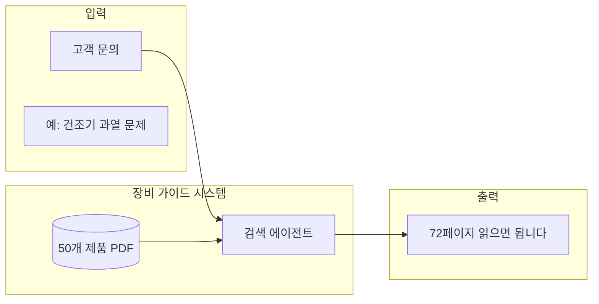

"신입이 일인분 하려면 1년이에요."

세탁설비 업체에서 일하는 K씨가 가장 답답해하던 문제입니다. 산업용 세탁기, 건조기, 다리미 프레스, 보일러, 행거 시스템. 10개 제조사에서 나온 50가지 장비를 다루는데, 신입이 이걸 다 익히려면 정말 1년이 걸립니다.

그런데 K씨는 마케터 출신입니다. 코딩을 배운 적도 없습니다. 이 사람이 어떻게 1개월 만에 회사의 데이터 구조를 바꾸고, 장비 가이드 시스템을 만들고, 견적 계산기까지 구축했을까요?

---

## 이 회사가 하는 일

세탁설비 업체는 세 가지 일을 합니다:

1. **신규 설치**: 세탁소가 "매장 통째로 만들어주세요"라고 하면, 장비들을 도매가로 사와서 설치
2. **장비 판매**: 기존 업체에 개별 장비 판매
3. **AS 수리**: 고장 나면 현장 출동해서 수리

7명의 직원이 연 30억 매출을 냅니다. 현장 인력 5명, 관리직 2명. 그런데 관리직도 현장을 나갑니다. 영업도 하고 AS도 하고 마케팅도 해야 합니다. 누구 하나 오피스에만 앉아 있는 사람이 없습니다.

고객이 세탁설비 업체를 고르는 기준 1위는 "친절함"입니다. 현장에서 얼마나 성의 있게 응대하느냐가 재계약을 결정합니다. 그래서 직원들은 현장에 집중해야 하는데, 현실은 다릅니다.

---

## 비규격적 업무들

현장 수리만 하면 될 것 같지만, 실제로는 온갖 잡무가 따라붙습니다.

- 구매 발주
- 재고 관리
- 견적서 작성 (경리나라 프로그램 사용)
- 수리 접수
- 완료 보고
- 사진 전송
- 고객 상담

K씨 표현으로는 "비규격적인 일들이 너무 많다"입니다. 설치하는 사람이 설치만 하지 않습니다. 파노라마처럼 여러 업무가 스쳐 지나갑니다.

그래서 야근을 합니다. 8시간 현장 나가고, 집에서도 오피스 업무를 처리합니다. 마케팅할 시간은 하루 2-3시간이 고작입니다.

그럼 사람을 더 뽑으면 되지 않을까요?

---

## "이 업계는 인력풀이 없다"

여기서 세탁설비 업계의 특수한 문제가 있습니다.

전기 기술자? 더 좋은 전기 회사로 갑니다. 냉동 기술자? 냉동 전문 회사로 갑니다. 세탁설비는 전기도 좀 알아야 하고, 냉동(건조기)도 좀 알아야 하고, 고객 상담도 해야 합니다.

> "전기를 배운 사람이 여기로 안 와. 냉동을 배운 사람도 여기로 안 와."

그래서 비전공자를 뽑아서 처음부터 가르칩니다. 그런데 그 교육에 1년이 걸립니다.

---

## 500가지 지식이 필요하다

왜 1년일까요? K씨가 계산해봤습니다.

> 50종 장비 × 장비당 10개 고장 패턴 = 500가지 지식

세탁기 하나만 해도 배수 불량, 모터 과열, 베어링 마모, 컨트롤러 오류... 고장 유형이 한두 가지가 아닙니다. 건조기도 마찬가지, 다리미 프레스도 마찬가지.

그런데 더 큰 문제가 있습니다.

### "6개월 전에 가르쳤잖아"

신입한테 세탁기 배수 문제 해결법을 가르쳤습니다. 그런데 그 세탁기가 6개월 후에 또 고장 납니다. 신입은 기억을 못 합니다. 당연합니다. 50종 장비를 순환하면서 보는데, 6개월 만에 다시 본 장비를 어떻게 기억합니까?

결국 또 가르치거나, 아니면 현장에서 헤매다가 고객 컴플레인이 들어옵니다.

> "너 6개월 전에 배웠잖아?"
> "6개월 만에 보는데 어떻게 알아요?"

서로 탓할 수 없습니다. 구조적 문제입니다.

---

## 실제 현장: 건조기 과열 수리

500가지 지식이 뭔지 감이 안 올 수 있습니다. K씨가 실제 수리 과정을 설명해줬습니다.

> 건조기가 과열돼서 멈췄어요. 일단 온도 센서를 테스터기로 확인해야 합니다. 테스터기로 Input과 Output이 정상인지 체크하고, 과열 방지 스위치(리셋 버튼)가 작동하는지 눌러봅니다. 둘 다 정상이면 컨트롤러 문제일 수 있어요. 컨트롤러 교체할 때는 방향이 있어서 A는 A에, B는 B에 맞춰서 끼워야 합니다.

4단계입니다. 설명하는 데 1분 걸렸습니다.

그런데 이런 설명이 500가지 필요합니다. 500분 = 8시간 넘게. 그것도 한 번 듣고 다 외울 수 있다면요.

그럼 매뉴얼을 만들면 되지 않을까요?

---

## 지식이 어디 있는지 아무도 모른다

매뉴얼을 만들려고 할 때 K씨가 처음 느낀 건 이거였습니다:

> 데이터가 없는 게 아니라, 데이터가 어디 있는지 아무도 모른다.

| 장소 | 형태 | 문제 |
|------|------|------|
| 사장님 머릿속 | 암묵지 | 물어봐야 알 수 있음 |
| 직원 컴퓨터 | 각자 폴더 | 중복, 버전 혼란 |
| 수첩 | 손글씨 | 검색 불가 |
| 인터넷 PDF | 제조사 매뉴얼 | 흩어져 있음 |
| 오래된 책 | 스캔 안 됨 | PDF조차 없음 |

7명의 직원이 각자 자기 컴퓨터에 파일을 쌓아두고 있었습니다. 견적서도, 이메일도, 메모도 전부 따로따로.

### 매년 실패하는 매뉴얼 프로젝트

K씨는 매년 시도했습니다. "올해는 교육 매뉴얼 PPT를 만들자."

매번 실패했습니다. 너무 방대해서. 50종 장비, 500가지 고장 패턴, 각각의 해결 방법. 어디서부터 손을 대야 할지 모르겠습니다.

> "방대하고 복잡해서 항상 실패하지."

결국 신입 교육은 "그때그때 알려주기"로 돌아갑니다. 효율이 안 나는 구조가 반복됩니다.

---

## 정리: K씨가 해결하려던 문제

- 500가지 지식이 필요하고
- 데이터는 흩어져 있고
- 비규격적 업무가 많고
- 인력풀도 없다

이 네 가지가 맞물려서, 신입이 "일인분"을 하려면 1년이 걸리는 구조가 만들어졌습니다.

---

## 시작은 작은 것부터

그런데 K씨는 처음부터 "전사 시스템"을 만들려고 하지 않았습니다.

Claude Code를 결제하고 나서 처음 한 일은 본인한테 당장 필요한 것들이었습니다:

- 간단한 데이터 분석 대시보드
- 쓰고 싶었는데 비싸서 못 쓰던 SaaS 기능을 직접 구현
- 경리나라에서 아쉬웠던 기능들

이 과정에서 "어, 나도 만들 수 있네?"라는 자신감이 생겼습니다.

그리고 나서야 진짜 문제를 건드렸습니다:

> 신입이 1년 걸리는 걸, 2개월로 줄일 수 있으면?

10개월치 연봉을 아낄 수 있습니다. 일감이 몰려도 인력 부족으로 성장 못하는 구조를 바꿀 수 있습니다.

목표가 정해졌습니다. 그런데 어디서부터 시작해야 할까요?

---

## 7명의 USB를 모아서

K씨는 과감한 결정을 합니다. 일단 데이터부터 모으기로.

> "프라이빗한 거 빼고, 바탕화면에 있는 모든 폴더 다 담아서 줘."

전 직원 컴퓨터에 있는 파일을 전부 달라고 했습니다. 7개의 ZIP 파일이 USB로 모였습니다. 수년간 쌓인 견적서, 이메일, 사진, 메모들.

충격적이었지만, 사장님 컴퓨터만 폴더 정리가 되어 있었습니다. 나머지는 "폴더 자체가 없다"는 수준.

Claude Code에 이렇게 요청했습니다:

```
우리 사업이 이런 사업을 하고,
지금까지 내가 이런 고민들을 해서 이런 소프트웨어들을 만들었고,
이런 문제들에 착안해서 요런 것들을 만들고 싶은데,

일단 기존 데이터들을 분석해나가면 좋을 것 같아.
근데 내가 모든 데이터를 한 번에 컴퓨터가 읽기 좋은 형태로 만들 수는 없으니까,

일단 파일부터 정리하자.
- 견적서는 견적서대로
- 이메일은 이메일대로
- 서류 내부를 확인하면서 폴더 정리

그리고 각 파일에 어떤 담당자 컴퓨터에서 온 건지 태그로 남겨줘.
```

파일들이 분류되고 정리되자, 비로소 "우리 회사의 핵심 자산이 뭔지" 보이기 시작했습니다.

그런데 회사 내부 데이터만으로는 부족했습니다.

---

## 50개 매뉴얼, 자동으로 모으기

내부 데이터를 정리하니 패턴이 보였습니다. 10개 제조사에서 각각 5개씩, 대략 50개 제품. 이것들의 PDF 매뉴얼이 인터넷 어딘가에 흩어져 있었습니다.

```
10개 업체에서 각각 5개씩, 대략 50개 제품을 갖고 있는데,
이것들에 대해서 인터넷에서 PDF 파일이 50개가 될 때까지
모두 다운로드해줘.
```

Ultrawork 모드로 50개 제품 매뉴얼을 자동 수집했습니다.

### 장비 가이드 시스템

이제 "건조기가 과열돼서 멈춰요"라는 문의가 들어오면, 어떤 매뉴얼의 몇 페이지를 봐야 하는지 알려주는 시스템을 만들 수 있게 됐습니다.



신입이 현장에 나가기 전에 이 시스템에 물어봅니다. 기존에는 사장님한테 전화해서 물어봤습니다.

그런데 온라인에 없는 지식도 있었습니다.

---

## 300페이지 책을 디지털로

책상에 올려져 있던 2006년산 300페이지짜리 세탁설비 설계 서적. 이 업계 사람들은 다 아는 책인데, PDF 파일조차 없었습니다. 인터넷에도 없습니다.

K씨가 한 일:
1. 책을 잘라서 스캔
2. PDF로 변환
3. 한글 OCR 일괄 처리
4. 텍스트로 정리된 PDF 생성

> "한글 OCR이 리소스가 좀 많이 들더라고요."

쉽지 않았지만, 이제 이 책 내용을 기반으로 견적 패턴을 찾아 제안하는 시스템까지 만들었습니다.

여기까지 1개월이 걸렸습니다.

---

## 1개월 후의 변화

| 항목 | Before | After |
|------|--------|-------|
| 데이터 위치 | 7명의 컴퓨터에 흩어짐 | 한 곳에 정리, Git으로 관리 |
| 신입 교육 | 1년 | 목표: 2개월 |
| 장비 정보 검색 | 사장님한테 전화 | 시스템에 질문 |
| 견적 작성 | 경리나라 + 수기 계산 | 자동 계산기 |
| 기술 매뉴얼 | 300페이지 종이책 | 검색 가능한 텍스트 |
| PDF 매뉴얼 | 인터넷에 흩어짐 | 50개 한곳에 정리 |

### 아이디어 수집 시스템

팀원들이 "이런 거 만들 수 있겠다"는 생각이 들 때마다, 텔레그램 채팅방에 아이디어를 던집니다. 그 내용들이 기준 문서에 차곡차곡 정리됩니다.

---

## 아직 남은 문제들

성과가 있었지만, K씨도 인정합니다. 아직 완성이 아닙니다.

### 500가지 지식 데이터화

500가지 고장 패턴을 전부 데이터로 만들어야 합니다. K씨 계산으로는:

> "하나 설명하는 데 5분이면, 500개는 2,500분. 40시간 넘게."

그런데 PPT를 만드는 게 아니라, 그냥 말로 설명하면 됩니다. AI가 학습할 수 있는 형태로요.

### 현장 친절함은 대체 불가

앞서 말했듯이, 고객이 업체를 선택하는 기준 1위는 "친절함"입니다. 현장에 가서 사람을 만나고, 친절하게 응대하는 건 여전히 사람 몫입니다.

> "현장에서 일어나는 서비스 가치가 크다면, 시스템은 소용없는 거 아닌가요?"

K씨의 대답:

> "현장에서 하는 일을 대체하려는 게 아니에요. 현장에 가기 전에 준비하는 시간, 현장 다녀와서 처리하는 오피스 업무. 그걸 줄이는 거죠."

---

## K씨가 깨달은 것

아직 갈 길이 멀지만, 1개월간의 작업 끝에 K씨가 내린 결론이 있습니다:

> 95%의 회사들이 이렇게 정리 안 된 상태로 일하고 있습니다.

그리고 이제는 구분이 됩니다:

- 어떤 문제가 클로드 코드로 해결될 수 있는지
- 얼마나 시간이 걸릴지
- 지금은 안 되지만 1년 후쯤엔 가능할지

### 순서가 중요했습니다

1. **작은 것부터**: 당장 필요한 작은 도구 만들기
2. **데이터 수집**: 흩어진 데이터 한곳에 모으기 (7명 USB)
3. **구조화**: 컴퓨터가 읽을 수 있는 형태로 정리 (CSV, Markdown)
4. **시스템화**: 반복 업무를 자동화

한 번에 다 하려고 하지 마세요. K씨도 1개월이 걸렸고, 아직 완성이 아닙니다. 하지만 이제 방향이 보입니다.

---

## 다음 단계

방향이 보이니, 다음 할 일도 명확해졌습니다. K씨가 계획하고 있는 것들:

1. **500가지 지식 데이터화**: 짬밥 있는 직원들이 돌아가면서 녹음
2. **비규격적 오피스 업무 자동화**: 구매 발주, 재고 관리, 완료 보고
3. **마케팅 시간 확보**: 하루 2-3시간 → 풀타임으로

> "올해는 참 기대가 됩니다. 2026년, 미쳤다."
