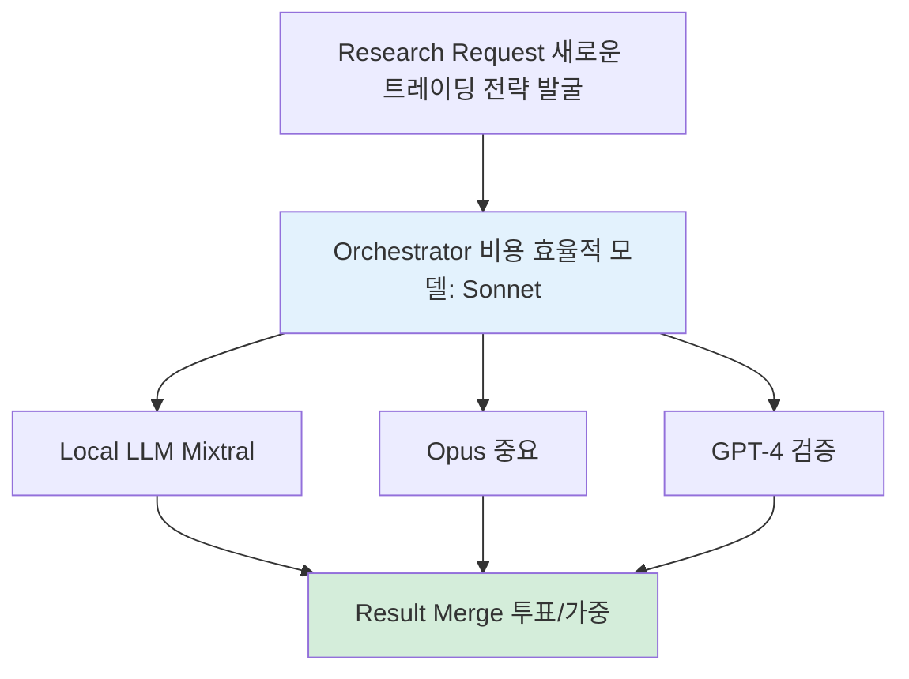
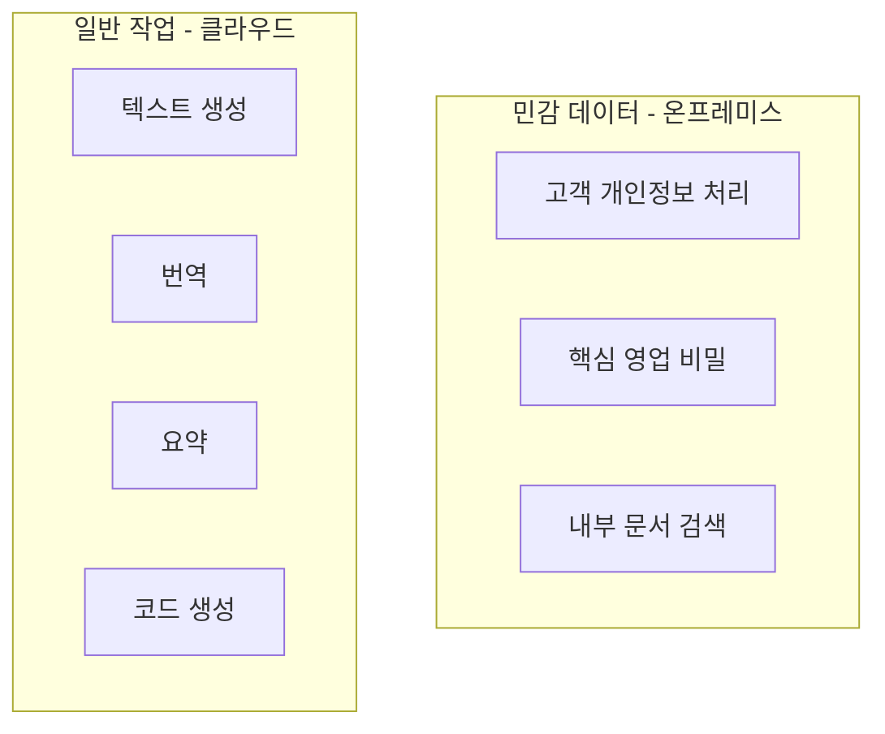

## 주장

금융권이나 의료권의 온프레미스 요구는 이해하지만, 나머지 업종에서 "보안" 명목으로 무조건 온프레미스를 고집하는 것은 비효율적이다. OpenAI, Gemini, Anthropic 같은 클라우드 AI는 B2B 계약을 맺고 쓰는 것이 현실적이다.

## 온프레미스가 필요한 경우 vs 불필요한 경우

### 온프레미스가 정당화되는 경우

1. 규제가 있는 산업
- 금융권: 고객 금융 정보, 거래 데이터
- 의료권: 환자 개인정보, 진료 기록
- 국방/공공: 국가 기밀, 보안 정보

이들 산업은 법적으로 데이터 외부 반출이 제한되거나, 유출 시 막대한 법적 책임이 발생한다.

2. 극도로 민감한 데이터
- 핵심 영업 비밀
- 특허 출원 전 기술 정보
- M&A 관련 내부 정보

3. 초대규모 트래픽 + 장기 운영
- 일일 수억 건 이상의 AI 호출
- 클라우드 비용이 자체 구축보다 비쌀 때
- 예: 네이버, 카카오 수준의 서비스

### 온프레미스가 불필요한 경우

대부분의 일반 기업
- 스타트업, 중소기업, 일반 제조업
- 출판사, 마케팅 에이전시
- 교육, 유통, 서비스업

이들 업종에서 "보안보안" 하면서 온프레미스를 고집하는 것은:
- 초기 투자 비용 과다
- 유지보수 부담
- 최신 모델 업데이트 지연
- 전문 인력 필요

현실적 조언: OpenAI, Gemini, Anthropic 같은 것들은 B2B 계약 맺고 쓰라고 권장한다.

## B2B 클라우드 AI의 장점

### 1. 보안 계약

주요 AI 제공사들은 엔터프라이즈 고객을 위한 보안 옵션을 제공한다:

OpenAI Enterprise:
- 데이터를 학습에 사용하지 않음 보장
- SOC 2 Type 2 인증
- GDPR, HIPAA 준수 옵션
- 전용 인스턴스 옵션

Google Gemini for Enterprise:
- 데이터 격리
- 고객 관리형 암호화 키 (CMEK)
- VPC 내 배포 가능

Anthropic Claude for Enterprise:
- 데이터 보존 정책 명시
- 학습 데이터 미사용 보장
- 커스텀 SLA

### 2. 비용 효율성

| 항목 | 클라우드 AI | 온프레미스 |
|------|------------|-----------|
| 초기 투자 | 없음 | 수천만~억원 |
| 하드웨어 | 없음 | GPU 서버 구매 |
| 유지보수 | 제공사 담당 | 자체 인력 필요 |
| 업데이트 | 자동 | 수동 관리 |
| 확장성 | 즉시 | 하드웨어 추가 구매 |

### 3. 최신 모델 접근

- GPT-4, Claude Opus 4.5 같은 최신 모델 즉시 사용
- 지속적인 성능 개선
- 새로운 기능 자동 추가

## 온프레미스 구축 사례: 당근마켓

그러나 당근 같은 곳들이 온프렘의 좋은 사례이기는 하다.

### 당근마켓이 온프레미스를 선택한 이유

1. 트래픽 규모: 일일 수천만 건의 AI 호출
2. 비용 최적화: 클라우드 비용이 자체 구축보다 비쌌음
3. 데이터 주권: 사용자 데이터를 외부에 보내지 않음
4. 커스터마이징: 자사 서비스에 최적화된 모델 튜닝

### 온프레미스 구축 가이드: 허예찬 사례

실제로 온프레미스를 구축하려면 얼마짜리 컴퓨터를 사서 어떤 서버 구성을 하면 되는지 허예찬 사례로 살펴보자.

#### 허예찬(23세)의 온프레미스 퀀트 트레이딩 시스템

하드웨어:
- 서버: AMD EPYC 192코어, RAM 1TB
- 비용: 1,300만원 (일회성)
- 위치: 자취방

소프트웨어 스택:
- 모델: 자체 호스팅 LLM (Llama, Mixtral 등) + 클라우드 API (Opus, GPT-4) 혼용
- 오케스트레이션: LangGraph
- 데이터베이스: PostgreSQL
- 모니터링: Grafana, Prometheus

앙상블 전략:

허예찬은 단일 모델이 아닌 앙상블 전략을 사용한다:

*Figure A06-1. 허예찬의 앙상블 전략: 로컬 + 클라우드 혼합*

앙상블 로직:
1. 단순 작업 → 로컬 LLM (무료, 빠름)
2. 중요 판단 → Opus (정확, 비쌈)
3. 검증 필요 → GPT-4 + Opus 교차 검증
4. 최종 결정 → 다수결 또는 가중 평균

월 운영 비용:
- 클라우드 API 토큰: $5,000~6,000
- 전기료: 약 100만원
- 총: 약 700만원

ROI:
- 월 거래량: $60M (800억원)
- 운영 비용: 0.01%

#### 일반 기업을 위한 온프레미스 구축 가이드

소규모 구축 (~500만원):
- 하드웨어: NVIDIA RTX 4090 × 2 + Workstation
- 모델: Llama 3 70B, Mixtral 8x7B
- 용도: 내부 문서 검색, 간단한 자동화
- 한계: 성능이 GPT-4/Opus보다 떨어짐

중규모 구축 (~3,000만원):
- 하드웨어: NVIDIA A100 × 2~4 + Server
- 모델: Llama 3.1 405B, 파인튜닝 가능
- 용도: 부서 단위 AI 시스템
- 장점: 클라우드보다 저렴 (장기)

대규모 구축 (~1억원 이상):
- 하드웨어: NVIDIA H100 × 8+ + Cluster
- 모델: 자체 학습, 파인튜닝
- 용도: 전사 AI 플랫폼
- 요구사항: 전문 인력 (MLOps 팀)

## 의사결정 가이드

### 클라우드 AI를 써야 하는 경우

- [ ] 규제 산업이 아니다
- [ ] 월 AI 호출 < 1,000만 건
- [ ] 초기 투자 예산이 제한적
- [ ] AI/MLOps 전문 인력이 없음
- [ ] 빠른 도입과 실험이 우선

→ OpenAI/Anthropic/Google B2B 계약 권장

### 온프레미스를 고려할 경우

- [ ] 규제 산업 (금융, 의료, 국방)
- [ ] 월 AI 호출 > 1억 건
- [ ] 장기적 비용 절감 필요
- [ ] AI/MLOps 팀 보유
- [ ] 데이터 주권이 핵심

→ 전문가와 상담 후 결정

## 하이브리드 접근

대부분의 기업에게 현실적인 방법은 하이브리드다:

*Figure A06-2. 하이브리드 접근: 민감 데이터와 일반 작업 분리*

장점:
- 민감 데이터는 내부에서 처리
- 일반 작업은 최신 클라우드 모델 활용
- 비용과 보안의 균형

## 결론

원칙:
1. 필요성 재검토: 정말 온프레미스가 필요한가?
2. B2B 계약 우선: 대부분은 클라우드 + 보안 계약으로 충분
3. 하이브리드 고려: 민감한 것만 온프레미스
4. 전문가 상담: 큰 투자 전에 반드시 전문가와 논의

현실적 조언:
> 금융권이나 의료권이 아닌 이상, 클라우드 AI를 B2B 계약으로 쓰는 것이 가장 현실적이다. "보안"을 명목으로 온프레미스를 고집하다가 초기 투자에 막혀 AI 전환 자체를 못하는 것이 더 큰 리스크다.

---

작성일: 2026-01-06
Chapter: Part 6, Chapter 3 - On-premises
키워드: 온프레미스, 클라우드 AI, 하이브리드, B2B 계약, 당근마켓, 허예찬
상태: 미분류 (94)

---
<!-- LLM Context Anchor -->
**핵심 요약**: 온프레미스 정당화 경우: 규제산업(금융/의료/국방), 극도로 민감한 데이터, 초대규모 트래픽. 나머지는 클라우드 AI를 B2B 계약으로. 허예찬 사례: 1,300만원 서버(AMD EPYC 192코어), 로컬LLM+클라우드API 앙상블, 월 700만원 운영비로 $60M 거래. 현실적 조언: 하이브리드(민감 데이터만 온프레미스, 일반은 클라우드).

**키워드**: `온프레미스` `클라우드AI` `B2B계약` `하이브리드` `허예찬` `당근마켓`
