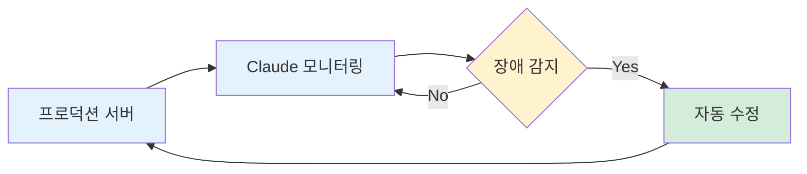

서버 개발자의 관점에서 Claude Code를 실무에 활용하는 방법을 공유합니다. 단순히 코드를 생성하는 것을 넘어, 개발 워크플로우 전체를 자동화하는 팁입니다.

---

## 꿀팁 1: PostgreSQL과 Python 연동

### 왜 PostgreSQL인가?

요즘 해외 개발자들 사이에서 PostgreSQL 사용이 크게 늘었습니다. MongoDB도 써보고 MySQL도 많이 썼지만, Python 라이브러리와의 연동 측면에서 PostgreSQL이 압도적으로 편해요.

### Claude Code와의 시너지

Claude Code에게 데이터베이스 작업을 시킬 때 PostgreSQL을 사용하면 다음과 같은 이점이 있습니다.

| 작업 | MySQL | PostgreSQL |
|------|-------|------------|
| 스키마 설계 | 가능 | 가능 |
| 테이블 생성 | 가능 | 가능 |
| Python 연동 테스트 | 제한적 | 원활 |
| API 결과 대신 DB 직접 확인 | 불편 | 편리 |

실제로 저는 이렇게 개발합니다:

1. Claude Code에게 "이런 데이터 구조가 필요해"라고 설명
2. Claude가 테이블 스키마를 설계하고 생성
3. 테스트할 때 API 응답 대신 DB에 직접 들어간 데이터를 확인

API 결과를 보면서 디버깅하는 것보다 DB를 직접 확인하는 방식이 훨씬 빠르고 정확합니다.

---

## 꿀팁 2: 영어로 프롬프트 쓰기

### 토큰 비용 차이

한국어와 영어는 토큰 소모량이 약 3배 차이가 납니다. 같은 의미를 전달해도 한국어가 훨씬 많은 토큰을 사용하죠.

```
"테스트 코드를 작성해줘" → 약 15 토큰
"Write test code" → 약 5 토큰
```

### 체감되는 품질 차이

영어로 프롬프트를 작성하면 비용 절감 외에도 미묘한 차이가 있습니다. 영어로 지시했을 때 Claude가 더 많은 권한을 갖고 적극적으로 행동하는 느낌을 받았어요.

한국어로 시켰을 때 "이건 못해요"라고 하던 것들이 영어로 하면 되는 경우도 있었습니다. 명확한 이유는 알 수 없지만, 실무에서 체감되는 차이입니다.

---

## 이야기 1: 백그라운드 터미널 자동 디버깅

### Claude Code의 핵심 장점

Copilot이나 Cursor와 Claude Code의 가장 큰 차이점은 터미널에 대한 읽기/쓰기 권한이에요.

저는 로컬에서 개발할 때 이렇게 합니다:

```
나: "백그라운드에서 이거 돌려"
Claude: (서버를 백그라운드에서 실행하고 로그를 모니터링)
나: "개발해봐"
Claude: (코드를 수정하면서 발생하는 에러를 자동으로 감지하고 수정)
```

### 자동 디버깅 플로우


*Figure B02-1. 백그라운드 터미널 자동 디버깅 플로우*

Claude가 백그라운드에서 로그를 계속 보고 있기 때문에, 제가 로그를 직접 확인하지 않아도 돼요. Syntax Error나 Runtime Error가 발생하면 Claude가 자동으로 감지해서 수정합니다.

이게 Claude Code를 쓰는 가장 큰 이유입니다. 터미널에 대한 접근 권한이 다른 AI 코딩 도구와의 결정적인 차이점이죠.

---

## 이야기 2: 원격 서버 배포 자동화

### 로컬-리모트 연동

백엔드 개발자는 로컬에서 개발한 후 리모트 서버(AWS 등)에 배포해야 합니다. 최근에는 Claude Code에게 서버 접속 정보를 직접 주고 배포까지 자동화하고 있어요.


*Figure B02-2. 로컬-리모트 배포 자동화 플로우*

이 플로우가 혁신적인 이유는:

1. 로컬에서 코드 수정
2. Claude가 자동으로 Push
3. 리모트 서버에서 Pull
4. 리모트에서 테스트 실행
5. 리모트에서 발생한 문제를 로컬에서 수정

리모트 서버에서 발생하는 문제점을 Claude가 감지하고, 로컬에서 수정해서 다시 Push하는 것까지 자동으로 돼요.

### 미래 아이디어: 서버 상주 에이전트

백엔드 개발자가 가장 힘든 일 중 하나는 장애 대응입니다. 새벽에 문제가 터지면 당직자가 깨어나서 해결해야 하죠. 경험이 많아야 짧은 시간 안에 문제를 파악하고 해결할 수 있습니다.

그래서 생각한 아이디어가 있습니다:

서버에 Claude Code를 NPM으로 설치해서 상시 모니터링하게 하면 어떨까요?



*Figure B02-3. 서버 상주 에이전트 구상*

문제가 생길 때마다 Claude가 코드를 직접 고쳐서 서비스가 계속 돌아가게 하는 겁니다. 아직 구현 전이지만, 이번 주에 떠오른 아이디어예요.

---

## 핵심 메시지

Claude Code는 단순한 코드 생성 도구가 아닙니다. 터미널에 대한 완전한 접근 권한을 가지고 있기 때문에, 개발 워크플로우 전체를 자동화할 수 있어요.

- PostgreSQL과 Python 연동으로 DB 작업 자동화
- 영어 프롬프트로 비용 절감 + 기능 확장
- 백그라운드 터미널 모니터링으로 자동 디버깅
- 로컬-리모트 배포 파이프라인 자동화

이런 접근 방식이 가능한 이유는 Claude Code가 터미널을 읽고 쓸 수 있기 때문입니다. 이것이 다른 AI 코딩 도구와의 결정적인 차이점입니다.

---

작성자: 김종우
최종 업데이트: 2026-01-08

---
<!-- LLM Context Anchor -->
**핵심 요약**: Claude Code 실무 활용 꿀팁. ①PostgreSQL+Python 연동(API 디버깅보다 DB 직접 확인이 빠름). ②영어 프롬프트(한국어 대비 토큰 3배 절감, 기능도 더 잘됨). ③백그라운드 터미널 자동 디버깅(Claude Code 핵심 차별점=터미널 읽기/쓰기 권한). ④로컬-리모트 배포 자동화(Push→Pull→Test→Fix 루프). ⑤서버 상주 에이전트 아이디어(장애 자동 대응).

**키워드**: `ClaudeCode` `PostgreSQL` `영어프롬프트` `터미널권한` `자동디버깅` `배포자동화`
