# GALLERY.md 전수 테스트

GALLERY.md의 모든 Mermaid 다이어그램을 순서대로 테스트합니다.

---

## 1. 성장 패러다임 비교
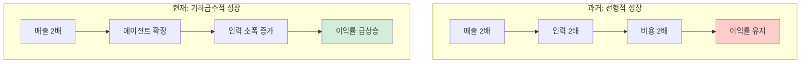

---

## 2. 롤업 전략 비교
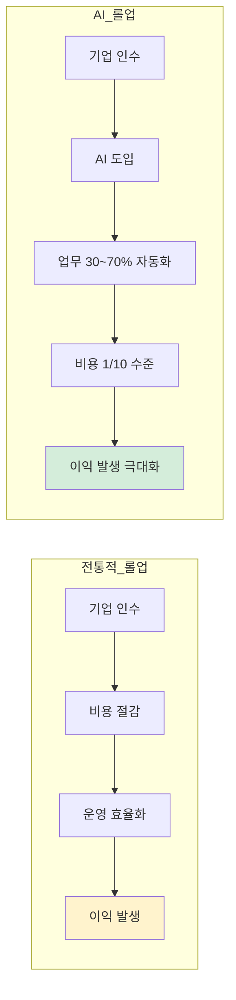

---

## 3. 시스템 아키텍처
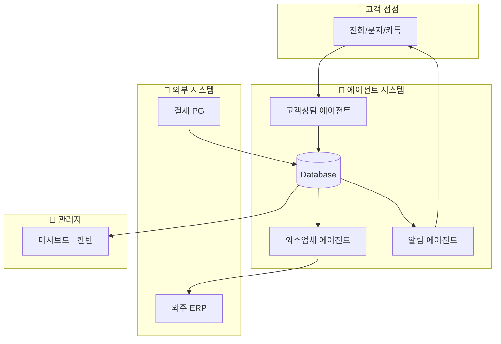

---

## 4. 시스템 기본 구조
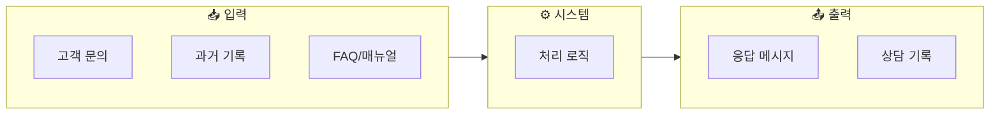

---

## 5. 분기 흐름
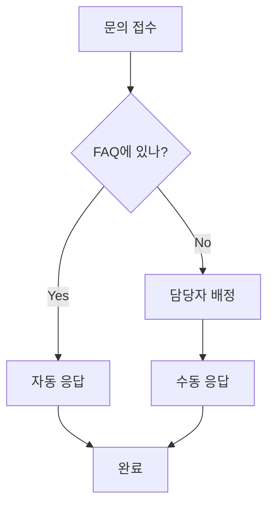

---

## 6. HITL vs HOTL
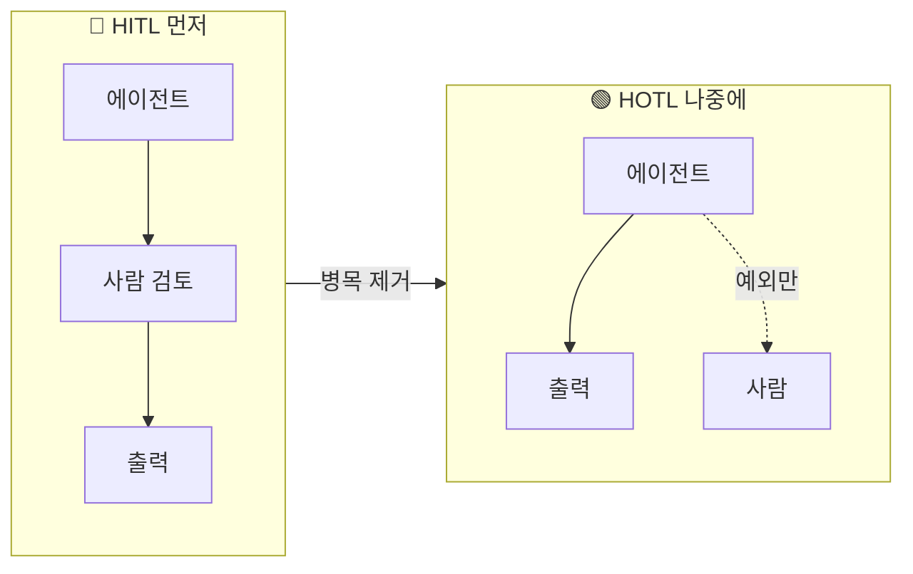

---

## 7. 수작업 병목
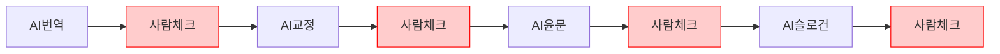

---

## 8. HITL 병목
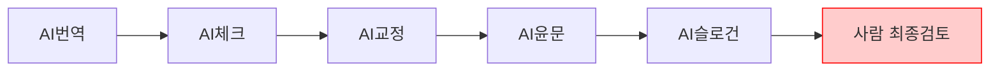

---

## 9. HOTL 예외
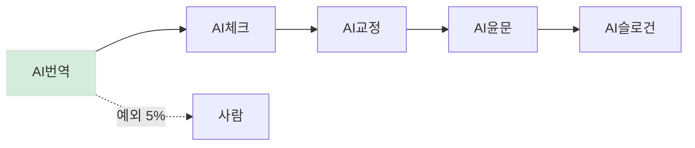

---

## 10. 어시스턴트 기본 구조
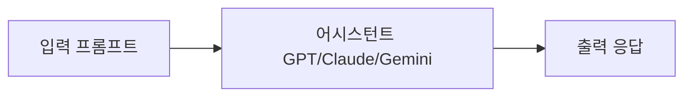

---

## 11. 전통적 AI
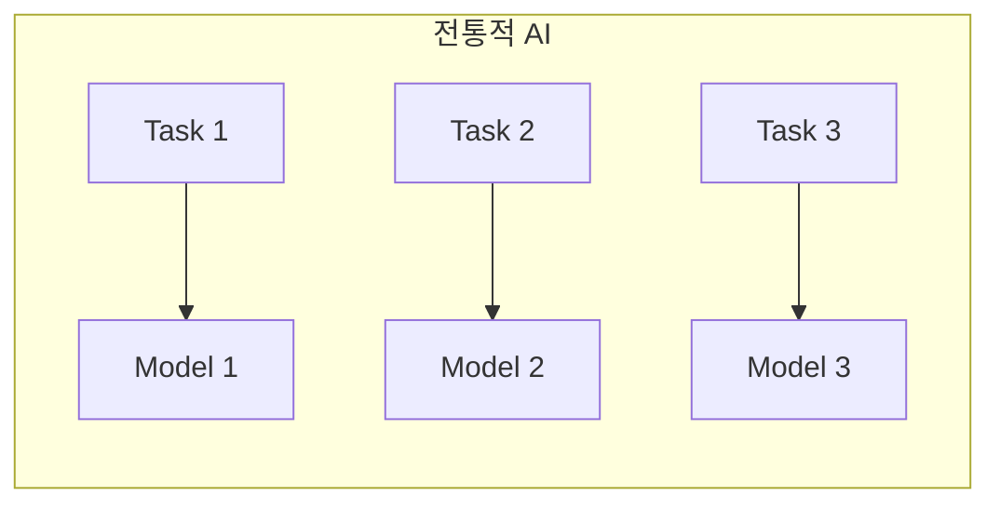

---

## 12. 파운데이션 모델
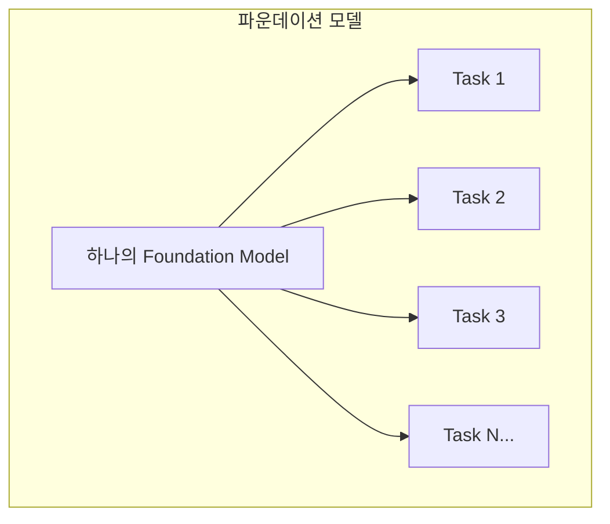

---

## 13. 유튜브 자막 파이프라인
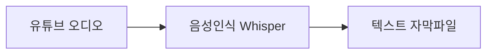

---

## 14. STT 기본
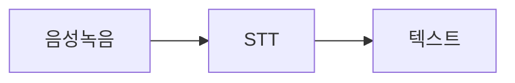

---

## 15. STT API
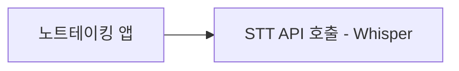

---

## 16. Realtime 분기
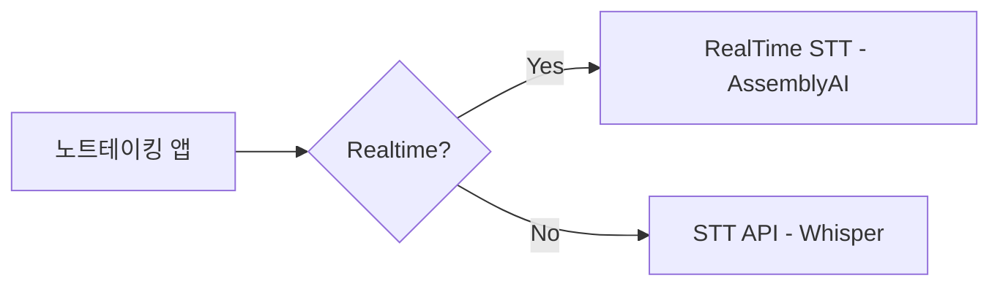

---

## 17. STT 파이프라인
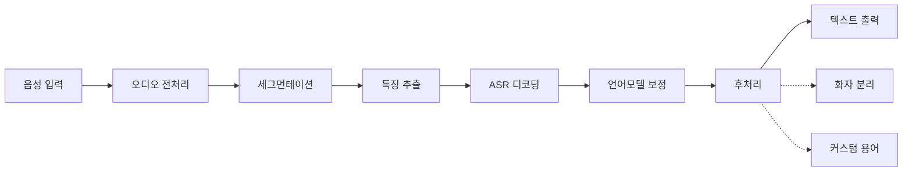

---

## 18. 후처리 파이프라인
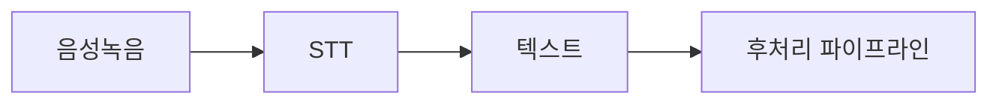

---

## 19. PPT 생성
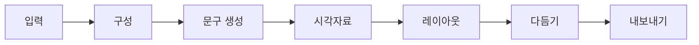

---

## 20. 캐릭터챗 기본
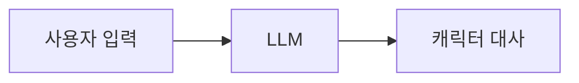

---

## 21. 캐릭터챗 메모리
```mermaid
flowchart LR
    A[사용자 입력] --> C[LLM] --> D[캐릭터 대사]
    M[메모리/상태] --> C
    D --> U[메모리 업데이트] --> M
```

---

## 22. 프롬프트 엔지니어링
```mermaid
flowchart LR
    A[프롬프트 엔지니어링] --> B[페르소나 주입] --> L[LLM]
    L --> O[캐릭터 응답]
```

---

## 23. 컨텍스트 엔지니어링
```mermaid
flowchart LR
    A[컨텍스트 엔지니어링] --> B[메모리/컨텍스트]
    B --> C[LLM]
    C --> D[응답]
    D --> B
```

---

## 24. 유튜브 요약 기본
```mermaid
flowchart LR
    A[유튜브 링크] --> B[Transcript 확보] --> C[요약/정리] --> D[노트 출력]
```

---

## 25. 자막 분기
```mermaid
flowchart LR
    A[유튜브 링크] --> C{자막 있나?}
    C -->|Yes| T1[자막 추출]
    C -->|No| A1[오디오 추출] --> S[STT]
    T1 --> T[Transcript]
    S --> T
```

---

## 26. 캐싱
```mermaid
flowchart LR
    U[링크 요청] --> K{캐시 히트?}
    K -->|Yes| R[캐시된 결과 반환]
    K -->|No| P[처리] --> W[캐시 저장] --> R2[결과 출력]
```

---

## 27. 음성 입력 아이디어
```mermaid
flowchart LR
    A[어떤 앱이든] --> H[단축키]
    H --> V[음성 입력 팝업]
    V --> S[STT]
    S --> T[텍스트 삽입]
```

---

## 28. 기본 대화
```mermaid
flowchart LR
    A[사용자] -->|프롬프트| B[AI 서비스]
    B -->|응답| A
    A -->|다시 프롬프트| B
    B -->|다시 응답| A
```

---

## 29. Claude Code 구조
```mermaid
graph TB
    subgraph Terminal[터미널 환경]
        User[사용자] --> CC[Claude Code]
        CC --> User
        CC --> FS[파일 시스템]
        CC --> CMD[명령어 실행]
        CC --> Web[웹 검색]
        CC --> API[외부 API]
    end
```

---

## 30. 모드 선택
```mermaid
flowchart TD
    Start[작업 시작] --> Mode{모드 선택}

    Mode -->|일반 모드| Normal[매번 승인 요청]
    Mode -->|Auto-accept| Auto[자동 승인]
    Mode -->|Plan 모드| Plan[계획 수립]

    Normal --> Task1[작업 1]
    Task1 --> Approve1[승인 대기]
    Approve1 --> Task2[작업 2]
    Task2 --> Approve2[승인 대기]

    Auto --> AutoTask1[작업 1 자동 실행]
    AutoTask1 --> AutoTask2[작업 2 자동 실행]
    AutoTask2 --> Critical{위험한 작업?}
    Critical -->|Yes| ApproveAuto[승인 요청]
    Critical -->|No| AutoTask3[작업 3 자동 실행]

    Plan --> Explore[Phase 1: 탐색]
    Explore --> Design[Phase 2: 설계]
    Design --> Review[Phase 3: 계획 검토]
    Review --> UserApprove[사용자 승인]
    UserApprove --> Execute[Phase 4: 일괄 실행]
```

---

## 31. 계획 모드 시퀀스
```mermaid
flowchart TB
    U1[사용자 요청] --> P1[코드베이스 탐색]
    P1 --> P2[아키텍처 분석]
    P2 --> P3[계획서 완성]
    P3 --> U2[사용자 검토]
    U2 --> P4[수정 반영]
    P4 --> U3[승인]
    U3 --> E1[실행]
    E1 --> E2[완료]
```

---

## 32. 작업 분류
```mermaid
flowchart TD
    Task[작업 요청] --> Check{작업 분류}

    Check -->|읽기 전용| Safe[안전한 작업]
    Check -->|파일 수정| Medium[민감한 작업]
    Check -->|시스템 변경| Danger[위험한 작업]

    Safe --> SafeList[파일 읽기, 코드 검색]
    Medium --> MediumList[파일 생성/수정, Git 커밋]
    Danger --> DangerList[파일 삭제, 시스템 명령]

    SafeList --> AutoSafe[자동 실행]
    DangerList --> AlwaysAsk[반드시 승인 요청]
```

---

## 33. 어시스턴트 vs 에이전틱 vs 에이전트
```mermaid
graph TB
    subgraph Simple[단순 어시스턴트]
        A1["Q"] --> A2["A"]
    end

    subgraph Agentic[에이전틱]
        B1["Q"] --> B2["계획"]
        B2 --> B3["실행"]
        B3 --> B4["A"]
    end

    subgraph FullAgent[완전 에이전트]
        C1["목표"] --> C2["자율실행"]
    end

```

---

## 34. Cursor 코드 작성 플로우
```mermaid
flowchart TB
    A["사용자: 이 함수를 리팩토링해줘"] --> B["1. 현재 코드 분석"]
    B --> C["2. 의도 파악"]
    C --> D["3. 수정 계획 수립"]
    D --> E["4. 코드 변경"]
    E --> F["5. 사용자 확인 요청"]
    F --> G["수정된 코드 사용자 승인 후 적용"]

    style A fill:#E3F2FD
    style G fill:#D4EDDA
```

---

## 35. API 비유
```mermaid
flowchart LR
    A[손님] -->|주문| B[웨이터]
    B -->|요청| C[주방]
    C -->|완성| B
    B -->|서빙| A
```

---

## 36. 폴링 vs 웹훅
```mermaid
flowchart TB
    subgraph Polling["API 방식 - 폴링"]
        A1["나: 택배 왔어요?"] --> B1["배송기사: 아직요"]
        B1 --> A2["나: 택배 왔어요?"]
        A2 --> B2["배송기사: 아직요"]
        B2 --> A3["나: 택배 왔어요?"]
        A3 --> B3["배송기사: 네, 방금 왔어요"]
    end

    subgraph Push["웹훅 방식 - 푸시"]
        C1["나: 택배 오면 문자 주세요"] --> D1["배송기사: 알겠습니다"]
        D1 -.->|"시간 경과"| D2["배송기사: 택배 도착했습니다"]
        D2 --> C2["나"]
    end

    style Polling fill:#FFCCCC
    style Push fill:#D4EDDA
```

---

## 37. 트리거 예시
```mermaid
flowchart LR
    T["트리거"] --> A["새 이메일"] --> R1["기록"]
    T --> B["오전 9시"] --> R2["발송"]
    T --> C["파일 업로드"] --> R3["AI 분석"]
```

---

## 38. Zapier 자동화 예시
```mermaid
flowchart LR
    A["Gmail에 첨부파일"] --> B["Google Drive에 저장"]
    B --> C["Slack에 알림"]

    style A fill:#E3F2FD
    style B fill:#D4EDDA
    style C fill:#FFF3CD
```

---

## 39. n8n 워크플로우 예시
```mermaid
flowchart LR
    A["웹훅"] --> B["데이터 추출"]
    B --> C["Claude API"]
    C --> D["결과 저장"]
    D --> E["알림 발송"]

    style C fill:#E3F2FD
```

---

## 40. ComfyUI 워크플로우 예시
```mermaid
flowchart TB
    A["텍스트 프롬프트"] --> B["Stable Diffusion"]
    C["참조 이미지 ControlNet"] --> B
    B --> D["후처리"]
    D --> E["이미지 출력"]

    style B fill:#E3F2FD
    style C fill:#FFF3CD
```

---

## 41. 이메일 스프레드시트 자동화
```mermaid
flowchart TB
    A["Gmail: 견적 요청 이메일"] --> B["회사명, 연락처 추출"]
    B --> C["Google Sheets에 새 행 추가"]
    C --> D["Slack #영업 채널에 알림"]

    style A fill:#FFF3CD
    style D fill:#D4EDDA
```

---

## 42. AI 고객 문의 자동 분류
```mermaid
flowchart TB
    A["고객센터 이메일 수신"] --> B["Claude API 문의 분류"]
    B --> C{"분류 결과"}
    C -->|"환불"| D["환불팀 Slack"]
    C -->|"배송"| E["배송팀 Slack"]
    C -->|"기타"| F["일반 문의함"]

    style B fill:#E3F2FD
```

---

## 43. HuggingFace 역할
```mermaid
flowchart TB
    A[개발자 A: 모델 학습] --> B[HuggingFace에 업로드]
    B --> C[개발자 B: 다운로드]
    B --> D[개발자 C: 다운로드]
    B --> E[개발자 D: 다운로드]

    style B fill:#FFF3CD
```

---

## 44. OpenRouter 작동 방식
```mermaid
flowchart LR
    A[내 앱] --> B[OpenRouter API]
    B --> C[GPT-4]
    B --> D[Claude]
    B --> E[Llama]
    B --> F[...]

    style B fill:#E3F2FD
```

---

## 45. LangGraph 예시
```mermaid
flowchart LR
    A[시작] --> B[계획]
    B --> C[실행]
    C --> D[검토]
    D --> E{OK?}
    E -->|Yes| F[끝]
    E -->|No| C

    style E fill:#FFF3CD
```

---

## 46. CrewAI 예시
```mermaid
flowchart LR
    A[연구원 에이전트] -->|정보 수집| B[분석가 에이전트]
    B -->|분석| C[작가 에이전트]
    C -->|보고서 작성| D[결과물]

    style A fill:#E3F2FD
    style B fill:#FFF3CD
    style C fill:#D4EDDA
```

---

## 47. AI 인프라 레이어
```mermaid
flowchart TB
    subgraph Infra["AI 인프라 레이어"]
        A[모델 저장소 HuggingFace]
        B[모델 서빙/라우팅 OpenRouter, fal, Replicate]
        C[개발 프레임워크 LangChain, LangGraph, CrewAI]
        D[최종 애플리케이션 여러분이 만드는 것]
    end

    A --> B --> C --> D

    style A fill:#E3F2FD
    style B fill:#FFF3CD
    style C fill:#D4EDDA
    style D fill:#E8D4F0
```

---

## 48. 시스템 기본 구조 (32번)
```mermaid
flowchart LR
    A[입력] --> B[처리] --> C[출력]
```

---

## 49. 커피숍 시스템
```mermaid
flowchart LR
    A["아메리카노" 입력] --> B[원두 갈기] --> C[추출] --> D[물 섞기] --> E[커피 출력]
```

---

## 50. ChatGPT 시스템
```mermaid
flowchart LR
    A["질문" 입력] --> B[토큰 처리] --> C[확률 계산] --> D["답변" 출력]
```

---

## 51. 회사 시스템
```mermaid
flowchart LR
    A[고객 요청 입력] --> B[영업팀] --> C[개발팀] --> D[QA팀] --> E[제품/서비스 출력]
```

---

## 52. 에이전트 5컴포넌트
```mermaid
flowchart TB
    subgraph Agent[에이전트]
        Brain["🧠 두뇌 - 추론 엔진 상황 파악, 판단, 계획 수립"]

        subgraph Components[핵심 컴포넌트]
            direction LR
            Sense["👁 감각 - 입력 사용자 요청 환경 관찰"]
            Tools["🦾 손발 - 도구 검색, API 호출 파일, 코드"]
            Memory["💾 기억 - 메모리 단기: 현재 대화 장기: 과거 기록"]
        end

        Goal["🎯 목표 + ⛔ 제약 무엇을 달성할 것인가 + 무엇을 하면 안 되나"]
    end

    Brain --> Components
    Components --> Goal

    style Brain fill:#E3F2FD
    style Goal fill:#FFF3CD
```

---

## 53. 병원 5블록 모델
```mermaid
flowchart TB
    subgraph Hospital[병원 5블록 모델]
        E[Executive - 경영진 병원장, 진료부장 운영 정책, 품질 기준]
        SS[SharedServices - 기업인프라 보험 청구, 행정, HR 의무기록 관리, 정산]
        EX["Execution - 실무진 ★ 핵심 의사: 진단, 처방 간호사: 환자 케어"]
        D["Discovery - 연구실 임상 연구, 신약 개발 학술 활동"]
        F["Front - 고객접점 ← 히포 집중 환자 대면 커뮤니케이션 예약, 안내, 24시간 응대"]
    end

    E --> SS
    E --> EX
    SS --> EX
    EX --> D
    EX --> F

    style EX fill:#D4EDDA,stroke:#DDDDDD
    style F fill:#FFF3CD,stroke:#DDDDDD
```

---

## 54. 손해사정사 AI 에이전트 구조
```mermaid
flowchart TB
    A[보험 청구 접수] --> B[약관 정보 기반 AI 에이전트]

    subgraph Agent[AI 에이전트 처리]
        B --> B1[약관 참조]
        B --> B2[가입 정보 참조]
        B --> B3[항목별 청구 가능/불가능 판단]
        B --> B4[사유 명시]
    end

    Agent --> C[UI로 결과 표현 - HITL]

    subgraph Result[결과 표시]
        C --> C1[청구 가능 항목 리스트]
        C --> C2[청구 불가 항목 + 사유]
    end

    Result --> D[손해사정사: 최종 검토 및 승인]
    D --> E[모든 수정 내역 로그 저장]
    E --> F[강화학습 데이터로 활용]

    style Agent fill:#E3F2FD
    style Result fill:#D4EDDA
```

---

## 55. HIPPO Agent Platform
```mermaid
flowchart TB
    subgraph Platform[HIPPO Agent Platform]
        subgraph UseCases[Use Cases]
            P[Provider use-cases]
            PA[Payor use-cases]
            PH[Pharma use-cases]
        end

        UseCases --> TA[1000+ Task Agents 자격확인, 케어관리, 리마인더 아웃리치, 임상시험...]

        TA --> PM[Primary Model - core 300B / private]

        PM <--> SM[Supervisor / Support Models - 30+ safety checks, accuracy, OCR labs/vitals, etc.]
    end

    style PM fill:#E3F2FD
    style SM fill:#FFF3CD
    style TA fill:#D4EDDA
```

---

## 56. Speech 입출력 흐름
```mermaid
flowchart LR
    A[Speech In] --> B[전처리 + STT]
    B --> C[Agents + Models]
    C --> D[Voice/Text/Docs]

    subgraph Input[입력 처리]
        B1[배경 소음 분리]
        B2[의료 용어 인식]
        B3[이중언어 전환]
        B4[발음 불명확 이해]
    end

    subgraph Output[출력 처리]
        D1[HD 음성 품질]
        D2[맞춤형 공감 음성]
        D3[임상 문서 자동 생성]
    end

    B -.-> Input
    D -.-> Output

    style C fill:#E3F2FD
```

---

## 57. 변호사 사무실 5블록
```mermaid
flowchart TB
    subgraph LawFirm[변호사 사무실 5블록]
        E[Executive 대외 협력, 파트너십 품질기준, 운영정책]

        SS[SharedServices 문서/기록 정리 Finance, 정산 HR, 급여, 근태]

        EX["Execution ★ 핵심 상담/사건수행 리서치/서면업무"]

        D[Discovery 뉴스 하이라이트 시장/경쟁사 동향]

        F[Front 24시간 문의 응대 커뮤니케이션 콘텐츠 제작/SEO]
    end

    E --> SS
    E --> EX
    SS --> EX
    EX --> D
    EX --> F
    F --> EX

    style EX fill:#D4EDDA,stroke:#DDDDDD
```

---

## 58. 토큰 비용 구조
```mermaid
flowchart TB
    subgraph Sent[내가 보낸 것]
        A["안녕?" - 4토큰]
    end

    subgraph Real[실제 전송되는 것]
        B[시스템 프롬프트 - 2,000 토큰]
        C[이전 대화 - 3,000 토큰]
        D[도구 설명 - 1,000 토큰]
        E[내 메시지 - 4 토큰]
        F["총 6,004 토큰 ← 과금"]
    end

    Sent --> Real

    style A fill:#D4EDDA
    style F fill:#FFF3CD
```

---

## 59. 모델 계층화 효과
```mermaid
flowchart LR
    subgraph Before[Before: 전부 Opus]
        B1[분류: 700원]
        B2[초안: 4,200원]
        B3[검토: 2,800원]
        B4[총: 7,700원]
    end

    subgraph After[After: 계층화]
        A1[분류: Haiku 14원]
        A2[초안: Sonnet 700원]
        A3[검토: Opus 2,800원]
        A4[총: 3,514원]
    end

    Before --> After

    style B4 fill:#FFCCCC
    style A4 fill:#D4EDDA
```

---

## 60. 3개월 라이트하우스 일정
```mermaid
flowchart TB
    subgraph M1[Month 1: 설계]
        A1[도메인 선정 확정]
        A2[프로세스 문서화]
        A3[기술 스택 결정]
        A4[팀 구성 - PM + 개발자]
    end

    subgraph M2[Month 2: 구축]
        B1[MVP 개발]
        B2[내부 테스트]
        B3[비용 측정 시작]
        B4[예외 케이스 수집]
    end

    subgraph M3[Month 3: 프로덕션]
        C1[실제 업무에 투입]
        C2[모니터링 체계 구축]
        C3[성과 측정]
        C4[문서화 및 사내 공유]
    end

    M1 --> M2 --> M3

    style M1 fill:#E3F2FD
    style M2 fill:#FFF3CD
    style M3 fill:#D4EDDA
```

---

## 61. 비용 구조 전환
```mermaid
flowchart LR
    subgraph Before[Before: 사람 중심]
        BA[매출 100]
        BB[인건비 60]
        BC[운영비 25]
        BD[이익 15]
    end

    subgraph After[After: 에이전트 중심]
        AA[매출 130 - 1.3배]
        AB[인건비 15 - 감독 인력만]
        AC[토큰비용 10]
        AD[운영비 15]
        AE[이익 90 - 6배]
    end

    Before --> After

    style BD fill:#FFCCCC
    style AE fill:#D4EDDA
```

---

## 62. 앙상블 전략
```mermaid
flowchart TB
    A[Research Request 새로운 트레이딩 전략 발굴] --> B[Orchestrator 비용 효율적 모델: Sonnet]

    B --> C[Local LLM Mixtral]
    B --> D[Opus 중요]
    B --> E[GPT-4 검증]

    C --> F[Result Merge 투표/가중]
    D --> F
    E --> F

    style B fill:#E3F2FD
    style F fill:#D4EDDA
```

---

## 63. 하이브리드 전략
```mermaid
flowchart TB
    subgraph OnPrem[민감 데이터 - 온프레미스]
        A1[고객 개인정보 처리]
        A2[핵심 영업 비밀]
        A3[내부 문서 검색]
    end

    subgraph Cloud[일반 작업 - 클라우드]
        B1[텍스트 생성]
        B2[번역]
        B3[요약]
        B4[코드 생성]
    end

    style OnPrem fill:#FFF3CD
    style Cloud fill:#E3F2FD
```
