# 시각 자료 갤러리

모든 다이어그램과 이미지를 한눈에 볼 수 있는 페이지입니다.

---

## SVG 다이어그램 (40개)

### 12번 - 티켓이 상태를 따라 흐른다


---

### 13번 - 인간과 AI의 역할 분담


---

### 31번 - 에이전트 전통적 정의


---

### 41번 - 시스템으로 바꾸는 첫 경험


---

### 42번 - 개념과 어휘 정립


---

### 43번 - LangChain과 LangGraph


---

### 44번 - 지식 계층과 구조화


---

### 45번 - 툴과 커넥터


---

### 46번 - 멀티에이전트 구성패턴


---

## 외부 이미지 (2개)

### 13번 - 인간과 AI의 역할 분담


### 16번 - 에이전트 시대의 세가지 역할


---

## Mermaid 다이어그램 Part 1 (34개)

### 11번 - 비용구조가 바뀌면 조직이 바뀐다 (2개)

#### 성장 패러다임 비교
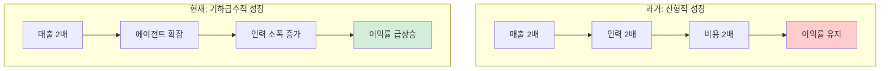

#### 롤업 전략 비교
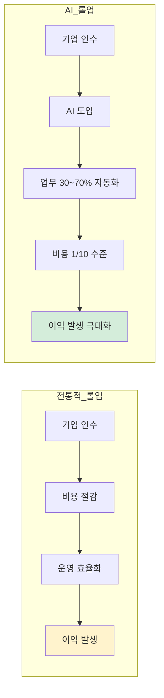

---

### 12번 - 티켓이 상태를 따라 흐른다 (3개)

#### 시스템 아키텍처
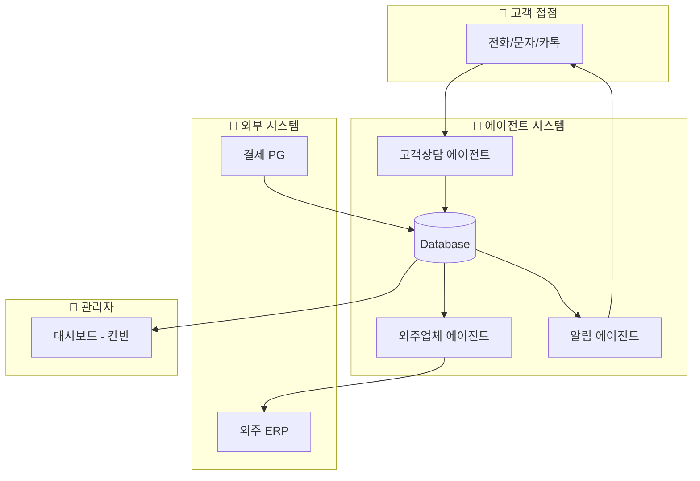

#### 상태 다이어그램

<!-- stateDiagram-v2 주석 처리 (GitHub 렌더링 테스트)
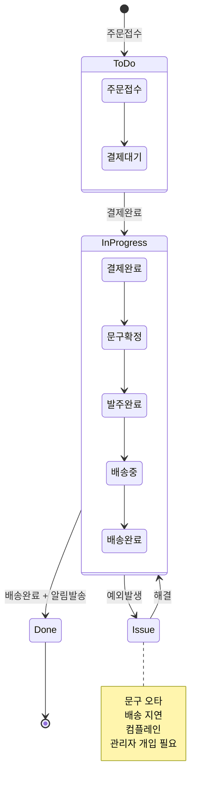
-->

#### ERD

<!-- erDiagram 주석 처리 (GitHub 렌더링 미지원)
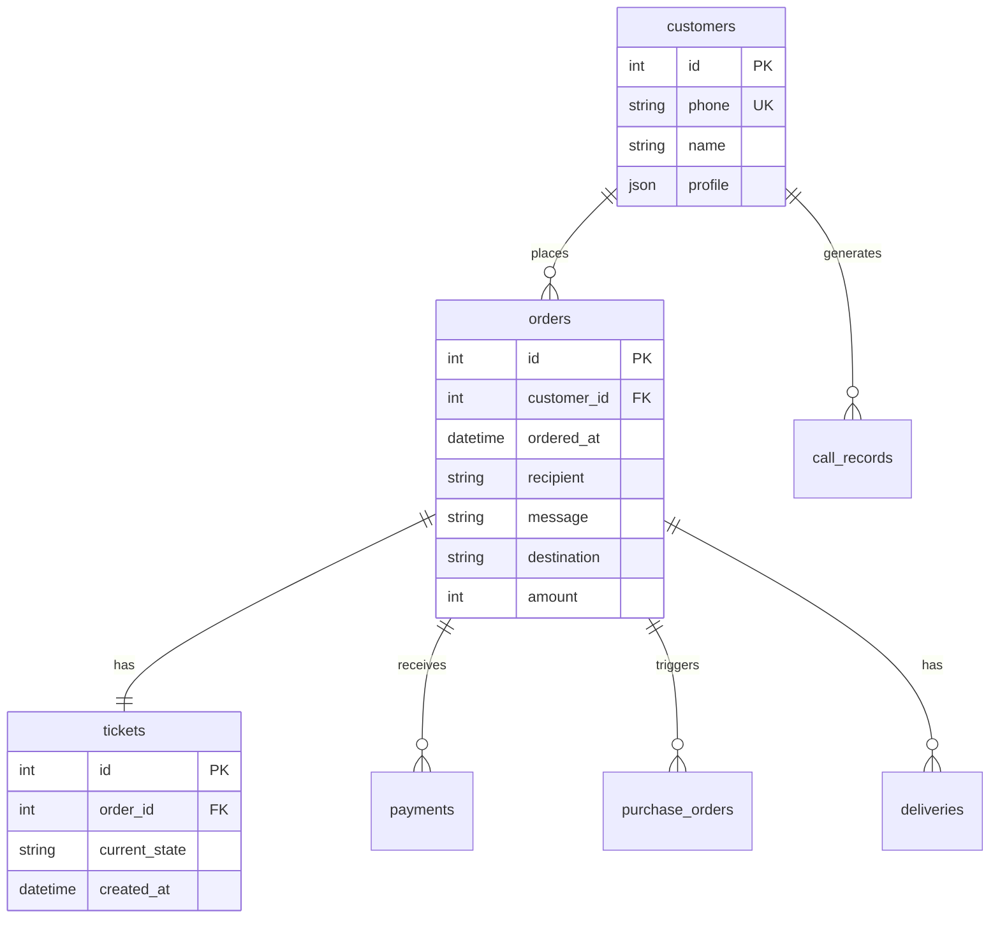
-->

---

### 15번 - HITL에서 HOTL로 가는 길 (3개)

#### 시스템 기본 구조
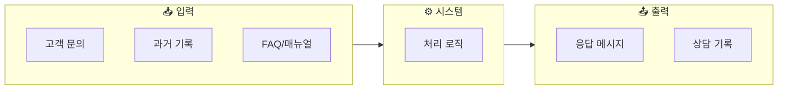

#### 분기 흐름
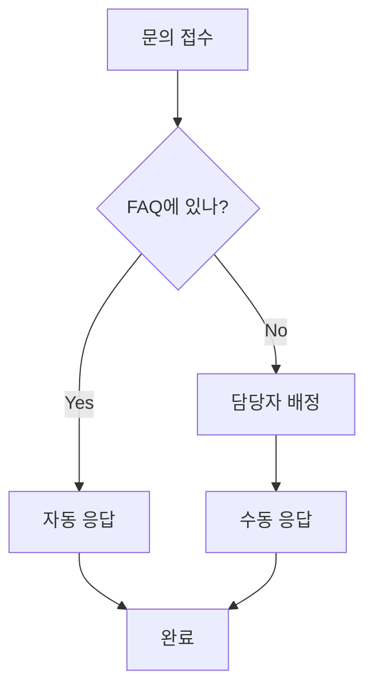

#### HITL vs HOTL
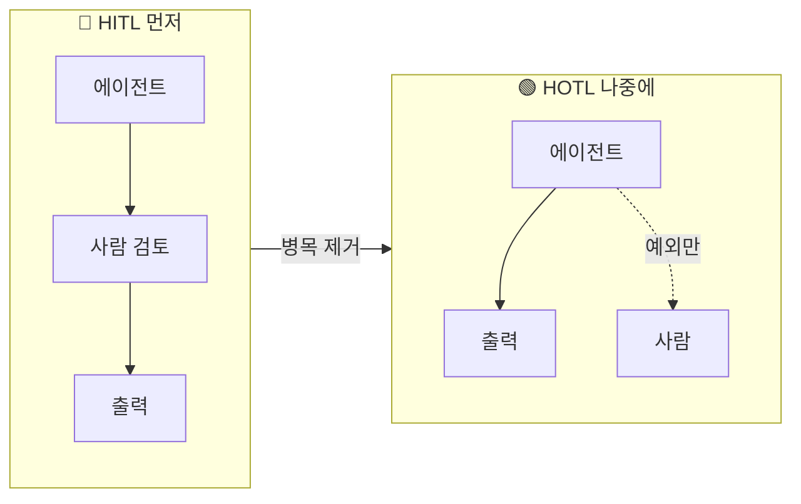

---

### 14번 - 같은 패턴 다른 규모 (3개)

#### 수작업 병목
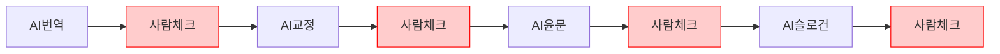

#### HITL 병목
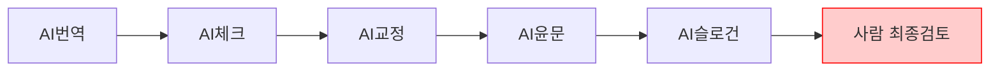

#### HOTL 예외
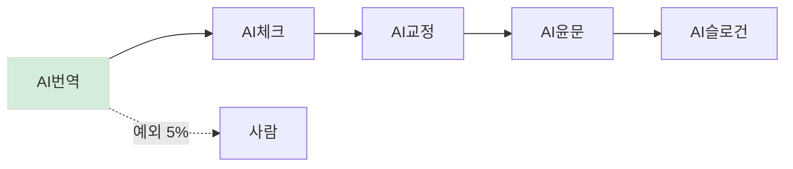

---

### 21번 - 범용 어시스턴트 (1개)

#### 어시스턴트 기본 구조
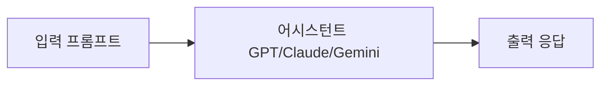

---

### 22번 - 파운데이션 모델과 Task (3개)

#### 전통적 AI
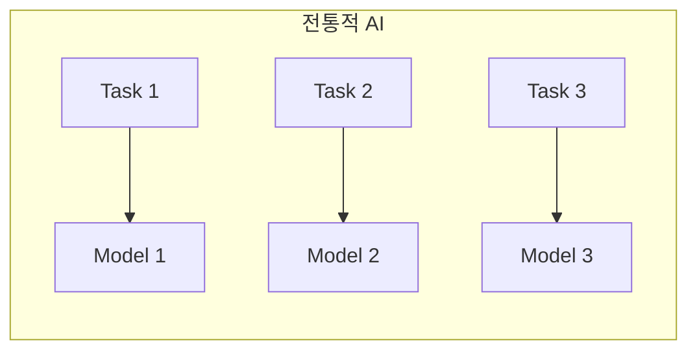

#### 파운데이션 모델
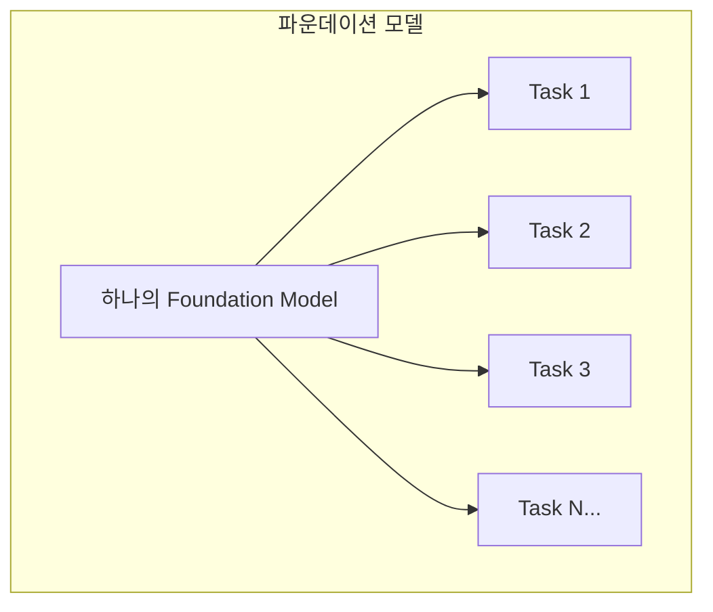

#### 유튜브 자막 파이프라인
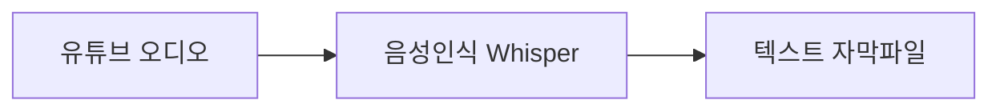

---

### 23번 - AI 프로덕트 분석 (16개)

#### STT 기본
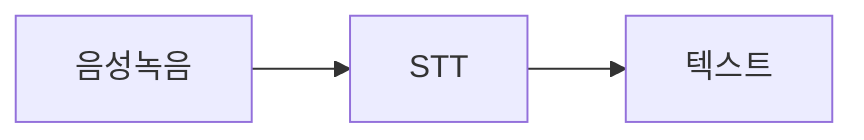

#### STT API
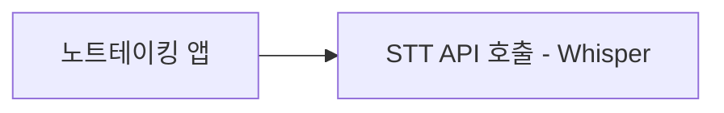

#### Realtime 분기
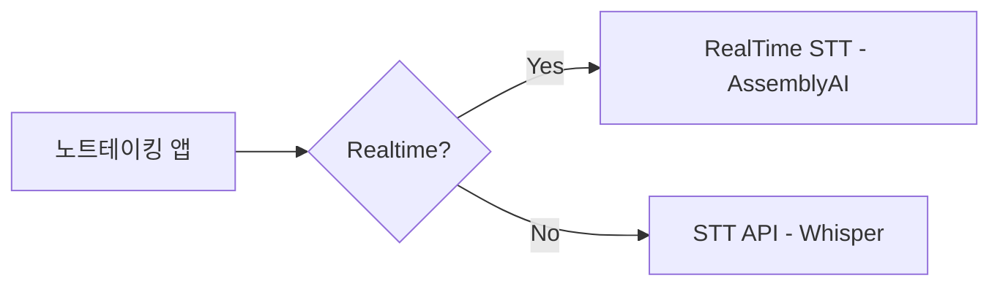

#### STT 파이프라인
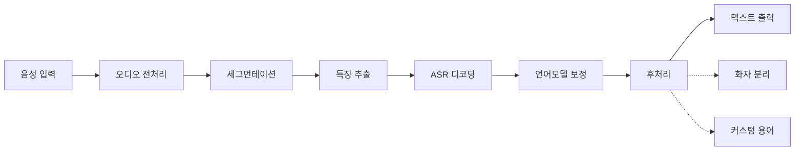

#### 후처리 파이프라인
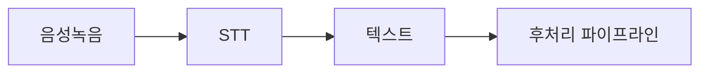

#### PPT 생성
```mermaid
flowchart LR
    A[입력] --> B[구성]
    B --> C[문구 생성]
    C --> D[시각자료]
    D --> E[레이아웃]
    E --> F[다듬기]
    F --> G[내보내기]
```

#### PPT Todo 생성

<!-- sequenceDiagram 주석 처리 (GitHub 렌더링 테스트)
```mermaid
sequenceDiagram
    participant U as User
    participant O as Orchestrator
    participant L as LLM-Agent
    participant T as Tool-python-pptx

    U->>O: "3장짜리 발표 만들어줘"
    O->>L: 요구사항 + 도구 목록
    L->>O: Todo 생성
    loop Todo 실행
        O->>T: 도구 호출
        T-->>O: 결과
        O->>L: 결과 전달, 다음 Todo 보정
    end
    O-->>U: 완성된 PPTX
```
-->

#### 캐릭터챗 기본
```mermaid
flowchart LR
    A[사용자 입력] --> B[LLM] --> C[캐릭터 대사]
```

#### 캐릭터챗 메모리
```mermaid
flowchart LR
    A[사용자 입력] --> C[LLM] --> D[캐릭터 대사]
    M[메모리/상태] --> C
    D --> U[메모리 업데이트] --> M
```

#### 프롬프트 엔지니어링
```mermaid
flowchart LR
    A[프롬프트 엔지니어링] --> B[페르소나 주입] --> L[LLM]
    L --> O[캐릭터 응답]
```

#### 컨텍스트 엔지니어링
```mermaid
flowchart LR
    A[컨텍스트 엔지니어링] --> B[메모리/컨텍스트]
    B --> C[LLM]
    C --> D[응답]
    D --> B
```

#### 유튜브 요약 기본
```mermaid
flowchart LR
    A[유튜브 링크] --> B[Transcript 확보] --> C[요약/정리] --> D[노트 출력]
```

#### 자막 분기
```mermaid
flowchart LR
    A[유튜브 링크] --> C{자막 있나?}
    C -->|Yes| T1[자막 추출]
    C -->|No| A1[오디오 추출] --> S[STT]
    T1 --> T[Transcript]
    S --> T
```

#### 캐싱
```mermaid
flowchart LR
    U[링크 요청] --> K{캐시 히트?}
    K -->|Yes| R[캐시된 결과 반환]
    K -->|No| P[처리] --> W[캐시 저장] --> R2[결과 출력]
```

#### 음성 입력 아이디어
```mermaid
flowchart LR
    A[어떤 앱이든] --> H[단축키]
    H --> V[음성 입력 팝업]
    V --> S[STT]
    S --> T[텍스트 삽입]
```

---

### 24번 - 에이전트 시스템 구조 이해하기 (5개)

#### 기본 대화
```mermaid
flowchart LR
    A[사용자] -->|프롬프트| B[AI 서비스]
    B -->|응답| A
    A -->|다시 프롬프트| B
    B -->|다시 응답| A
```

#### Claude Code 구조
```mermaid
graph TB
    subgraph Terminal[터미널 환경]
        User[사용자] --> CC[Claude Code]
        CC --> User
        CC --> FS[파일 시스템]
        CC --> CMD[명령어 실행]
        CC --> Web[웹 검색]
        CC --> API[외부 API]
    end
```

#### 모드 선택
```mermaid
flowchart TD
    Start[작업 시작] --> Mode{모드 선택}

    Mode -->|일반 모드| Normal[매번 승인 요청]
    Mode -->|Auto-accept| Auto[자동 승인]
    Mode -->|Plan 모드| Plan[계획 수립]

    Normal --> Task1[작업 1]
    Task1 --> Approve1[승인 대기]
    Approve1 --> Task2[작업 2]
    Task2 --> Approve2[승인 대기]

    Auto --> AutoTask1[작업 1 자동 실행]
    AutoTask1 --> AutoTask2[작업 2 자동 실행]
    AutoTask2 --> Critical{위험한 작업?}
    Critical -->|Yes| ApproveAuto[승인 요청]
    Critical -->|No| AutoTask3[작업 3 자동 실행]

    Plan --> Explore[Phase 1: 탐색]
    Explore --> Design[Phase 2: 설계]
    Design --> Review[Phase 3: 계획 검토]
    Review --> UserApprove[사용자 승인]
    UserApprove --> Execute[Phase 4: 일괄 실행]
```

#### 계획 모드 시퀀스
```mermaid
flowchart TB
    U1[사용자 요청] --> P1[코드베이스 탐색]
    P1 --> P2[아키텍처 분석]
    P2 --> P3[계획서 완성]
    P3 --> U2[사용자 검토]
    U2 --> P4[수정 반영]
    P4 --> U3[승인]
    U3 --> E1[실행]
    E1 --> E2[완료]
```

#### 작업 분류
```mermaid
flowchart TD
    Task[작업 요청] --> Check{작업 분류}

    Check -->|읽기 전용| Safe[안전한 작업]
    Check -->|파일 수정| Medium[민감한 작업]
    Check -->|시스템 변경| Danger[위험한 작업]

    Safe --> SafeList[파일 읽기, 코드 검색]
    Medium --> MediumList[파일 생성/수정, Git 커밋]
    Danger --> DangerList[파일 삭제, 시스템 명령]

    SafeList --> AutoSafe[자동 실행]
    DangerList --> AlwaysAsk[반드시 승인 요청]
```

---

**25번 이후 Mermaid 다이어그램은 [Part 2](GALLERY-2.md)에서 계속됩니다.**

---

## 요약

| 유형 | 개수 | 위치 |
|------|------|------|
| SVG 파일 | 40개 | `output/draft/assets/` |
| 외부 이미지 (로컬) | 2개 | `inbox/images/` |
| 외부 이미지 (GitHub) | 1개 | GitHub user-attachments |
| Mermaid 인라인 (Part 1) | 34개 | 11번~24번 |
| Mermaid 인라인 (Part 2) | 32개 | [GALLERY-2.md](GALLERY-2.md) |
| **총계** | **109개** | - |

---

**최종 업데이트**: 2026-01-09
