# 시각 자료 갤러리

모든 다이어그램과 이미지를 한눈에 볼 수 있는 페이지입니다.

---

## SVG 다이어그램 (40개)

### 12번 - 티켓이 상태를 따라 흐른다


---

### 13번 - 인간과 AI의 역할 분담


---

### 31번 - 에이전트 전통적 정의


---

### 41번 - 시스템으로 바꾸는 첫 경험


---

### 42번 - 개념과 어휘 정립


---

### 43번 - LangChain과 LangGraph


---

### 44번 - 지식 계층과 구조화


---

### 45번 - 툴과 커넥터


---

### 46번 - 멀티에이전트 구성패턴


---

## 외부 이미지 (2개)

### 13번 - 인간과 AI의 역할 분담


### 16번 - 에이전트 시대의 세가지 역할


---

## Mermaid 다이어그램 Part 1 (34개)

### 11번 - 비용구조가 바뀌면 조직이 바뀐다 (2개)

#### 성장 패러다임 비교
```mermaid
graph TB
    subgraph 과거["과거: 선형적 성장"]
        P1[매출 2배] --> P2[인력 2배]
        P2 --> P3[비용 2배]
        P3 --> P4[이익률 유지]
    end

    subgraph 현재["현재: 기하급수적 성장"]
        C1[매출 2배] --> C2[에이전트 확장]
        C2 --> C3[인력 소폭 증가]
        C3 --> C4[이익률 급상승]
    end

    style P4 fill:#FFCCCC
    style C4 fill:#D4EDDA
```

#### 롤업 전략 비교
```mermaid
graph LR
    subgraph 전통적_롤업
        A1[기업 인수] --> A2[비용 절감]
        A2 --> A3[운영 효율화]
        A3 --> A4[이익 발생]
    end

    subgraph AI_롤업
        B1[기업 인수] --> B2[AI 도입]
        B2 --> B3[업무 30~70% 자동화]
        B3 --> B4[비용 1/10 수준]
        B4 --> B5[이익 발생 극대화]
    end

    style A4 fill:#FFF3CD
    style B5 fill:#D4EDDA
```

---

### 12번 - 티켓이 상태를 따라 흐른다 (3개)

#### 시스템 아키텍처
```mermaid
flowchart TB
    subgraph CustomerContact["📱 고객 접점"]
        Phone["전화/문자/카톡"]
    end

    subgraph AgentSystem["🤖 에이전트 시스템"]
        CS["고객상담 에이전트"]
        Vendor["외주업체 에이전트"]
        Alert["알림 에이전트"]
        DB[(Database)]
    end

    subgraph ExternalSystem["🏢 외부 시스템"]
        ERP["외주 ERP"]
        PG["결제 PG"]
    end

    subgraph Admin["👤 관리자"]
        Dashboard["대시보드 - 칸반"]
    end

    Phone --> CS
    CS --> DB
    DB --> Vendor
    Vendor --> ERP
    PG --> DB
    DB --> Alert
    Alert --> Phone
    DB --> Dashboard
```

#### 상태 다이어그램

<!-- stateDiagram-v2 주석 처리 (GitHub 렌더링 테스트)
```mermaid
stateDiagram-v2
    [*] --> ToDo: 주문접수

    state ToDo {
        주문접수 --> 결제대기
    }

    ToDo --> InProgress: 결제완료

    state InProgress {
        결제완료 --> 문구확정
        문구확정 --> 발주완료
        발주완료 --> 배송중
        배송중 --> 배송완료
    }

    InProgress --> Issue: 예외발생
    Issue --> InProgress: 해결

    InProgress --> Done: 배송완료 + 알림발송
    Done --> [*]

    note right of Issue
        문구 오타
        배송 지연
        컴플레인
        관리자 개입 필요
    end note
```
-->

#### ERD

<!-- erDiagram 주석 처리 (GitHub 렌더링 미지원)

-->

---

### 15번 - HITL에서 HOTL로 가는 길 (3개)

#### 시스템 기본 구조
```mermaid
flowchart LR
    subgraph Input["📥 입력"]
        I1["고객 문의"]
        I2["과거 기록"]
        I3["FAQ/매뉴얼"]
    end

    subgraph System["⚙️ 시스템"]
        S["처리 로직"]
    end

    subgraph Output["📤 출력"]
        O1["응답 메시지"]
        O2["상담 기록"]
    end

    Input --> System --> Output
```

#### 분기 흐름
```mermaid
flowchart TD
    A["문의 접수"] --> B{"FAQ에 있나?"}
    B -->|Yes| C["자동 응답"]
    B -->|No| D["담당자 배정"]
    D --> E["수동 응답"]
    C --> F["완료"]
    E --> F
```

#### HITL vs HOTL
```mermaid
flowchart LR
    subgraph HITL["🔵 HITL 먼저"]
        H1["에이전트"] --> H2["사람 검토"] --> H3["출력"]
    end

    subgraph HOTL["🟢 HOTL 나중에"]
        T1["에이전트"] --> T2["출력"]
        T1 -.->|"예외만"| T3["사람"]
    end

    HITL -->|"병목 제거"| HOTL
```

---

### 14번 - 같은 패턴 다른 규모 (3개)

#### 수작업 병목
```mermaid
flowchart LR
    A[AI번역] --> B[사람체크]
    B --> C[AI교정]
    C --> D[사람체크]
    D --> E[AI윤문]
    E --> F[사람체크]
    F --> G[AI슬로건]
    G --> H[사람체크]

    style B fill:#FFCCCC,stroke:#ff0000
    style D fill:#FFCCCC,stroke:#ff0000
    style F fill:#FFCCCC,stroke:#ff0000
    style H fill:#FFCCCC,stroke:#ff0000
```

#### HITL 병목
```mermaid
flowchart LR
    A[AI번역] --> B[AI체크]
    B --> C[AI교정]
    C --> D[AI윤문]
    D --> E[AI슬로건]
    E --> F[사람 최종검토]

    style F fill:#FFCCCC,stroke:#ff0000
```

#### HOTL 예외
```mermaid
flowchart LR
    A[AI번역] --> B[AI체크]
    B --> C[AI교정]
    C --> D[AI윤문]
    D --> E[AI슬로건]

    A -.->|예외 5%| F[사람]
    style A fill:#D4EDDA,stroke:#DDDDDD
```

---

### 21번 - 범용 어시스턴트 (1개)

#### 어시스턴트 기본 구조
```mermaid
flowchart LR
    A[입력 프롬프트] --> B[어시스턴트 GPT/Claude/Gemini]
    B --> C[출력 응답]
```

---

### 22번 - 파운데이션 모델과 Task (3개)

#### 전통적 AI
```mermaid
flowchart LR
    subgraph Traditional[전통적 AI]
        T1[Task 1] --> M1[Model 1]
        T2[Task 2] --> M2[Model 2]
        T3[Task 3] --> M3[Model 3]
    end
```

#### 파운데이션 모델
```mermaid
flowchart TB
    subgraph Foundation[파운데이션 모델]
        FM[하나의 Foundation Model]
        FM --> T1[Task 1]
        FM --> T2[Task 2]
        FM --> T3[Task 3]
        FM --> T4[Task N...]
    end
```

#### 유튜브 자막 파이프라인
```mermaid
flowchart LR
    A[유튜브 오디오] --> B[음성인식 Whisper]
    B --> C[텍스트 자막파일]
```

---

### 23번 - AI 프로덕트 분석 (16개)

#### STT 기본
```mermaid
flowchart LR
    A[음성녹음] --> B[STT] --> C[텍스트]
```

#### STT API
```mermaid
flowchart LR
    A[노트테이킹 앱] --> B[STT API 호출 - Whisper]
```

#### Realtime 분기
```mermaid
flowchart LR
    A[노트테이킹 앱] --> C{Realtime?}
    C -- Yes --> B1[RealTime STT - AssemblyAI]
    C -- No --> B[STT API - Whisper]
```

#### STT 파이프라인
```mermaid
flowchart LR
    A[음성 입력] --> P1[오디오 전처리]
    P1 --> P2[세그먼테이션]
    P2 --> P3[특징 추출]
    P3 --> P4[ASR 디코딩]
    P4 --> P5[언어모델 보정]
    P5 --> P6[후처리]
    P6 --> T[텍스트 출력]
    P6 -.-> P7[화자 분리]
    P6 -.-> P8[커스텀 용어]
```

#### 후처리 파이프라인
```mermaid
flowchart LR
    A[음성녹음] --> B[STT] --> C[텍스트]
    C --> D[후처리 파이프라인]
```

#### PPT 생성
```mermaid
flowchart LR
    A[입력] --> B[구성]
    B --> C[문구 생성]
    C --> D[시각자료]
    D --> E[레이아웃]
    E --> F[다듬기]
    F --> G[내보내기]
```

#### PPT Todo 생성

<!-- sequenceDiagram 주석 처리 (GitHub 렌더링 테스트)
```mermaid
sequenceDiagram
    participant U as User
    participant O as Orchestrator
    participant L as LLM-Agent
    participant T as Tool-python-pptx

    U->>O: "3장짜리 발표 만들어줘"
    O->>L: 요구사항 + 도구 목록
    L->>O: Todo 생성
    loop Todo 실행
        O->>T: 도구 호출
        T-->>O: 결과
        O->>L: 결과 전달, 다음 Todo 보정
    end
    O-->>U: 완성된 PPTX
```
-->

#### 캐릭터챗 기본
```mermaid
flowchart LR
    A[사용자 입력] --> B[LLM] --> C[캐릭터 대사]
```

#### 캐릭터챗 메모리
```mermaid
flowchart LR
    A[사용자 입력] --> C[LLM] --> D[캐릭터 대사]
    M[메모리/상태] --> C
    D --> U[메모리 업데이트] --> M
```

#### 프롬프트 엔지니어링
```mermaid
flowchart LR
    A[프롬프트 엔지니어링] --> B[페르소나 주입] --> L[LLM]
    L --> O[캐릭터 응답]
```

#### 컨텍스트 엔지니어링
```mermaid
flowchart LR
    A[컨텍스트 엔지니어링] --> B[메모리/컨텍스트]
    B --> C[LLM]
    C --> D[응답]
    D --> B
```

#### 유튜브 요약 기본
```mermaid
flowchart LR
    A[유튜브 링크] --> B[Transcript 확보] --> C[요약/정리] --> D[노트 출력]
```

#### 자막 분기
```mermaid
flowchart LR
    A[유튜브 링크] --> C{자막 있나?}
    C -->|Yes| T1[자막 추출]
    C -->|No| A1[오디오 추출] --> S[STT]
    T1 --> T[Transcript]
    S --> T
```

#### 캐싱
```mermaid
flowchart LR
    U[링크 요청] --> K{캐시 히트?}
    K -->|Yes| R[캐시된 결과 반환]
    K -->|No| P[처리] --> W[캐시 저장] --> R2[결과 출력]
```

#### 음성 입력 아이디어
```mermaid
flowchart LR
    A[어떤 앱이든] --> H[단축키]
    H --> V[음성 입력 팝업]
    V --> S[STT]
    S --> T[텍스트 삽입]
```

---

### 24번 - 에이전트 시스템 구조 이해하기 (5개)

#### 기본 대화
```mermaid
flowchart LR
    A[사용자] -->|프롬프트| B[AI 서비스]
    B -->|응답| A
    A -->|다시 프롬프트| B
    B -->|다시 응답| A
```

#### Claude Code 구조
```mermaid
graph TB
    subgraph Terminal[터미널 환경]
        User[사용자] --> CC[Claude Code]
        CC --> User
        CC --> FS[파일 시스템]
        CC --> CMD[명령어 실행]
        CC --> Web[웹 검색]
        CC --> API[외부 API]
    end
```

#### 모드 선택
```mermaid
flowchart TD
    Start[작업 시작] --> Mode{모드 선택}

    Mode -->|일반 모드| Normal[매번 승인 요청]
    Mode -->|Auto-accept| Auto[자동 승인]
    Mode -->|Plan 모드| Plan[계획 수립]

    Normal --> Task1[작업 1]
    Task1 --> Approve1[승인 대기]
    Approve1 --> Task2[작업 2]
    Task2 --> Approve2[승인 대기]

    Auto --> AutoTask1[작업 1 자동 실행]
    AutoTask1 --> AutoTask2[작업 2 자동 실행]
    AutoTask2 --> Critical{위험한 작업?}
    Critical -->|Yes| ApproveAuto[승인 요청]
    Critical -->|No| AutoTask3[작업 3 자동 실행]

    Plan --> Explore[Phase 1: 탐색]
    Explore --> Design[Phase 2: 설계]
    Design --> Review[Phase 3: 계획 검토]
    Review --> UserApprove[사용자 승인]
    UserApprove --> Execute[Phase 4: 일괄 실행]
```

#### 계획 모드 시퀀스
```mermaid
flowchart TB
    U1[사용자 요청] --> P1[코드베이스 탐색]
    P1 --> P2[아키텍처 분석]
    P2 --> P3[계획서 완성]
    P3 --> U2[사용자 검토]
    U2 --> P4[수정 반영]
    P4 --> U3[승인]
    U3 --> E1[실행]
    E1 --> E2[완료]
```

#### 작업 분류
```mermaid
flowchart TD
    Task[작업 요청] --> Check{작업 분류}

    Check -->|읽기 전용| Safe[안전한 작업]
    Check -->|파일 수정| Medium[민감한 작업]
    Check -->|시스템 변경| Danger[위험한 작업]

    Safe --> SafeList[파일 읽기, 코드 검색]
    Medium --> MediumList[파일 생성/수정, Git 커밋]
    Danger --> DangerList[파일 삭제, 시스템 명령]

    SafeList --> AutoSafe[자동 실행]
    DangerList --> AlwaysAsk[반드시 승인 요청]
```

---

**25번 이후 Mermaid 다이어그램은 [Part 2](GALLERY-2.md)에서 계속됩니다.**

---

## 요약

| 유형 | 개수 | 위치 |
|------|------|------|
| SVG 파일 | 40개 | `output/draft/assets/` |
| 외부 이미지 (로컬) | 2개 | `inbox/images/` |
| 외부 이미지 (GitHub) | 1개 | GitHub user-attachments |
| Mermaid 인라인 (Part 1) | 34개 | 11번~24번 |
| Mermaid 인라인 (Part 2) | 32개 | [GALLERY-2.md](GALLERY-2.md) |
| **총계** | **109개** | - |

---

**최종 업데이트**: 2026-01-09
