# Mermaid 호환성 테스트

각 조합별로 렌더링 여부를 테스트합니다.

---

## 테스트 1: 단순 flowchart LR (기준)
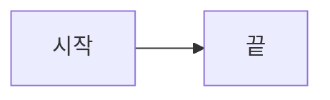

---

## 테스트 2: flowchart LR + 한글 edge label
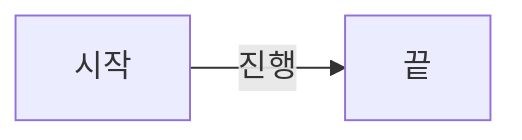

---

## 테스트 3: flowchart TB + subgraph (내부 edge 없음)
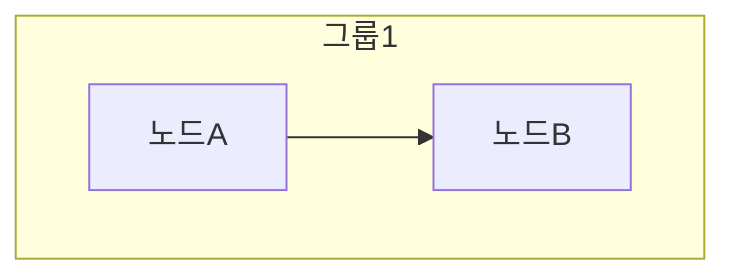

---

## 테스트 4: flowchart TB + subgraph + 내부 edge


---

## 테스트 5: graph TB + subgraph + 내부 edge


---

## 테스트 6: flowchart + 2개 subgraph + cross 연결
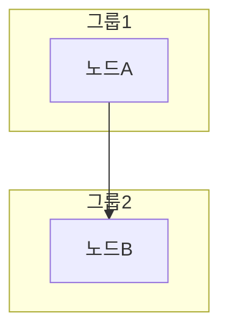

---

## 테스트 7: graph + 2개 subgraph + cross 연결


---

## 테스트 8: flowchart + subgraph + style on node
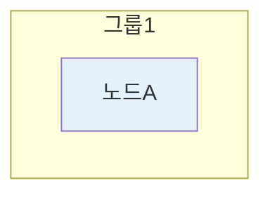

---

## 테스트 9: graph + subgraph + style on node


---

## 테스트 10: flowchart + subgraph container style
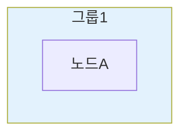

---

## 테스트 11: subgraph 레이블에 따옴표
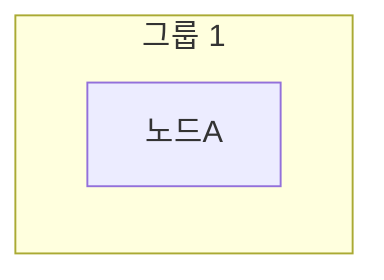

---

## 테스트 12: subgraph 레이블에 콜론
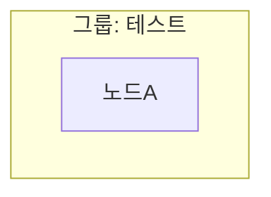

---

## 테스트 13: 노드 레이블에 괄호
```mermaid
flowchart LR
    A[함수(param)] --> B[결과]
```

---

## 테스트 14: edge label에 따옴표
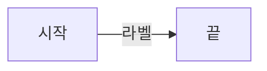

---

## 테스트 15: 복잡한 분기 (style 없음)
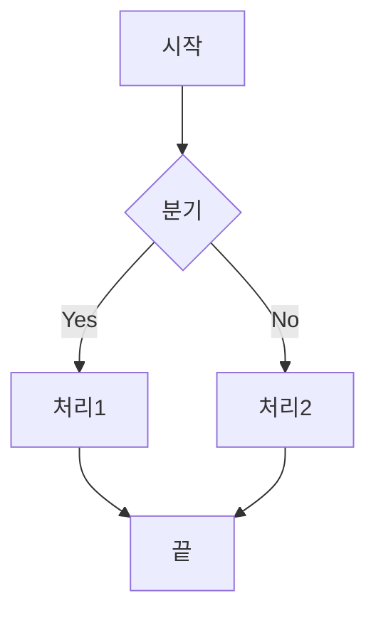

---

## 테스트 16: 복잡한 분기 + style
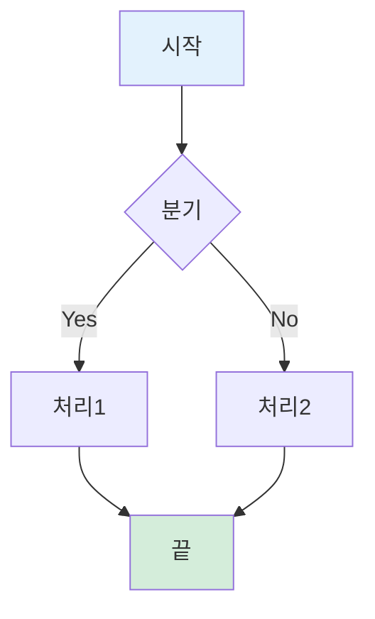

---

## 테스트 17: 따옴표 + 콜론
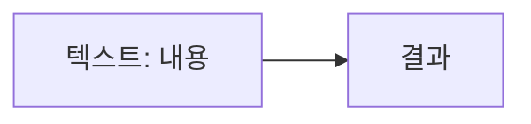

---

## 테스트 18: 따옴표 없이 콜론


---

## 테스트 19: 따옴표 + 대시 (스페이스 포함)
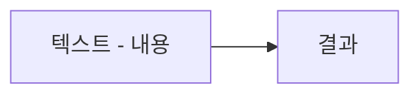

---

## 테스트 20: 따옴표 없이 대시


---

## 테스트 21: subgraph 따옴표 레이블 + 대시
```mermaid
flowchart TB
    subgraph G1["그룹 - 테스트"]
        A[노드]
    end
```

---

## 테스트 22: subgraph 따옴표 없이 대시
```mermaid
flowchart TB
    subgraph G1[그룹 - 테스트]
        A[노드]
    end
```

---

## 테스트 23: 따옴표 + 긴 한글 문장
```mermaid
flowchart LR
    A["사용자가 이 함수를 리팩토링해달라고 요청"] --> B[결과]
```

---

## 테스트 24: 따옴표 노드 + style
```mermaid
flowchart LR
    A["시작"] --> B["끝"]
    style A fill:#E3F2FD
```

---

## 테스트 25: 한 노드에서 여러 브랜치 (멀티브랜치)
```mermaid
flowchart LR
    T[트리거] --> A[액션1]
    T --> B[액션2]
    T --> C[액션3]
```

---

## 테스트 26: 따옴표 노드 멀티브랜치
```mermaid
flowchart LR
    T["트리거"] --> A["액션1"]
    T --> B["액션2"]
    T --> C["액션3"]
```

---

## 테스트 27: graph + subgraph + 내부 양방향 엣지
```mermaid
graph TB
    subgraph G1[그룹1]
        A[노드A] --> B[노드B]
        B --> A
    end
```

---

## 테스트 28: graph + subgraph + 내부 멀티브랜치
```mermaid
graph TB
    subgraph G1[그룹1]
        A[중심] --> B[분기1]
        A --> C[분기2]
        A --> D[분기3]
        A --> E[분기4]
    end
```

---

## 테스트 29: 한글 subgraph ID (실패 예상)
```mermaid
flowchart TB
    subgraph 인프라[AI 인프라]
        A[노드A] --> B[노드B]
    end
```

---

## 테스트 30: 점선 화살표 + 라벨
```mermaid
flowchart TB
    A[시작] -.->|"시간 경과"| B[끝]
```

---

## 테스트 31: subgraph 후 빈 줄 (P1 의심)
```mermaid
graph TB
    subgraph G1[그룹1]
        A[노드A] --> B[노드B]
    end

```

---

## 테스트 32: 체인 연결 A --> B --> C (P2 의심)
```mermaid
flowchart LR
    T["트리거"] --> A["새 이메일"] --> R["기록"]
```

---

## 테스트 33: 4단 체인 연결
```mermaid
flowchart LR
    A[1단계] --> B[2단계] --> C[3단계] --> D[4단계]
```

---

## 테스트 34: 체인 + 분기 혼합
```mermaid
flowchart LR
    T[트리거] --> A[이메일] --> R1[기록]
    T --> B[시간] --> R2[발송]
    T --> C[파일] --> R3[분석]
```

---

## 테스트 35: graph LR 기본
```mermaid
graph LR
    A[시작] --> B[끝]
```

---

## 테스트 36: flowchart TD 기본
```mermaid
flowchart TD
    A[시작] --> B[끝]
```

---

## 테스트 37: stateDiagram-v2 기본
```mermaid
stateDiagram-v2
    [*] --> 대기
    대기 --> 실행
    실행 --> 완료
    완료 --> [*]
```

---

## 테스트 38: stateDiagram + state 그룹
```mermaid
stateDiagram-v2
    [*] --> Active
    state Active {
        작업1 --> 작업2
        작업2 --> 작업3
    }
    Active --> [*]
```

---

## 테스트 39: stateDiagram + note
```mermaid
stateDiagram-v2
    [*] --> 대기
    대기 --> 처리중
    note right of 처리중
        이 상태에서 작업 수행
    end note
    처리중 --> [*]
```

---

## 테스트 40: erDiagram 기본
```mermaid
erDiagram
    CUSTOMER ||--o{ ORDER : places
    ORDER ||--|{ LINE_ITEM : contains
```

---

## 테스트 41: sequenceDiagram 기본
```mermaid
sequenceDiagram
    participant A as 사용자
    participant B as 시스템
    A->>B: 요청
    B-->>A: 응답
```

---

## 테스트 42: sequenceDiagram + loop
```mermaid
sequenceDiagram
    participant U as User
    participant S as System
    U->>S: 시작
    loop 반복 작업
        S->>S: 처리
    end
    S-->>U: 완료
```

---

## 테스트 43: 마름모 {} 노드
```mermaid
flowchart TD
    A[시작] --> B{조건}
    B -->|Yes| C[처리]
    B -->|No| D[종료]
```

---

## 테스트 44: 원형 () 노드
```mermaid
flowchart LR
    A((시작)) --> B[처리] --> C((끝))
```

---

## 테스트 45: 실린더 [()] 노드 (DB)
```mermaid
flowchart LR
    A[앱] --> B[(데이터베이스)]
```

---

## 테스트 46: 양방향 화살표
```mermaid
flowchart LR
    A[클라이언트] <--> B[서버]
```

---

## 테스트 47: --> + -.-> 혼합
```mermaid
flowchart TB
    A[시작] --> B[메인]
    B --> C[끝]
    A -.->|예외| D[예외처리]
```

---

## 테스트 48: subgraph + direction LR
```mermaid
flowchart TB
    subgraph G1[그룹]
        direction LR
        A[노드A] --> B[노드B] --> C[노드C]
    end
```

---

## 테스트 49: 이모지 + style 조합
```mermaid
flowchart TB
    A["📱 입력"] --> B["🤖 처리"] --> C["📤 출력"]
    style A fill:#E3F2FD
    style B fill:#FFF3CD
    style C fill:#D4EDDA
```

---

## 테스트 50: 색상 5종 테스트
```mermaid
flowchart LR
    A[파란색] --> B[노란색] --> C[초록색] --> D[빨간색] --> E[보라색]
    style A fill:#E3F2FD
    style B fill:#FFF3CD
    style C fill:#D4EDDA
    style D fill:#FFCCCC
    style E fill:#E8D4F0
```

---

## 테스트 51: GALLERY 26번 - API 비유 (루프 구조)
```mermaid
flowchart LR
    A[손님] -->|주문| B[웨이터]
    B -->|요청| C[주방]
    C -->|완성| B
    B -->|서빙| A
```

---

## 테스트 52: GALLERY 26번 - 폴링 vs 웹훅
```mermaid
flowchart TB
    subgraph Polling["API 방식 - 폴링"]
        A1["나: 택배 왔어요?"] --> B1["배송기사: 아직요"]
        B1 --> A2["나: 택배 왔어요?"]
        A2 --> B2["배송기사: 아직요"]
        B2 --> A3["나: 택배 왔어요?"]
        A3 --> B3["배송기사: 네, 방금 왔어요"]
    end

    subgraph Push["웹훅 방식 - 푸시"]
        C1["나: 택배 오면 문자 주세요"] --> D1["배송기사: 알겠습니다"]
        D1 -.->|"시간 경과"| D2["배송기사: 택배 도착했습니다"]
        D2 --> C2["나"]
    end

    style Polling fill:#FFCCCC
    style Push fill:#D4EDDA
```

---

## 테스트 53: GALLERY 26번 - 트리거 예시
```mermaid
flowchart LR
    T["트리거"] --> A["새 이메일"] --> R1["기록"]
    T --> B["오전 9시"] --> R2["발송"]
    T --> C["파일 업로드"] --> R3["AI 분석"]
```

---

## 테스트 54: GALLERY 26번 - Zapier 자동화
```mermaid
flowchart LR
    A["Gmail에 첨부파일"] --> B["Google Drive에 저장"]
    B --> C["Slack에 알림"]

    style A fill:#E3F2FD
    style B fill:#D4EDDA
    style C fill:#FFF3CD
```

---

## 테스트 55: GALLERY 26번 - n8n 워크플로우
```mermaid
flowchart LR
    A["웹훅"] --> B["데이터 추출"]
    B --> C["Claude API"]
    C --> D["결과 저장"]
    D --> E["알림 발송"]

    style C fill:#E3F2FD
```

---

## 테스트 56: GALLERY 26번 - ComfyUI 워크플로우
```mermaid
flowchart TB
    A["텍스트 프롬프트"] --> B["Stable Diffusion"]
    C["참조 이미지 ControlNet"] --> B
    B --> D["후처리"]
    D --> E["이미지 출력"]

    style B fill:#E3F2FD
    style C fill:#FFF3CD
```

---

## 테스트 57: GALLERY 26번 - 이메일 스프레드시트 자동화
```mermaid
flowchart TB
    A["Gmail: 견적 요청 이메일"] --> B["회사명, 연락처 추출"]
    B --> C["Google Sheets에 새 행 추가"]
    C --> D["Slack #영업 채널에 알림"]

    style A fill:#FFF3CD
    style D fill:#D4EDDA
```

---

## 테스트 58: GALLERY 26번 - AI 고객 문의 자동 분류
```mermaid
flowchart TB
    A["고객센터 이메일 수신"] --> B["Claude API 문의 분류"]
    B --> C{"분류 결과"}
    C -->|"환불"| D["환불팀 Slack"]
    C -->|"배송"| E["배송팀 Slack"]
    C -->|"기타"| F["일반 문의함"]

    style B fill:#E3F2FD
```
