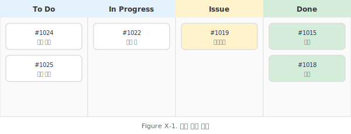
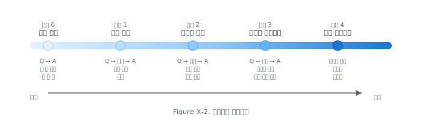
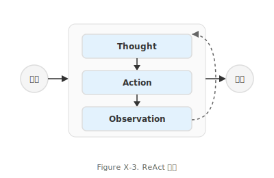
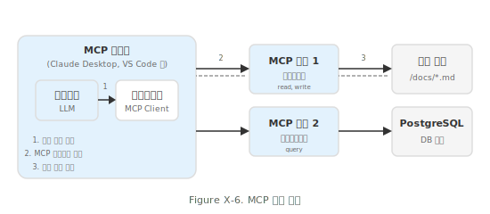
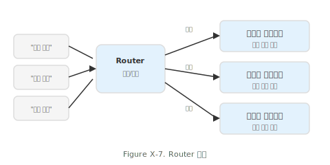
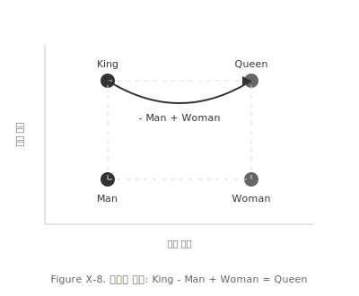
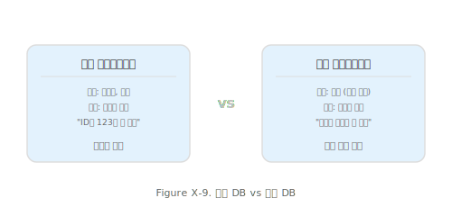
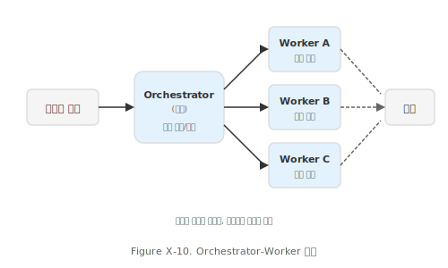

# 디자인 시스템 v2 샘플 갤러리 (파란색 기반)

10개 샘플 - 파란색 단일 톤 디자인 시스템 적용

---

## 적용된 디자인 시스템

### 기본 색상
| 용도 | Hex |
|------|-----|
| 배경 (밝음) | `#FFFFFF` |
| 배경 (중간) | `#F5F5F5` |
| 테두리 | `#DDDDDD` |
| 텍스트 | `#333333` |
| 보조 텍스트 | `#666666` |

### 포인트 (파란색)
| Hex | 용도 |
|-----|------|
| `#E3F2FD` | 컴포넌트 (단일 톤 기본) |
| `#BBDEFB` ~ `#90CAF9` | 위계 필요 시에만 |

**원칙**: 그라데이션은 필요할 때만. 단순한 다이어그램은 검정/회색만.

### 시맨틱 (상태 표시에만)
| 용도 | Hex |
|------|-----|
| 경고/Issue | `#FFF3CD` |
| 성공/완료 | `#D4EDDA` |

### 폰트
- Pretendard, -apple-system, sans-serif
- L: 14px/600, M: 12px/500, S: 10px/400

---

## 샘플 목록

### 1. 칸반 보드

### 2. 에이전트 스펙트럼

### 3. ReAct 패턴

### 4. RAG 흐름

### 5. HITL 다이어그램

### 6. MCP 흐름

### 7. Router 패턴

### 8. 임베딩 공간

### 9. DB 비교

### 10. Orchestrator-Worker

---

## 색상 사용 규칙 (de facto)

| 색상 | Hex | 의미 | 사용처 |
|------|-----|------|--------|
| 파랑 | `#E3F2FD` | 프로세스, 컴포넌트 | 모든 일반 컴포넌트 (단일 톤) |
| 흰/회 | `#F5F5F5` | 중립, 입력, 출력 | 입력값, 결과, 외부 리소스 |
| 초록 | `#D4EDDA` | **성공, 완료** | Done 상태 (칸반 등) |
| 노랑 | `#FFF3CD` | **경고, 주의** | Issue 상태 (칸반 등) |

**핵심 원칙**:
1. 출력/결과는 회색 (중립) - 초록 아님
2. 초록/노랑은 **상태(state)** 표현에만 사용
3. 같은 역할 = 같은 색상 (Worker A/B/C 동일)
4. 그라데이션 사용 안 함 (스펙트럼 등 특수 케이스 제외)
5. 단순 다이어그램은 검정/회색만
