# 디자인 시스템 샘플 갤러리

4개 다이어그램 × 3가지 색상 = 12개 샘플

---

## 1. 칸반 보드 (단순)

### 파랑 #E3F2FD
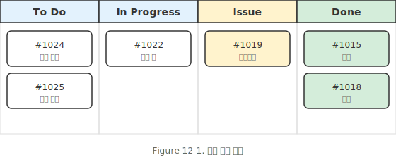

### 회색 #EEEEEE
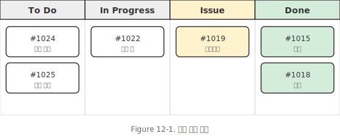

### 연두 #E8F5E9
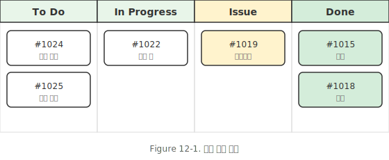

---

## 2. 에이전트 스펙트럼 (그라데이션)

### 파랑 #E3F2FD
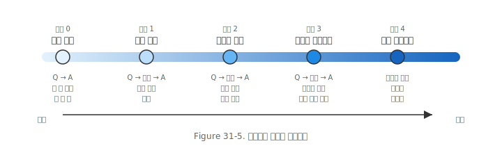

### 회색 #EEEEEE
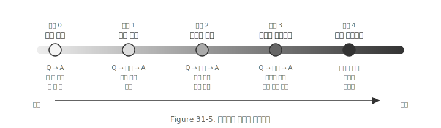

### 연두 #E8F5E9
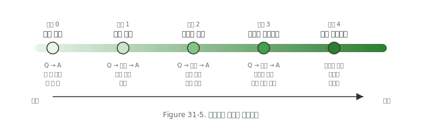

---

## 3. ReAct 패턴 (루프)

### 파랑 #E3F2FD
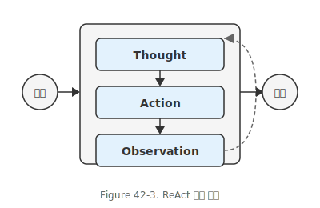

### 회색 #EEEEEE
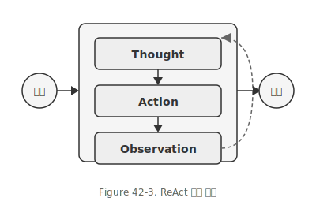

### 연두 #E8F5E9
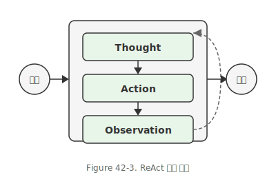

---

## 4. RAG 흐름 (복잡)

### 파랑 #E3F2FD
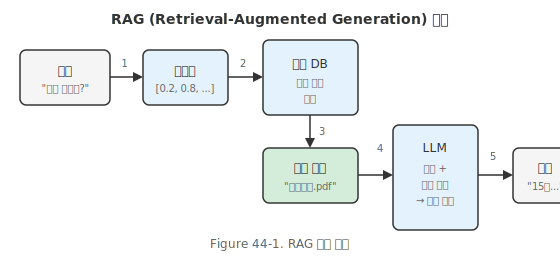

### 회색 #EEEEEE
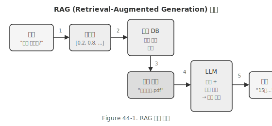

### 연두 #E8F5E9
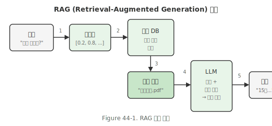

---

## 색상 옵션 요약

| 옵션 | Hex | 특징 |
|------|-----|------|
| 파랑 | `#E3F2FD` | 차분함, 기술 문서 |
| 회색 | `#EEEEEE` | 극단적 미니멀, 흑백 인쇄 |
| 연두 | `#E8F5E9` | 부드러움, 친근함 |

---

## 공통 디자인

- **폰트**: Pretendard (14/12/10px)
- **테두리**: #333333, 1.5px
- **배경**: #F5F5F5
- **Figure 타이틀**: 하단
